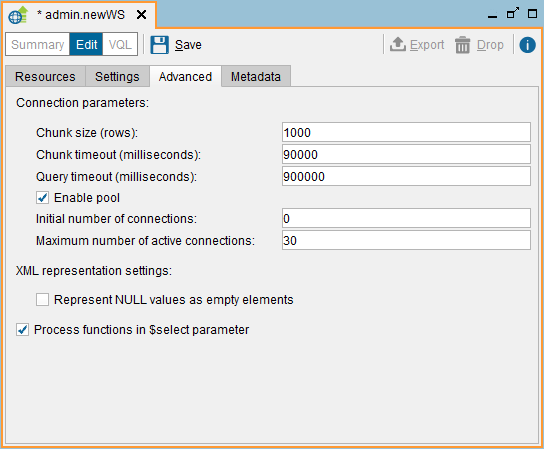

========================
Advanced Tab (REST)
========================

In this dialog you can configure several advanced settings of the Web
service.

   Creating a REST Web service: Advanced tab

The Virtual DataPort Web services are deployed to an application server
(usually in the Web service container embedded in the Denodo Platform).
Each time a Web service operation is invoked, it sends a query to the
Virtual DataPort server to obtain the required results. It is possible
to configure the parameter of these connections established from the
Service to the Server: **Chunk Size**, **Chunk Timeout**, **Query
Timeout**, **Enable Pool**, **Initial Size** and **Max. Active**. These
parameters are explained in the section :ref:`Connection from the Web
Services to the Server`.

|

By default, the Denodo REST Web services explicitly specify that a value
of a field is ``NULL`` by adding the attribute ``xsi:nil="true"`` to the
element. E.g. if in a row, the value of the field ``field_name`` is
``NULL``, the service returns the following:

<field\_name xsi:nil=“true” />

If you do not want the Web Service to specify ``NULL`` values with the
attribute ``xsi:nil="true"``, select the **Represent NULL values as
empty elements** check box. In this way, ``NULL`` values will be
represented with an empty element. E.g. ``<field_name />``. The problem
of enabling this option is that, for ``text`` fields, there is no
difference between a ``NULL`` value and an empty string.

Note that this only applies to the XML representation of the views.

|

When an application sends a request to a REST web service of Denodo to obtain the data of a view, it can add the parameter "$select" to the URL, to select the fields to project. By default, the value of this parameter can be a comma-separated list of fields and expressions. These are the same expressions you can use in the SELECT clause of a query. E.g. 
\http://denodo-dv-prod-01.acme.com/server/customer360/customer360/views/customer?$select=country%20in%20('US','UK','ES')

See more about how to use the parameter "$select" in the table :ref:`Parameters supported by the Denodo RESTful Web service and published REST Web services` of the section :ref:`Input Parameters of the RESTful Web Service`.

If you clear the check box **Process functions in $select parameter**, the value of $select has to be a comma-separated list of fields of the view, not expressions.