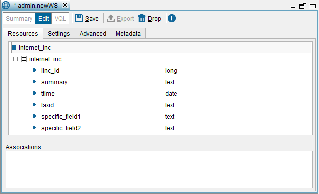

=============
Resources Tab
=============

This tab lists the resources published by the Service.

   Creating a REST Web service: Resources tab

-  *To add a new view*, drag it from the Server Explorer to the dialog.
   The Tool will add the view to the list of resources published by the
   Service.
   If you have dragged two views that are linked by an association (see
   section :ref:`Primary Keys of Views`), the Tool will also add the
   association to the list of published objects.
-  *To rename the Web service*, click on its name and enter the new
   name. You can only rename a Web service when you are creating, not
   when you are editing it.
-  *To rename a field of the Web service*, click on its name and enter
   the new name. Also, you can right-click on the field and click
   **Rename**.
   When renaming a field, the Service will publish the field with the
   new name. In addition, in IDU requests you have to use the new name
   of the field.
   This does not affect the RSS representation.
-  *To search for a view or a field* in the tree of resources, press
   **Ctrl+F**.

In REST Web services, by default, all the fields of the views can be
used as input and output fields.

In some scenarios, you may need to remove fields from the output or
force clients to provide a value for a field when querying the Web
service.

To achieve this, you can change the status of a field to the following:

-  **No searchable**: the clients of the Web service will not be able to
   filter the results by this field.
   To set a field to “No searchable”, right-click on the field and click
   **Remove from input**.
-  **Do not output**: the field does not appear in the results. In
   addition, the clients of the Web service will not be able to order
   the results by this field, but will be able to filter them by this
   field.
   To set a field to “Do not output”, right-click on the field and click
   **Remove from output**.
-  **Mandatory**: the clients of the Web service will have to provide a
   value for this field when querying the Web service.
   To set a field as “Mandatory”, right-click on the field and click
   **Set as mandatory**.

To change the status of several fields at once, hold *Ctrl* or Shift and
select the fields you want to modify.

If you do not want to publish a field of a view, you can remove it from
the Web service by right-clicking on it and clicking **Drop**.

.. note:: If you delete an obligatory field of the view, the clients
   will not be able to query the view.

