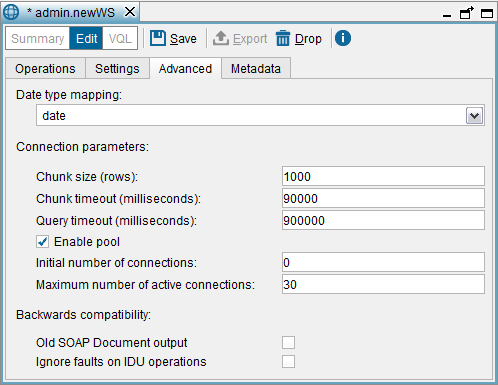

===================
Advanced Tab (SOAP)
===================

The Virtual DataPort Web services are deployed to an application server
(usually in the Web service container embedded in the Denodo Platform).
Each time a Web service operation is invoked, it sends a query to the
Virtual DataPort server to obtain the required results. It is possible
to configure the parameter of these connections established from the
Service to the Server: **Chunk Size**, **Chunk Timeout**, **Query
Timeout**, **Enable Pool**, **Initial Size** and **Max. Active**.

These parameters are explained in the section :ref:`Connection from the Web
Services to the Server`.

This tab also allows configuring the following:

-  **Date type mapping**: the type of data used to publish ``date`` fields.
   The options are the XML Schema ``date`` and ``dateTime`` data types. The
   XML Schema ``date`` type only considers the day, month and year, whereas
   the ``dateTime`` also considers the hour, minute, second and
   millisecond.

-  **Old SOAP DOCUMENT output** (only applies when the Web service style is
   DOCUMENT): if selected, the output of the SOAP Web service is backward
   compatible with the SOAP Web services published from previous versions
   of the Denodo Platform.

-  **Ignore faults on IDU operations**: in previous versions of the Denodo
   Platform, the SOAP Web services do not raise a SOAP fault when an
   insert, delete or update operation fails. Instead, it returns that the
   number of modified rows is zero. This was a problem for external clients
   because it was not possible to know why the operation had failed.

   -  If this check box is *cleared* (default option) the service raises a
      SOAP fault when an insert, delete or update operation fails.
   -  If this check box is *selected*, the service does *not* return an
      error when an insert, delete or update operation fails. In this case,
      the service returns that the number of modified rows is zero.

   Creating a SOAP Web service: Advanced tab

