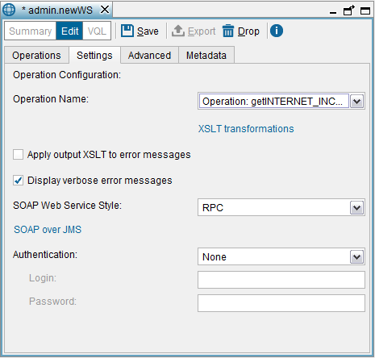
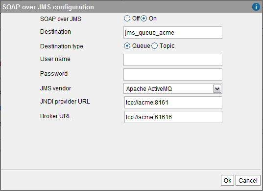

===================
Settings Tab (SOAP)
===================

In this tab, you can configure the following parameters of the SOAP Web
service:

-  XSLT Transformations. You can define XSLT stylesheets that transform
   the SOAP requests and responses to adapt them to the requirements of
   existing SOAP clients. See section :ref:`XSLT Transformations`.
-  If you want the Web service to return verbose error messages: by
   default, the Denodo Web services return verbose error messages when
   there is an error invoking one of the operations. These messages
   indicate where the problem was raised. E.g. if there was a timeout
   connecting to one of the data sources, an error executing a query,
   etc. If you do not want the clients of the Web service to get these
   verbose messages, clear the check box **Display verbose error
   messages**. In this case, the service will return a simple error
   message.
-  The Web Service style: **RPC** or **DOCUMENT**.
-  SOAP over JMS. Virtual DataPort can subscribe to a JMS server to
   listen to SOAP messages. See section :ref:`SOAP over JMS`.
-  Configure the authentication method of the SOAP version of the Web
   Service. See section :doc:`/vdp/administration/publication_of_web_services/web_services_authentication/web_services_authentication`.

   Creating a SOAP Web service: Settings tab

SOAP Over JMS
=================================================================================

SOAP is transport-independent and can be bound to any protocol. Although
it is usually used with HTTP, it can also be used with JMS (`Java Message
Service <https://www.oracle.com/technetwork/java/jms/>`_). When using SOAP over JMS 
(`SOAP over Java Message Service <https://www.w3.org/TR/soapjms/>`_), the client sends the SOAP message to
the JMS server, which forwards it to the Web service. Then, the Web
service sends the response back to the JMS server, which forwards it to
the client.

SOAP over HTTP is more interoperable as there is more support for it.
However, there are certain factors that you can only achieve using SOAP
over JMS:

-  **Scalability**. By using SOAP over JMS, clients can send requests
   without waiting for the response. That way, the server does not have
   to process all the requests as they arrive and clients are not
   blocked waiting for a response.
-  **Reliability**. The JMS server ensures that requests and responses
   are delivered. In case of any failure in the communication, the JMS
   server keeps trying to send the messages. This is important in
   environments that deal with critical data.

A Denodo SOAP Web service always processes SOAP over HTTP requests, but
you can configure it to subscribe to a JMS server to listen to SOAP
messages as well.

Follow these steps to enable this feature:

#. In the **Settings** tab, click **SOAP over JMS**. The Tool will
   display the “SOAP over JMS configuration” dialog (see `SOAP over JMS
   configuration dialog`_)
#. Select **On** to enable SOAP over JMS support.
#. **Destination** is the name of the queue or topic that Virtual
   DataPort will subscribe to, waiting for SOAP messages.
   Depending on the vendor of the JMS server, you might have to create
   the destination, or it is created automatically when the new Web
   service tries to subscribe to it.
#. Select **Queue** or **Topic**.
#. **User name** and **Password**. Credentials to connect to the JMS
   server.
#. **JMS vendor**. Select **GENERIC** if the vendor of the JMS server is
   not in the list and it can be accessed via JNDI. In this case, you
   have to provide the appropriate JNDI connection properties (see
   appendix :ref:`JMS Connection Details: JNDI Properties`).
#. Click **Ok**.

   SOAP over JMS configuration dialog

When you deploy the Web service, it connects to the selected JMS server
and subscribe to the JMS queue or topic so it can receive the messages
sent to that destination.

The responses to the requests will be sent to the destination indicated
in the “Reply to” field of the JMS message.

.. important:: A Web service with SOAP over JMS enabled needs the
   client jars of the JMS server to establish a connection with it. The
   section :doc:`Installing the JMS Connectors to Create JMS Listeners and Web
   services with SOAP over JMS <../../../../platform/installation/postinstallation_tasks/postinstallation_tasks_in_virtual_dataport/installing_the_jms_connectors_to_create_jms_listeners_and_web_services_with_soap_over_jms>`
   of the Installation Guide, explains how to
   install these client jars into the Denodo Platform.

If the Web service is deployed into an external application server, you
have to copy these jars into the ``/WEB-INF/lib`` directory of the
``war`` file, before deploying it.
