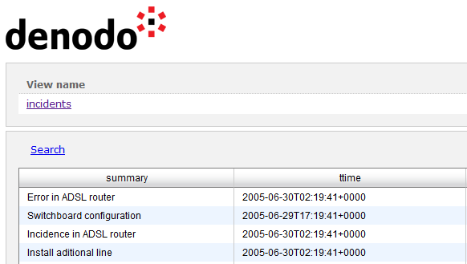

===================================
Configuring the RESTful Web Service
===================================

This section explains how to configure several settings of the global
RESTful web service (i.e. the service at \http://denodo-server.acme.com:9090/denodo-restfulws).

This section is not about the settings of REST web services (i.e. services that publish a specific set of views).

Limit the Maximum Number of Rows Returned
=================================================================================

You can limit the maximum number of rows returned by the RESTful web
service. That is, if this limit is enabled, when a client queries a
view, the number of rows in the response will never exceed this limit.

This feature is useful to make sure that there is not any client who
puts too much strain on the Virtual DataPort server or its data sources.

To set this limit, follow these steps:

#. Stop all the Denodo servers. The goal is to make sure the web container is stopped.
#. Edit the file ``other_settings.xml`` of the folder
   :file:`{<DENODO_HOME>}/resources/apache-tomcat/webapps/denodo-restfulws/WEB-INF/`
#. Set the value of the property ``maximumRowsPerPage`` to the limit you
   want to set.
#. Start the Denodo servers.

Changes to this file *will not* be overwritten by the installation
of subsequent updates of the Denodo Platform.

The Administration Tool provides graphical support to configure this
limit on REST web services (the ones that only publish a set of views).
The section :ref:`Settings Tab (REST)` explains how to do this.

Cross-origin Resource Sharing (CORS)
=================================================================================

The RESTful web service provides support for Cross-origin resource
sharing (`Cross-Origin Resource Sharing (CORS) <https://www.w3.org/TR/cors/>`_). The section :ref:`vdp-admin-publish-ws-settings-tab-cors` (settings of published REST web services) explains in more details what CORS is.

To enable the CORS support on the global RESTful web service, follow
these steps:

#. Stop all the Denodo servers. The goal is to make sure the web container is stopped.
#. Edit the file ``cors_settings.xml`` of the folder
   :file:`{<DENODO_HOME>}/resources/apache-tomcat/webapps/denodo-restfulws/WEB-INF/`
#. Uncomment the contents of the file.
#. If the value of the property is \*, the Service will allow CORS
   requests received from any domain.
   
   To limit the domains from which CORS requests are allowed, change 
   the value of the property ``cors.allowOrigin``; replace * with the list of allowed URLs. Separate each URL by a comma.   

   For example, ``https://foo.com, http://foo.com, https://foo.bar.com`` 

   CORS requests from any other origin will be denied with the HTTP code 403 (Forbidden)

   .. important:: For each URL, enter its protocol as well. URLs that not contain 
      the protocol are invalid. E.g. **foo.com** is invalid.

#. Start the Denodo servers.

Changes to this file *will not* be overwritten by the installation
of subsequent updates of the Denodo Platform.

This change only affects the global RESTful web service. If you want to
publish REST web services with CORS support, see the section
:ref:`vdp-admin-publish-ws-settings-tab-cors` (settings of published REST web services).

Customizing the Look & Feel of the RESTful Web Service
=================================================================================

The RESTful web service provides support to replace the logo displayed
at the top of the HTML representation.

|image0|

To replace the Denodo logo with another logo, follow these steps:

#. Edit the file ``denodo-customizable.css`` of the folder
   :file:`{<DENODO_HOME>}/resources/apache-tomcat/webapps/denodo-restfulws/resources/`
#. Uncomment the CSS definition ``div#page-header``.
#. In this definition, replace the URL of the attribute
   ``background-image`` with the URL of the new logo.
   
   If you want to host the new logo in the web container embedded in
   Denodo, copy it to the folder
   :file:`{<DENODO_HOME>}/resources/apache-tomcat/webapps/export/`, in the host where the Denodo server runs. After copying it there, you can link to this file with the URL :file:`https://{<host of the Denodo server>}:9090/export`.
   
   You should end up with a CSS definition similar to this one:
   
   .. code-block:: css
   
      div#page-header {
         background-image: url('https://localhost:9090/export/new_logo.png');
         background-position: top left;
         background-repeat: no-repeat;
         height: 45px;
         padding-bottom: 25px;
         position: relative;
         width: 85%;
         height: 80px;
      }
      
   

These changes are effective immediately. You do not need to restart. You may need to refresh the cache of the browsers.

Changes to this file *will not* be overwritten by the installation
the installation of subsequent updates of the Denodo Platform.

*After* following the steps above, *all* the REST web services that you
deploy or redeploy and that do not have its CSS definition customized,
will use this new CSS definition. Therefore, they will display the new
icon instead of the Denodo one.

Modifying the Connection Parameters Between the RESTful Web Service and Virtual DataPort
========================================================================================

As any client of Virtual DataPort, the RESTful web service has its own
connection parameters. In most situations, the default connection
parameters of the service are fine, but there may be scenarios where you
need to change them. For example, let us say that you are going to query
views that take a long time to respond. The default query timeout of
this service is fifteen minutes. If you think that some queries may take
longer, increase it by following these steps:

#. Stop all the Denodo servers. The goal is to make sure the web container is stopped.
#. Edit the file ``connection_settings.xml`` of the folder
   :file:`{<DENODO_HOME>}/resources/apache-tomcat/webapps/denodo-restfulws/WEB-INF/`.
#. Increase the value of the property ``queryTimeout``. Note the value
   of this property is in milliseconds.
   
   You can also modify other properties of this file if you need to.
   Each property has a comment above explaining it.
#. Start the Denodo servers.

Changes to this file *will not* be overwritten by the installation
of subsequent updates of the Denodo Platform.

This change only affects the global RESTful web service. Each REST web
service has its own connection parameters.

Enabling Processing Functions in the Parameter $select
=========================================================

By default, in the global RESTful web service, the value of the input parameter "$select" can only be a list of fields separated by comma (see more about this in :ref:`Parameters supported by the Denodo RESTful Web service and published REST Web services`).

You can configure this service so the value of $select can be a list of functions, not just field names. To do this, follow these steps:

#. Stop all the Denodo servers. The goal is to make sure the web container is stopped.
#. Edit the file :file:`{<DENODO_HOME>}/resources/apache-tomcat/webapps/denodo-restfulws/WEB-INF/other_settings.xml`.

#. At the end of the file, add the following:

   .. code-block:: xml

      <env-entry>
          <env-entry-name>processFunctionsInSelectParameter</env-entry-name>
          <env-entry-type>java.lang.Boolean</env-entry-type>
          <env-entry-value>true</env-entry-value>
      </env-entry>

#. Start the Denodo servers.

Changes to this file *will not* be overwritten by the installation
of subsequent updates of the Denodo Platform.

This change only affects the global RESTful web service. You can control this feature for each REST web service with the option *Process functions in $select parameter* (tab *Advanced* of the configuration of the service).

