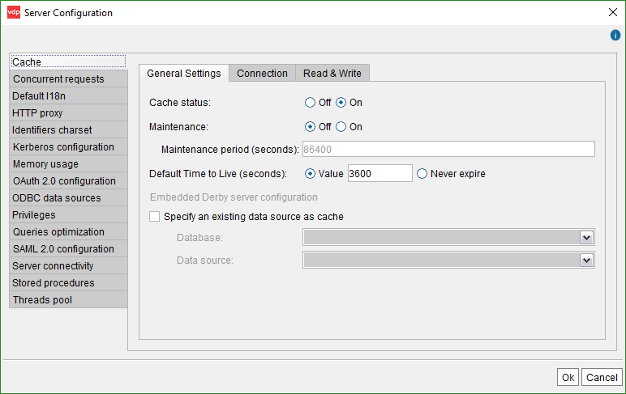
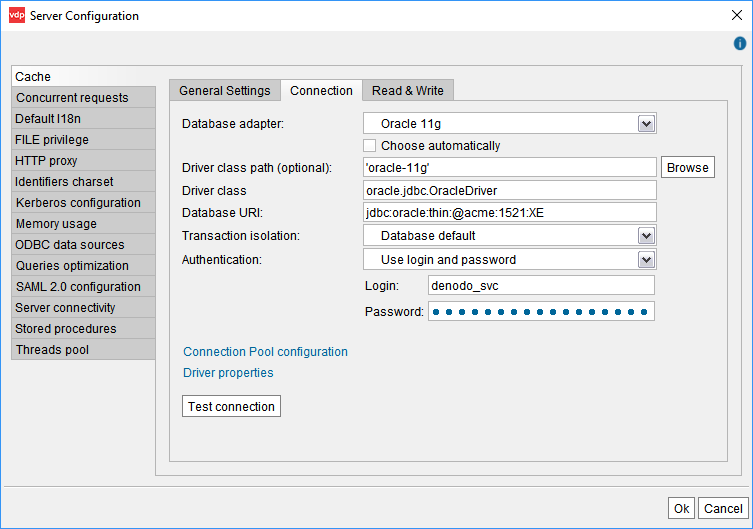
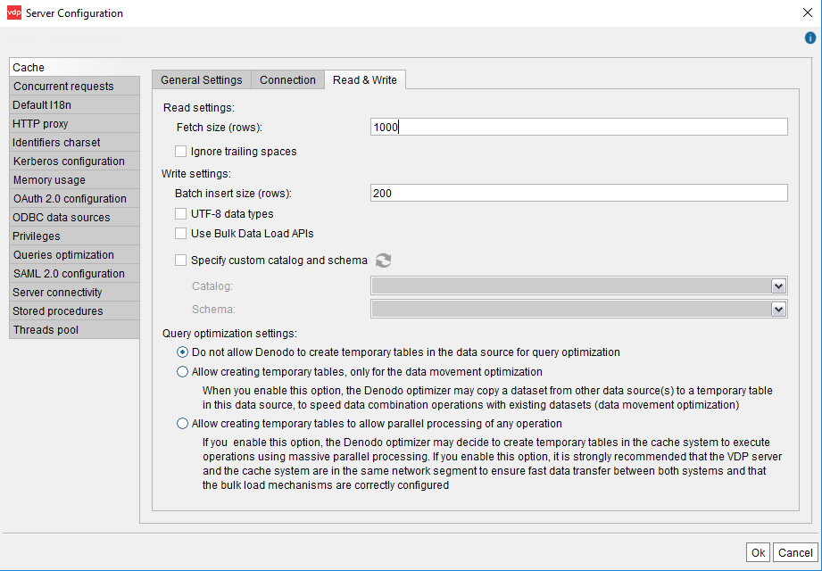

=====================
Configuring the Cache
=====================

Virtual DataPort incorporates a system called *cache* *module* that can
store a local copy of the data retrieved from the data sources, in a
JDBC database.

This section explains how to enable the cache engine in the Server.
After this, the cache has to be configured for every view that you want
its data to be cached (the section :ref:`Configuring the Cache of a View` explains how to do this).

See more information about how the cache works in the section :ref:`Cache
Module`.

To activate the cache in the Server, click on the menu **Server configuration** > **Administration**. 
Then, click the **Cache** tab.

This dialog is divided in three tabs:

.. rubric:: General Settings tab

-  Select **Cache status on** to enable the cache engine.

-  **Maintenance Period (seconds)**: specifies how often the Server
   executes the *Cache Maintenance Task*. This task deletes the invalid or
   expired entries from the cache’s database.

   The difference with “Time to Live” is that when an entry of the cache
   reaches its “Time to live”, expires but it is not deleted from the
   database. Instead, it is just ignored when retrieving data from the
   cache.
   
   The “Maintenance Period” should be greater than the “Time to Live”
   because removing expired entries from the cache is more expensive than
   ignoring them.
   
   Select **Maintenance** **Off** to avoid executing the cache maintenance
   task periodically.
   
   .. note:: In production environments, we strongly recommend settings
      this option to “Off” to avoid executing the Cache Maintenance task
      periodically. Instead, use the Denodo Scheduler to program the execution
      of the ``CLEAN_CACHE_DATABASE`` procedure at a period where the Server
      and the cache’s database are not expected to be under heavy load.
   
   The section :ref:`Cache Maintenance Task` explains in more detail what the
   Cache Maintenance task does.
   

-  **Default Time to Live for views (seconds)**: This is the default Time
   to Live for views with cache enabled.
   
   If **Never expire** is selected, the entries of the cache never
   expire, unless indicated otherwise in the view’s cache configuration.

-  If the cache is stored in the embedded Derby database, some parameters
   can be configured by clicking **Embedded Derby Server Configuration**:

   -  **Enable Remote Access**: it allows the embedded database to be
      accessed by external JDBC-compliant clients. This can be useful for
      auditing and monitoring purposes.
   -  **Server port**: this option allows changing the port where the
      embedded database runs.

-  To use an existing JDBC data source to cache data, select **Specify an existing data source as cache**
   and select the data source using the combo boxes. By using this option, Denodo will be able to
   completely push down the queries that combine cached data and views from this data source.

.. note:: When you select *Specify an existing data source as cache*, consider the security 
   implications of enabling "pass-through session credentials" on 
   this data source. If you enable this option, you will need to grant read access to 
   these users on the cache database. These users will be able to connect directly 
   to this database, not just from Denodo and they will be able to by-pass the row restrictions, column 
   restrictions and other privileges set in Denodo.

   
   Cache configuration: General Settings tab

|

.. rubric:: Connection tab

-  **Database adapter**: type of the database management system (DBMS)
   which will be used as cache.
   Virtual DataPort embeds an `Apache Derby <http://db.apache.org/derby/>`_ 
   database, which can be used to store the
   cache data by selecting the **Embedded Derby Server** check box. In
   this case, you do not have to fill in any other field.
   
   This embedded database can be configured to be accessible remotely by
   clicking on **Embedded Derby server configuration** (see below for
   more detail).
   
   If you select the **Generic** adapter, you may have to do additional
   configuration steps (read section :ref:`Generic Support for Other
   Databases`).
   
-  **Driver class path**: unless you selected the adapter *Generic*, the default value is correct. Each adapter has a default value, which is the directory where Denodo will load the JDBC driver from.

   If Denodo does not include the driver of the selected adapter, copy it to the folder :file:`<DENODO_HOME>/lib-external/jdbc-drivers/{database name - version}`. For example, if you selected Teradata 15, copy the driver to :file:`<DENODO_HOME>/lib-external/jdbc-drivers/{teradata-15}`. You do *not* need to restart after copying the driver there. Sometimes a JDBC driver is a set of jars and in that case, you need to copy all of them to this folder.

   Check the table :ref:`JDBC Drivers supported by Virtual DataPort` of the appendix "Supported JDBC Data Sources" to see
   if Denodo includes the driver.

   |
   
   Alternatively, you can enter a path to the jar file(s) of the JDBC driver. To do this, click **Browse** to select them. To select more than one jar, hold **Ctrl** and select each jar. You can also select a folder and all the jar files in it will be loaded. When clicking **Browse**, you browse the file system of the host where the Server is running and not where the Administration Tool is running.

   .. note:: Whenever possible, use the default value because it will facilitate migrating elements between environments (e.g. from development to testing). If you indicate the path to the driver instead of copying to the appropriate folder, that path may not exist in the host to which you migrate this data source.

-  **Driver class**: Unless you selected the adapter *Generic*, the default value is correct. This is the Java class name of the JDBC driver.
   For example, for MySQL databases the value is ``com.mysql.jdbc.Driver``.

-  **Database Uri**: URI of the database used as cache.

-  **Transaction isolation**: isolation level of the transactions and
   queries executed in the database of the cache.
   The available options are:

   -  **Database default**: the Server uses the default isolation level of
      the database.
   -  **Read uncommitted**: a transaction can read data that is not
      committed (dirty reads).
      
      For example, a transaction A inserts a row in a view, transaction B
      reads the new row and then, transaction A rollbacks.
   -  **Read committed**: the database keeps write locks until the end of
      the transaction so a transaction can read only committed data and
      dirty reads cannot occur.
      
      However, the database releases read locks as soon as the ``SELECT``
      operation ends, so the same ``SELECT`` query may return different
      results in the same transaction (non-repeatable reads).
      
      For example, transaction A reads a row and transaction B changes this
      row. If transaction A reads this row again, it will obtain different
      values.
   -  **Repeatable read**: the database keeps read and write locks until
      the end of the transaction. Therefore, it avoids dirty reads and
      non-repeatable reads. However, this isolation level does not avoid
      phantom reads. This problem occurs when one transaction executes a
      query over a range of rows using a condition, while another
      transaction can simultaneously insert a row in the same range.
   -  **Serializable**: this is the highest isolation level and avoids
      dirty reads, non-repeatable reads and phantom reads by locking range
      of rows or the entire tables.

-  **Authentication**: the options are:
   
   -  **Use login and password**: connect to the cache database using the login and password you enter.

   -  **Use Kerberos**: connect to cache database using Kerberos authentication. The section 
      :ref:`Connecting to a JDBC Source with Kerberos Authentication` contains information that also apply to the configuration of the cache.

   This user account needs to have privileges to create and delete tables and indexes and, execute INSERT, UPDATE and DELETE requests.

-  Click **Connection Pool configuration** to configure the parameters of
   the connections pool used to access the cache database (see section
   :ref:`Importing JDBC Sources`).

-  Click **Driver properties** to add properties that will be used as
   arguments when establishing a connection with the database.

-  Click **Test Connection** to check that the Server can connect to this database using the settings you entered.

   
   Cache configuration: Connection tab

|

.. rubric:: Read & Write tab

-  **Fetch size (rows)**: it gives the JDBC driver a hint as to the number
   of rows that should be fetched from the cache’s database when more rows
   are needed.

-  **Stream tuples** (only when selecting a “MySQL” adapter): if
   selected, when the Server executes a query in the database to retrieve
   cached data, it will force MySQL to stream the results to the Server
   one row at a time. Otherwise, MySQL will not send the results of the
   queries to the Server until it has finished the query.
   
   Select this check box if you plan to store and retrieve from the cache
   the result of queries that return large data sets, which may not fin
   the heap space of the Server’s Java Virtual Machine. If this is not
   the case, clear this check box because it will probably result in
   faster execution times.

-  **Ignore trailing spaces**: if selected, the Server removes the space
   characters at the end of ``text`` type values of the results returned by
   this data source’s views.

-  **Use external tables for data movement**: (only when selecting a
   “Netezza” adapter): if selected, when the cache engine reads data from
   Netezza to insert it into another Netezza database that has the option
   “Use Bulk Data Load APIs” selected, it will do so using its “External
   tables” feature. See more about the data movement optimization in the
   section :ref:`Data Movement`.

-  **Batch insert size (rows)**: when the cache engine caches data, it
   executes an ``INSERT`` statement in the cache’s database, for each row
   it has to store in the cache. These ``INSERT`` statements are executed
   in batches to speed up the process of loading the cache.
   
   This value sets the number of ``INSERT`` queries per batch.

-  **UTF-8 data types**: when you enable cache on a view, the Server
   creates a table in the cache database to store the cached data of this
   view. The impact of selecting or clearing this check box depends on the
   type and subtype of each field of the view:

   -  For the fields whose subtype is defined, the Server will define the
      field in the cache table with the subtype of the field. For example, if
      the subtype of a text field is VARCHAR and its size is 200, the Server
      will define the field as VARCHAR(200).

   -  For the fields whose subtype is undefined:

      -  If the type of the field is *not* text, the data type to store them is
         always the same regardless of whether this check box is selected or not.
         The Server uses the appropriate types depending on the database used for
         caching.

      -  For the fields of type text whose subtype is undefined, one of this can
         happen:

         a. If “UTF-8 data types” is *selected*, the Server will define the field
            in the cache table with a data type that can store all the UTF-8
            characters. These data types use more space in the database that
            regular text data types.
         b. If “UTF-8 data types” is *cleared*, the Server will define the field
            as VARCHAR.
            
            
            
   In the “Summary” tab of a view, the tooltip of the “Field type” column
   displays if the subtype of the field is defined or not: if it just shows
   a field type (int, text, date, etc.), the subtype is undefined. If the
   tooltip also has the label “Source type properties”, the subtype of the
   field is defined.
    
   The data types capable of storing all the UTF-8 characters use more disk
   space in the database.
          

-  **Use Bulk Data Load APIs** (only for some databases): if
   selected, when the cache database is the target of a data movement,
   Virtual DataPort will use the native API of the database to load data
   onto the database, instead of executing ``INSERT`` statements.

   The section :ref:`Bulk Data Load` explains how Virtual DataPort uses these APIs.

-  **Specify custom catalog and schema**: select this if you want to create the tables and indexes of the cache on a 
   catalog and/or schema that is not the default one.
   Then, click |image0| to obtain the list of catalog and schemas from the database and select them.
   
   Depending on the database, the lists *Catalog* or *Schema* can be disabled if the database only 
   has catalogs and not schemas or vice versa.   

-  **Query optimization settings** (only available for some database adapters): the options below control if the query optimizer is allowed to insert data obtained from other data sources into the cache database to be able to push more operations to this database instead of executing them locally, in the Virtual DataPort server.
   
   -  **Do not allow Denodo to create temporary tables in the data source for query optimization**: the query optimizer will not move data into the cache database to execute queries.

   -  **Allow creating temporary tables, only for the data movement optimization**: if selected, the optimizer 
      may select the cache database as the destination of :ref:`data movements<Data Movement>`.
  
   -  **Allow creating temporary tables to allow parallel processing of any operation** (only for some parallel databases): if selected, the optimizer
      may select the cache database as the destination of data movements. In addition, it may create temporary tables with data to push down :ref:`massive parallel operations<Parallel Processing>` to this database. If selected, make sure that:

      i. The Virtual DataPort server and the database are in the same network segment to ensure the data is transferred fast between both systems.
      #. You selected the check box *Use bulk data load APIs* on this data source so the data is inserted as fast as possible into this database.

   
   Cache configuration: Read & Write tab

The first time Virtual DataPort uses an external DBMS to store the
cached data, it will generate the required tables and indexes
automatically.

Any configuration changes will become immediately effective except when
the cache DBMS is changed, in which case the Virtual DataPort Server
must be restarted.

By default, views do not store its data in the cache. Therefore, after
enabling the cache module, you also need to activate the cache option in
the views that require it. The section
:ref:`Configuring the Cache of a View` explains how to do it.

.. note:: When using an external database to store the cache data, the
   database must be started before the Virtual DataPort Server.

By default, all the Virtual DataPort databases have the same cache
configuration. However, you can change the cache configuration for a
specific database. This will affect the elements created inside this
database. The section :ref:`Configuring and Deleting Databases` explains how
to configure the cache of a specific database.

The entries in the cache are invalidated when they reach their "Time to
Live". However, you can invalidate manually the cache of a specific view
(see :ref:`Configuring the Cache of a View`) or
a set of views (see section :ref:`Invalidate Cache`).

.. |image0| image:: ../../common_images/refresh-green.png

