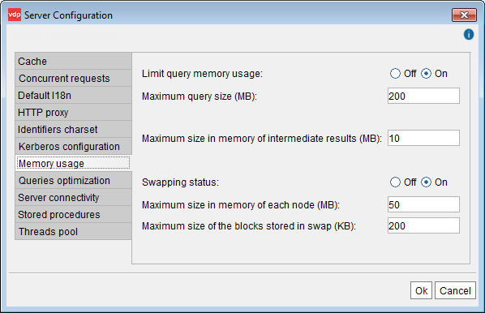

================================================
Configuring the Memory Usage and Swapping Policy
================================================

Virtual DataPort provides three methods to avoid memory overflows when
dealing with huge datasets:

#. Stop retrieving data from a source when the size of these data that
   have not been processed, exceeds a certain limit (“Maximum size in
   memory of intermediate results (MB)”).
#. The swapping mechanism, which stores in secondary storage the
   intermediate results of the execution of a query, if their size
   exceeds a certain limit. It also swaps the intermediate results of
   the sorting operations (queries with an ``ORDER BY`` involved).
   This is configured with “Swapping status” and “Maximum size in memory
   of each node (MB)”.
#. Limit the maximum memory used by any query (“Maximum query size
   (MB)”).

To change these settings, click **Server configuration** on the menu
**Administration** and then, click **Memory Usage** (see `Memory Usage
configuration`_).

   Memory Usage configuration

By default, all the databases and their views use the memory usage and
swapping configuration set in this dialog. However, a database or a view
may have its own settings.

Read the section :ref:`Configuring and Deleting Databases` to learn how to
change these settings for a specific database and section :ref:`Memory Usage
and Swapping Policy of Views`, to change these settings for a specific
view.

Note that the settings of a database override the Server ones and the
settings of a specific view override the database ones.

Memory Usage Settings
=====================

When a user queries a view, Virtual DataPort retrieves the necessary
data from the sources. In certain scenarios, the Server is able to stop
obtaining data from these sources for a while and resume later. For
example:

-  One of the sources may provide the required data faster than the
   other. E.g., you are querying a join view that involves two JDBC data
   sources. One of them connects to a database that runs on a very
   powerful machine and the other connects to another database that runs
   on a slow machine.
-  The query involves a join view with a complex join condition that
   takes more time to evaluate that what it takes to retrieve data.

In these scenarios, when the size of the data from a source that have
not been processed yet, exceeds the value of the field **Maximum size in
memory of intermediate results** (megabytes), the Server will stop
retrieving more data from this source. After the Server has processed
some of these data so the size of the data stored in memory decreases,
the Server will resume obtaining data.

Swapping Settings
=================

Click **Swapping status on** to enable the swapping engine for all the
views that have the option “Swapping status Default” selected in its
“Advanced” dialog. You can also change the default value of the
following parameters:

-  **Maximum size in memory of each node** (megabytes). During the
   execution of a query, the Server swaps to disk the intermediate
   results produced during the execution, if these results exceed the
   maximum size specified in this parameter.

-  **Maximum size of the blocks written to disk** (Kbytes). Whenever the
   Server swaps to disk intermediate results, the size of the files that
   store these results is, at most, the value of this parameter.
   The changes in these settings will become effective immediately.

Virtual DataPort swaps data to disk in the following scenarios:

#. *Order by*: In views/queries that perform an ORDER BY that is not
   delegated to the source. In this scenario, the Server has to wait until
   it receives all the rows of the result set to begin ordering them. If
   the size of the data received exceeds the *Maximum size in memory of each node*, the
   Server begins swapping to disk the data that has to be ordered. After
   receiving all the data, the Server begins ordering it.

#. *Group by*: In views/queries that perform a GROUP BY operation that is
   not delegated to the source. In this scenario, the Server has to wait
   until it receives all the rows of the result set to begin this
   operation. If the size of the data received exceeds the *Maximum size in memory of each node*, the Server begins swapping to disk the data that has to be
   ordered.
   
   There are several exceptions under which the Server does not has to
   swap any data to disk:

   a. When the view/query projects the value of a field
   b. When the view/query projects the result of a “cumulative” function.
      That is, it projects these functions: ``AVG``, ``COUNT``, ``SUM``,
      ``MAX`` or ``MIN``.

#. *Hash join*: when the Server executes a hash join, first it loads all
   the data from the right branch of the join and then begins processing
   the data from the left branch. If the size of the data from the right
   branch exceeds the “Maximum size in memory”, the behavior of the Server
   changes depending on the join condition:

   a. If the join condition uses the operators =, <, <=, > or >=, the
      Server sorts the data of both branches by the join attributes, and
      then switches the join strategy to merge.
      To be able to sort the data, it swaps data to disk.
   b. If the join condition uses a different operator (e.g. ``like``), the
      Server begins swapping to disk the data from the right branch of the
      join. After obtaining all the data from the right branch, it begins
      reading the swapped data block by block to execute the join.
   

#. *Minus* and *intersect* operations: in terms of memory management and
   swapping, these operations behave as hash joins. Therefore, the Server
   swaps data to disk in the same scenarios.

#. *Merge join*: merge join is the most efficient join method and its
   memory footprint is generally very low. However, there are two scenarios
   where its memory consumption is higher:

   a. When in the rows from the right branch of the join, there are a lot
      of rows in which the join attributes have the same value.
   b. Or, when the join condition uses a non-equal operator. I.e. instead
      of =, it uses <, <=, >, >=, like, etc.

   In these scenarios, the Server has to keep in memory a lot of rows from
   the right branch of the join to be able to check if they match with the
   rows from the left branch. When the amount of data from the right branch
   exceeds the “Maximum size in memory”, the Server begins to swap to disk
   the data from the right branch.

#. *When caching data*: When the cache is enabled for a view and the
   Server executes a query that involves caching data of this view, the
   Server has to store the results in the cache database and at the same
   time, return these results to the client that executes the query.
   Storing data in the cache database is usually slower than returning it
   to the client. Therefore, the Server has to keep in memory the results
   that has not cached yet. When the size of this data exceeds the
   “Maximum size in memory”, the Server begins swapping to disk these
   results and slowly retrieving them to insert them in the cache
   database.
   
   There is an exception to this: when you add the parameter
   ``'cache_return_query_results' = 'false'`` to the ``CONTEXT`` clause of
   the query. In this case, the Server does not need to swap the results
   of the query to avoid a memory overflow.

.. note:: You can configure the use of “swapping” dynamically for a
   specific query using the VQL ``CONTEXT`` clause. See more about this in
   the section :ref:`Configuring Swapping Policies` of the VQL Guide.

Maximum Size of a Query
=======================

By default, Virtual DataPort limits the total amount of memory used by a
query. To change this limit, change the value on the **Maximum query
size (MB)** box.

The section :ref:`Memory Management` explains how the memory management
works in Virtual DataPort and its subsection :ref:`Limit the Maximum Amount
of Memory of a Query` focuses on how the limit set in this wizard is
enforced.

