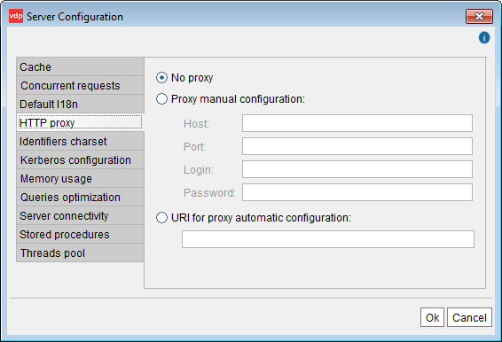

===================================
Default Configuration of HTTP Proxy
===================================

Some VDP data sources can use http routes to access source data. The
data sources that use the “Default proxy configuration” will use the
settings of this wizard.

To configure the default proxy preferences, click **Server
configuration** on the menu **Administration** and then, click **HTTP
proxy** (see `HTTP Proxy Configuration`_).

In this dialog, you can enter the details of the proxy or provide the
URL of a ``proxy.pac`` file that contains the configuration parameters
of the proxy.

To enter the proxy parameters manually, click **Proxy manual
configuration** and provide a value for the following parameters:

-  **Host**. Name of the machine that acts as Proxy.
-  **Port**. Port number of the Proxy server.
-  **Login**. User identifier used to authenticate in the proxy. If the
   proxy does not require authentication, it must be left blank.
-  **Password**. User access password. If the Proxy does not require
   authentication, it must be left blank.

To provide the URL of a ``proxy.pac`` file, click **URI for proxy
automatic configuration** and enter the URL of the file in the box
below.

In the data sources that have an HTTP path, you can set a proxy
configuration different from the default one.

   HTTP Proxy Configuration
