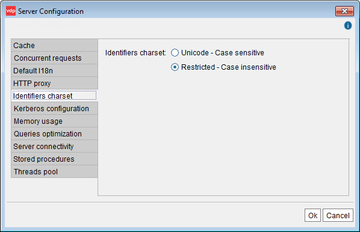

===================
Identifiers Charset
===================
   

Virtual DataPort supports Unicode characters in the name of most of its
elements: databases, user names, roles, data sources, wrappers, views
and their fields, etc.

Virtual DataPort allows you to select one of the following char sets for
the entire Server and also, one for each database:

#. Restricted (default one): you can only use basic characters in the
   name of elements and the fields of the views. See section :ref:`Restricted
   Mode`.
#. Unicode: you can use any character in these names. See section
   :ref:`Unicode Mode`.

Changing from one char set to another, *only* changes which characters
can the users use when creating/editing views from the Administration
Tool. It does *not* affect the behavior of the Server.

Restricted Mode
===============

When the Server or a database is in *Restricted mode*, the
Administration Tools that connect to this Server or database have the
following behavior:

-  You can only create elements (user names, data sources, wrappers, views,
   etc.) whose identifiers follow these rules:

   -  The first character has to be one of these:

      -  ``a`` to ``z``. If you enter uppercase letters, they Tool
         automatically converts them to lowercase.
      -  The Unicode characters with the code point from 200 to 377.

   -  The next characters have to be one of these:

      -  ``a`` to ``z``.
      -  Numbers
      -  The underscore: ``_``.
      -  The Unicode characters with the code point from 200 to 377.

When an element is created in this mode, its identifier is case
insensitive. E.g. the query ``SELECT * FROM incidences`` is equivalent
to ``SELECT * FROM INCIDENCES``.

Unicode Mode
============

When the Server or a database is in *Unicode mode*, the Administration
Tools that connect to this Server or database have the following
behavior:

-  The identifiers of elements (data sources, wrappers, views and their
   fields, etc.) can contain any character.
-  When the name contains one or more characters that do not belong to
   the “Restricted char set” (see the section :ref:`Restricted Mode`), the
   Administration Tool automatically surrounds the name with double quotes in the VQL statement it sends to the
   Virtual DataPort server.
   
   For example,
   
   .. code-block :: sql
     
      CREATE VIEW "例" AS... or SELECT * FROM "Categories".
   
   
-  The Tool automatically adds the double quotes whenever is necessary.
   You only have to add them when creating views manually from the VQL
   Shell or a JDBC client.

.. note:: View names starting with ``_`` are not supported.

When the Server or the database is in Unicode mode, the name of an
element is case-sensitive if at least one of these conditions are met:

-  The name is surrounded by double quotes and at least one character
   is uppercase.
-  Or, the name has characters that do not belong to the “Restricted
   char set”. If all the characters belong to the “Restricted char set”,
   the name is case insensitive.

If an element is case-sensitive you always have to surround its name
with double quotes. For example,

.. code-block :: sql
 
   SELECT * FROM "Incident",
   ALTER TABLE "Phone_INC", 
   etc.

You cannot create elements of the same type with the same name but
different case. E.g.: you cannot create the views ``"incident"``
and ``"INCIDENT"``.

In the VQL statements generated by the Server, if the name of an element
is surrounded by double quotes ("") it means the name is case-sensitive.

If an element listed in the Server Explorer of the Administration Tool has
a name with at least one upper case character, it was created with
double quotes and therefore, it is a case sensitive element. Because of
this, the name of this element has to be surrounded with double quotes.

|

By default, the Unicode support is disabled and can be enabled for the
entire Server or just for some of its databases.

To enable this support for the entire Server, click **Server
configuration** on the menu **Administration** and then, click
**Identifiers charset** (see `Identifiers charset dialog`_).

In this dialog, click **Unicode** -**Case sensitive** and click **Ok**.

   Identifiers charset dialog

The Unicode support can also be enabled only in some databases (see
section :doc:`Creating Databases </vdp/administration/databases_users_and_access_rights_in_virtual_dataport/administration_of_databases_users_roles_and_their_access_rights/creating_databases>`).

