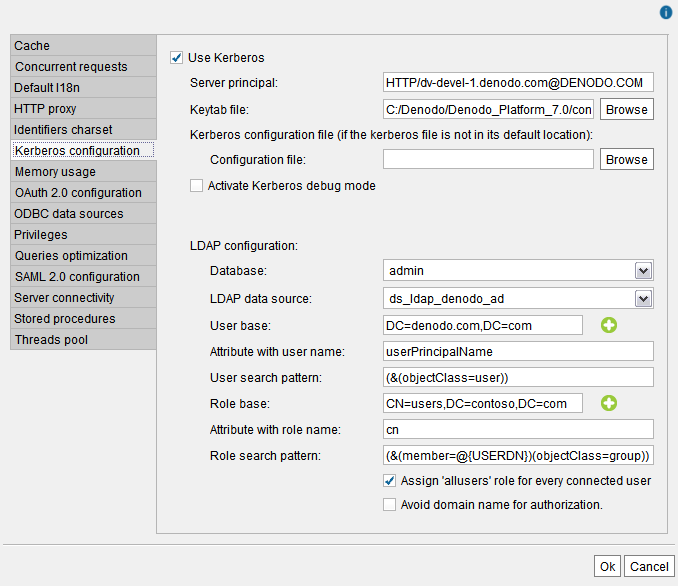

=====================================================================
Setting-Up the Kerberos Authentication in the Virtual DataPort Server
=====================================================================

To set up the Kerberos authentication in Virtual DataPort, first you need to do the :ref:`post-installation tasks regarding Kerberos <Setting-up Kerberos Authentication>` described in the Installation Guide.

After this, copy the keytab file to the host where the Virtual DataPort server runs. For example, to :file:`{<DENODO_HOME>}/conf`.

After this, login with the Administration Tool as an administrator user,
click the menu **Administration** > **Server configuration** and then, click the tab **Kerberos configuration**.

   Kerberos configuration wizard

In this wizard, provide the following details:

#. Select **Use Kerberos**.

#. In the box **Server principal** enter the “Service Principal Name” (SPN)
   used to create the *keytab* file.
   
   For example, if you created the SPN with the command
   
   .. code-block:: batch
   
      setspn -S HTTP/denodo-prod.subnet1.contoso.com@CONTOSO.COM CONTOSO.COM\denodo_server
   
   enter ``HTTP/denodo-prod.subnet1.contoso.com@CONTOSO.COM``.

#. In the box **Key tab file** enter the path to the *keytab* file. 

   .. important:: Enter the absolute path to the file, not a relative one.

#. Leave the **Kerberos configuration file** box empty unless your environment meets one of these conditions:

   - The host where Virtual DataPort runs *does not* belong to a Kerberos realm (e.g. a Windows Active Directory domain). 
   - Or the host where Virtual DataPort runs is Linux/Unix.
   - Or you are in a cross-domain scenario. That is, the organization has several domains.
   
   If the environment meets any of these conditions, enter the path to the file ``krb5.conf`` or ``krb5.ini``  
         
   Usually, the administrators of the Active Directory can provide a krb5 file. It is better to use one of an application that already uses Kerberos authentication to make sure it is correct.

#. The first time you set up Kerberos, we recommend selecting the check box **Activate Kerberos debug mode**
   in case you run into any issues. Once Kerberos has been set up, disable this.

   .. rubric:: Virtual DataPort with the update 20190903 or newer:
   
   If you installed the update 20190903 or newer, to obtain the Kerberos debug messages, open the file :file:`{<DENODO_HOME>}/conf/vdp/log4j2.xml` and add the following line *right below* the line ``<Loggers>``:

   .. code-block:: xml

      <Logger name="com.denodo.util.logging.JavaConsoleLogging" level="debug" />

   Restart Virtual DataPort to apply the changes to this file.
      
   You will find the Kerberos debug messages in :file:`{<DENODO_HOME>}/logs/vdp/vdp.log`.

   .. rubric:: Virtual DataPort with the update 20190312 or older:
   
   If you installed the update 20190312 or older, to obtain the Kerberos debug messages with the update, launch Virtual DataPort from the command line and redirect the output to a file. That is because the Kerberos debug messages are logged to the standard output, not the log files. To do this, execute this:
   
   On Windows:
   
   .. code-block:: batch
   
      cd <DENODO_HOME>\bin
      vqlserver_startup.bat > server_kerberos_logging.log 2>&1
      
   On Linux:
   
   .. code-block:: bash
   
      cd <DENODO_HOME>/bin
      ./vqlserver_startup.sh > server_kerberos_logging.log 2>&1

   You will find the Kerberos debug messages in the *local file* :file:`{<DENODO_HOME>}/bin/server_kerberos_logging.log`.
   
   When you disable the Kerberos debug mode, you no longer need to redirect the output to a file.

#. Set up the LDAP configuration to retrieve the roles assigned to the
   users that are authenticated with Kerberos.

   a. **Database**: select the database of Virtual DataPort where you have
      stored the LDAP data source created in the previous section.
   #. **LDAP data source**: select the data source.
   #. **User base**: node of the Active Directory that is used as scope to
      search nodes that represent users. You can enter more than one “User
      base” by clicking the button |image1| beside the “User base” box. When there is more than one “User
      base”, the Server searches the user’s node in the first “User base”
      scope. If the Server does not find the node that represents the user, it
      searches it in the second “User base” scope. If it also fails, in the
      third, etc. If the Server does not find the node that represents the
      user, it denies access to the user.
   #. **Attribute with user name**: name of the attribute that contains the
      user name of users, in the nodes that represent users.
      
      Usually, this has to be "userPrincipalName".
      
   #. **User search pattern**: pattern used to generate the LDAP queries
      that will be executed to obtain the nodes that represent the users
      that try to connect to the Server.
   #. **Role base**: node of the LDAP server that is used as the scope to
      search the nodes that represent roles that users of this database can
      have. You can enter more than one “Role base” by clicking the button
      |image1| beside the “Role base” box. The LDAP query formed with the
      “Role search” pattern will be executed in every “Role base” scope.
   
   #. **Attribute with role name**: name of the attribute that contains the
      name of the role, in the nodes that represent roles.
   #. **Role search pattern**: pattern used to generate the LDAP queries
      that will be executed to obtain the nodes that represent the roles of
      a user. This pattern has to contain the token ``@{USERDN}`` or ``@{USERLOGIN}`` (it cannot contain both):
   
      -  ``@{USERDN}`` will be replaced with the Distinguished Name of the user that tries to connect to this database. For example, "CN=john,CN=Users,DC=acme,DC=loc".
      
      -  ``@{USERLOGIN}`` will be replaced with the login name of the user that tries to connect to this database. For example, "john".

   #. Select **Assign "allusers" role for every connected user** to grant
      the privileges of the role “allusers” to all the users that log in
      successfully even if this role has not been assigned to the user in
      the LDAP server.
      
      For example, if you want all users to have read access over a particular database, select this option and grant this privilege to the role “allusers”.

      This option does not modify the roles granted to the user in the LDAP server. This means that if you later clear this check box, the users that log in will not have the privileges granted by the role “allusers”.
      
   #. If in the Active Directory, the attribute you entered in *Attribute with user name* only stores the user account of the users but not the domain name, select **Avoid domain name for authorization**. For example, if the attribute stores "mphilips", not "mphilips\@contoso.com"
   
      The login name contained in a Kerberos ticket includes the domain name (e.g. "mphilips\@contoso.com"). This is what, by default, the Server filters by when searching the entry of this user in Active Directory. If *Attribute with user name* is "userPrincipalName" and this attribute has the login name "mphilips" and not "mphilips\@contoso.com", the authentication will fail unless you select this check box.
      
      If you select this check box, the Server will search for entries whose "userPrincipalName" is "mphilips".
   
   
   The appendix :ref:`Useful Tools to Debug Issues with Active Directory or
   Other LDAP Servers` contains a list of tools useful to debug problems
   related to finding a user and its roles in the Active Directory and other LDAP servers.

|

Once you restart the Server, the Kerberos authentication will be available for:

-  JDBC clients that use the appropriate driver properties. The section :ref:`Connecting to Virtual DataPort Using Kerberos Authentication` of the Developer Guide lists these properties.

-  Administration tools :ref:`configured to use Kerberos authentication<Configuring the Administration Tool to Use Kerberos Authentication>`.

When the Denodo JDBC driver and the administration tool establish a connection, they negotiate with the Server the type of authentication (user/password or Kerberos). So, by default, after enabling Kerberos in the Server, they will be able to keep using user/password authentication. If before you enabled Kerberos, they were able to connect (you created the user accounts in Virtual DataPort or set up databases with LDAP authentication), they will still be able to connect with user and password.

For ODBC clients, see the section :ref:`below <Enabling Kerberos Authentication for ODBC Clients>`.
   
Enabling Kerberos Authentication for ODBC Clients
=================================================

To enable Kerberos authentication for ODBC clients, follow these steps:

1. Click the menu **Administration** > **Database management**.
#. Select one database and click **Edit**.
#. In **ODBC/ADDO.net authentication type**, select **Kerberos**.
 

You have to do this for all databases you want its ODBC clients to use Kerberos. 

.. note:: When you enable Kerberos authentication on a database, ODBC clients can no longer use user/password authentication to connect to this database. Therefore, existing ODBC clients will have to be reconfigured to use Kerberos.

   The reason is that, unlike for JDBC clients and the administration tool, the authentication method used in the ODBC interface is set by the Server, not the client. 

.. |image1| image:: ../../common_images/icon-plus3.png

Disable Kerberos Replay Cache
===============================

A replay cache (or “rcache”) keeps track of all the tickets recently presented by a client application that connects to Denodo. The purpose of this cache is that if a duplicate authentication request is detected in the replay cache, the Server refuses the connection and returns an error to the client. This mechanism avoids "replay attacks". 

There are scenarios where replays are adequately defended against or where performance or other considerations
outweigh the risk of replays. If that is the case, you may want to disable this protection. To do this, add the following system property to the Java Virtual Machine (JVM) settings of the Virtual DataPort server.

.. code-block:: batch

      -Dsun.security.krb5.rcache=none

After adding this property, restart the Virtual DataPort server for the change to take effect. After this, a client can use the same Kerberos ticket during all its validity period.

:ref:`This section <Virtual Machine and Web Container Configuration>` explains how to change the JVM settings from the Control Center. This :ref:`other section <installation_guide_configuration_of_the_jvm_parameters_from_the_command_line>` explains how to change it from the command line.
