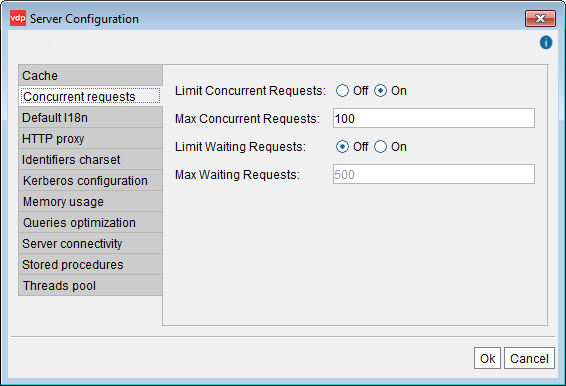

==========================================
Limiting the Number of Concurrent Requests
==========================================

It is possible to limit the number of requests that the Virtual DataPort
Server will accept concurrently. When that limit is reached, the new
requests will be queued and executed according to their arrival order.

Limiting the number of concurrent requests is useful in high load
environments, since it avoids performance degradation issues when there
is a peak load.

To change these settings, click **Server configuration** on the menu
**Administration** and then, click **Concurrent requests** (see
`Concurrent Requests configuration`_).

In this dialog, you can configure the following parameters:

-  **Activate/deactivate the limitation of concurrent requests**. If
   deactivated, the server will try to execute all requests as they
   come.
-  **Maximum number of concurrent requests**. The Virtual DataPort
   server will only accept this number of concurrent requests.
-  **Maximum number of requests on queue**. Maximum number of queued
   requests waiting to be executed. New requests beyond this number will
   be discarded.

   Concurrent Requests configuration

