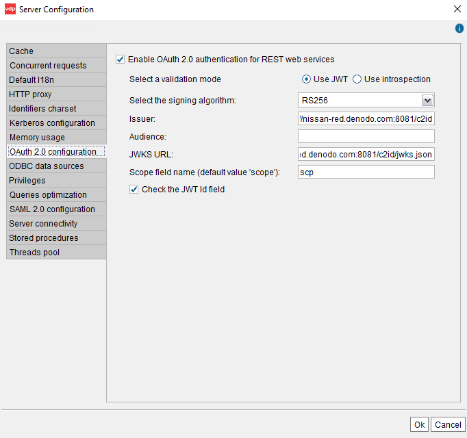
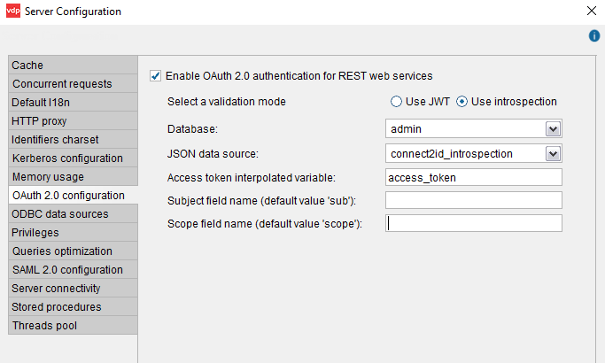

=====================================================================
Setting-Up the OAuth Authentication in the Virtual DataPort Server
=====================================================================

To be able to enable OAuth 2.0 authentication on a REST web service, first you have to enable this support at a global level. 
To do this, on the menu **Administration**, click **Server configuration** and then, **OAuth 2.0 configuration**

Denodo supports two of the approaches have been developed to read an access token and obtain its scopes:

1. JSON Web Token (JWT) 
#. Token Introspection

You need to select the approach that the identity server of your organization supports.

JWT
=================================================

Select **Use JWT** to use the mechanism "JSON Web Token (JWT)" to read the access tokens sent by applications.

   OAuth JWK configuration wizard

In this wizard, provide the following details:

-  **Select the signing algorithm**: algorithm used by the issuer to sign the tokens. The public key is going
   to be recovered using the *JSON Web Key Set (JWKS)* located at the URL provided below.

-  **Issuer**: unique identifier of the entity that issues the JWT tokens.

-  **Audience** (optional): Identifier of the Denodo server as an intended audience. It must
   be present in the token.

-  **JWKS URL**: URL to the *JSON Web Key Set* of public
   keys that can be used to sign an authentication token. This is provided by the OAuth authentication server.

-  **Scope field name (default value 'scope')** (optional): name of the parameter that contains the scopes of the token.
   By default, the value of this field is "scope", but for some authentication servers this could be different.

-  Select **Check the JWT Id field** if the access token contains a *JWT ID* that can be validated to prevent
   replication attacks.

After changing the OAuth 2.0 settings, you need to restart the server.

Introspection
=================================================

In order to use the mechanism "Token introspection", first you need to create a JSON data source. When a web service with OAuth authentication receives a request, this data source will be used to send a request to the identity manager in order to validate that the OAuth access token sent by the client is valid.

According to the standard that defines this mechanism, the requests sent to the *introspection endpoint* have to meet these requirements:

-  Use an **HTTP POST** request.
-  The parameters must be **URL encoded**. The URL is something like \http://acme-auth-server.denodo.com:8081/c2id/token/introspect?token=@access_token
-  The parameter with the access token value is **token**.
-  The parameter ``token_type_hint`` may be used to indicate that the token sent is an access token (the standard
   value in this case is 'access_token').

Check the documentation of the authorization server of your organization to see if the requirements are others.

   .. figure:: oauth_introspection_json_server_configuration.png
      :align: center
      :class: figure-border
      :alt: JSON configuration wizard
      :name: JSON configuration wizard
   
      JSON configuration wizard
      
Once you create this data source, enable OAuth 2.0 authentication for web services.

   OAuth introspection configuration wizard

-  **Database**: select the database of the JSON data source.

-  **JSON data source**: select the data source you just created.

-  **Access token interpolated variable**: field that contains the value of the interpolated variable with the token.

   For example, let us say you created the JSON data source with this URL: \http://acme-auth-server.denodo.com:8081/c2id/token/introspect?token=@access_token
   
   In this case, the value of this field has to be "access_token". At runtime, the Denodo server will read the access token from the request and assign it to the interpolation variable "access_token".

-  **Subject field name (default value 'sub')** (optional): name of the parameter in the token that contains the "subject" of the token.
   By default, the value of this field is "sub", but for some authentication servers it is different.

-  **Scope field name (default value 'scope')** (optional): name of the parameter in the token that contains the "scope" of the token.
   By default, the value of this field is "scope", but for some authorization servers it is different.
   
After changing the OAuth 2.0 settings, you need to restart the server.

