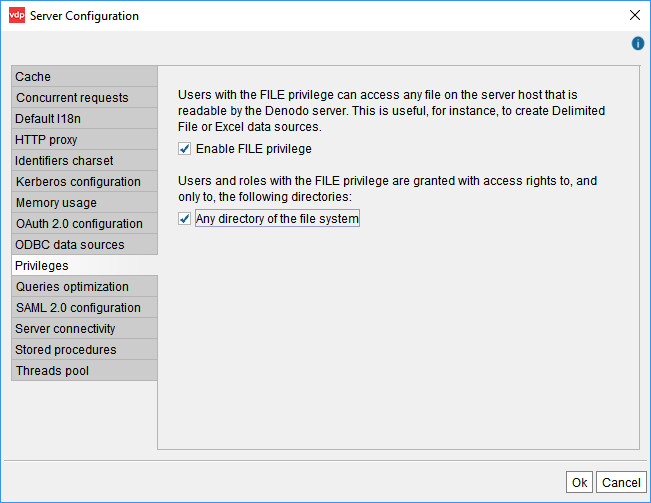

==========
Privileges
==========

In the tab "Privileges", you can configure the behavior of the privilege FILE.

The FILE Privilege
==================

Some dialogs of the administration tool list the files of the host where the Virtual DataPort server runs. For example,

-  In JDBC data source dialog, when you click *Browse* to select the jar files of the JDBC driver.

-  In data sources DF, Excel, JSON and XML, when you select a *Local* path and click *Browse* to select the file. This is the file that the Server will process when querying base views of this data source.

In these dialogs, the Tool lists the files of the Server - not the local ones - because they have to be files that the Server has access to.

The folders and files listed by these dialogs are limited by the file system permissions. That is, the Server and therefore, the Tool, can only list files that the user account with which you launch the Server has read privileges over.

The FILE privilege is a privilege you can grant to non-administrator users. This privilege provides a more fine-grained control over the files that the administration tool lists when creating/modifying data sources.

|

By default, non-administrator users *without* this privilege cannot browse through the file system where the Denodo server runs.

By default, non-administrator users *with this privilege* can browse through all the file system. If you want to limit the directories they can access, do the following:

1. On the menu **Administration**, click  > **Server configuration**.
#. Click the tab **Privileges**.
#. In this tab, clear the check box **Any directory of the file system**.
#. Click **Add new directory** and select the directory you want to allow access. You can add as many directories you want.

Before clicking **Ok**, decide if you want:

a. Allow users with the FILE privilege to create data sources over any file: select the check box **Any directory of the file system**.

#. Allow users with the FILE privilege to create data sources over files located only on certain directories: clear **Any directory of the file system** and add those directories.

#. Prevent all non-administrator users from creating data sources over local files: clear **Any directory of the file system** and do *not* add any directory.

#. Disable this privilege. If you do, any user *with or without* the FILE privilege will be able to browse through the files of the file system where the Denodo server runs (only the files that the user account that starts the Denodo servers is allowed to read). To do this, clear the check box **Enable FILE privilege**. If you disable this privilege, you cannot assign it to users either.

|

.. rubric:: How this privilege affects users:

-  Non-administrator users that do *not* have this privilege will not be able to create any data source that involves accessing a file. That is:

   -  Data sources configured to process files from the local file system. I.e. Excel, DF, JSON or XML data sources configured to use a file in the local file system.
   -  JDBC data sources whose JDBC driver is not included with the Denodo Platform. The reason is that you have to provide its path and without the FILE privilege you do not have access to it.
   -  Web service data sources whose WSDL file is in the local file system.
   -  Custom wrappers with an input parameter of type "ROUTE" that points to a local file.     
   
-  This privilege does not affect the execution of the query. That is, a user can create and query base views over existing data sources, regardless of where the data is coming from and whether they have the FILE privilege or not.

-  As with the other privileges (EXECUTE, WRITE, etc.), this one does not affect administrators either. Administrators can still browse through all the files that the user account of the Server allows. 

-  A user with the privilege FILE cannot create a DF, JSON or XML data source that points to a local path with an interpolation variable (e.g. ``/opt/denodo/customer_data/@VARIABLE/customer.xml`` is forbidden), *unless* the check box *Any directory of the file system* is selected.
