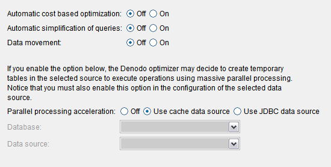

====================
Queries Optimization
====================

In this dialog, you can enable several features of the Execution
Engine that optimize the execution of queries:

1. The cost-based optimizations. See section :ref:`Cost-Based Optimization`.
#. The Automatic simplification of queries. If enabled, the Execution
   Engine tries to simplify the queries before executing them. The goal
   is to decrease the number of operations in the Query plan and
   increase the number of operations that are delegated to the data
   sources.
   This optimization is enabled by default.
   The section :ref:`Automatic Simplification of Queries` explains how this
   feature works.
#. The :ref:`data movement<Data Movement>` optimization.
#. The :ref:`parallel processing<Parallel Processing>` query optimization. If enabled, the query optimizer
   will be able to create temporary tables in the database of the selected data source to insert data and execute
   operations using massive parallel processing (MPP). You can select:
   
   a. The **cache data source**
   b. Another JDBC data source (**Custom data source**) 
  
   Either the cache data source or the selected JDBC data source have to connect to a database that supports parallel
   processing. In the :ref:`parallel processing<Use of an MPP engine as cache>` section there are 
   several examples of how to setup the MPP engine combined with different cache configurations.
   
   If you enable this optimization, make sure that:
   
   i. The Virtual DataPort server and the database are in the same network segment to ensure the data is transferred fast between both systems.
   #. You selected the check box *Use bulk data load APIs* on the configuration of the cache or the data source so the data is inserted as fast as possible into this database.
   
   

   Queries optimization dialog