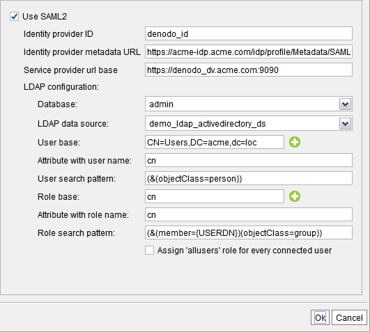

===================
SAML Authentication
===================

The REST web services published by Virtual DataPort support SAML authentication (Security Assertion Markup Language).

At runtime, when a client sends a request to a REST web service with SAML authentication, the Server use the SAML protocol to authenticate the user. Then, it uses the LDAP settings of this dialog to obtain its roles so it validates what queries this user can execute.

Before enabling SAML authentication on any REST web service, you have to set up LDAP settings in the same way you do it if you want to enable Kerberos authentication or enable LDAP authentication for a database.

If you have not done this for Kerberos authentication or for a database with LDAP authentication, you need to create an LDAP data source that points to Active Directory or the LDAP server used in your organization to authenticate users.

To do this, click the menu **Administration** > **Server configuration**. Then, 
click **SAML 2.0 configuration**.
 

   
   Global configuration of SAML authentication

In this wizard, provide the following details:

-  **Identity provider ID**: Identifier of the identity provider (IdP).

-  **Identity provider metadata URL**: URL of the Identity provider’s metadata. At runtime, the Server recovers the identity provider certificate from this URL.

   .. important:: If this URI is https and the SSL certificate of this service is not 
      signed by a known Certificate Authority (CA) like Verisign, Comodo, etc., 
      you have to add it to the *TrustStore* of the Server. The section 
      :ref:`Importing the Certificates of Data Sources (SSL/TLS Connections)` of the 
      Installation Guide explains how to do this.
      Otherwise, when the Server connect to this service, the connection will 
      fail because the certificate is not trusted.

-  **Service provider URL base**: URL of the Denodo web container. E.g. 
   \https://acme:9090/ being 9090 the default port of the Denodo web container.

   If Denodo is running on a cluster behind a load balancer, enter the URL of the load balancer.

-  **Database**: select the database of Virtual DataPort where you have stored the LDAP data source.

-  **LDAP data source**: select the data source.

-  **User base**: node of the Active Directory that is used as scope to search 
   nodes that represent users. You can enter more than one “User base” by clicking 
   the button |image0| beside the “User base” box. When there is more than one “User base”, the Server searches the user’s node in the first “User base” scope. If the Server does not find the node that represents the user, it searches it in the second “User base” scope. If it also fails, in the third, etc. If the Server does not find the node that represents the user, it denies access to the user.

-  **Attribute with user name**: name of the attribute that contains the user name of users, in the nodes that represent users.

-  **User search pattern**: pattern used to generate the LDAP queries that will be executed to obtain the nodes that represent the users that try to connect to the Server.

-  **Role base**: node of the LDAP server that is used as the scope to search the nodes 
   that represent roles that users of this database can have. You can enter more 
   than one “Role base” by clicking the button |image0| beside the “Role base” box. The LDAP query formed with the “Role search” pattern will be executed in every “Role base” scope.

-  **Attribute with role name**: name of the attribute that contains the name of the role, in the nodes that represent roles.

-  **Role search pattern**: pattern used to generate the LDAP queries that will be executed 
   to obtain the nodes that represent the roles of a user. This pattern has to 
   contain the token ``@{USERDN}`` or ``@{USERLOGIN}`` (it cannot contain both):
   
   -  ``@{USERDN}`` will be replaced with the Distinguished Name of the user that tries to connect to this database. For example, "CN=john,CN=Users,DC=acme,DC=loc".
   
   -  ``@{USERLOGIN}`` will be replaced with the login name of the user that tries to connect to this database. For example, "john".

-  Select **Assign 'allusers' role for every connected user** to grant the privileges of the role “allusers” to all the users that log in successfully even if this role has not been assigned to the user in the LDAP server.

   For example, if you want all users to have read access over a particular database, select this option and grant this privilege to the role “allusers”.
   
   This option does not modify the roles granted to the user in the LDAP server. This means that if you later clear this check box, the users that log in will not have the privileges granted by the role “allusers”.

.. |image0| image:: ../../common_images/icon-plus3.png

Validation of the Response Signature
=====================================

By default, the REST web services of Virtual DataPort do not require SAML assertions to be signed. If 
an assertion is signed, the service will validate its signature but it is not mandatory that they are signed.

If you want REST services to only accept SAML assertions that are signed, follow these steps:

1. From the VQL Shell, execute this command:

   .. code-block:: vql

      SET 'com.denodo.vdb.security.SAMLAuthenticator.requireResponseSigned' = 'true';

2. Restart the Virtual DataPort server to apply the change. You do not need to redeploy the web services.