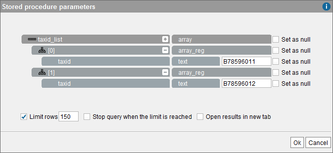
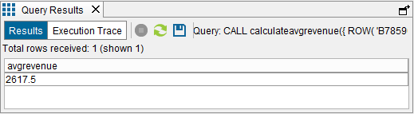

===========================
Executing Stored Procedures
===========================

To execute a stored procedure, click **Execute** (|image1|) in the
dialog that displays the schema of the stored procedure.

The Tool will display a dialog similar to `Execution of the Stored
Procedure CalculateAvgRevenue`_, where you have to enter the input
values. Then, click **Ok** to execute the procedure. You can stop the
execution of a procedure by clicking on **Stop**.

The figure :ref:`below <Execution of the Stored Procedure CalculateAvgRevenue>` shows the
screen in which the values of the input parameters for the procedure
``CalculateAvgRevenue`` are specified. This sample procedure receives as
input a parameter of type array of registers called ``taxid_list``. Each
register has a field called ``taxid`` (client’s Tax ID).

In our example, we create two registers with the values
``B78596011`` and ``B78596012``.

   Execution of the Stored Procedure ``CalculateAvgRevenue``

   Result of the execution of the stored procedure ``CalculateAvgRevenue``

Stored procedures can be also invoked from the VQL Shell using the
``CALL`` statement (see section :ref:`Use of Stored Procedures` of the VQL Guide).

.. |image1| image:: ../../common_images/execute.png

