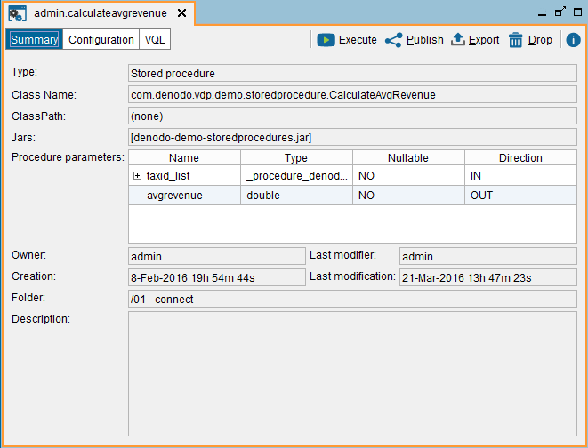

===========================
Importing Stored Procedures
===========================

To create a new stored procedure, click **Stored procedure** on the
menu **File** > **New**.

   Importing a Stored Procedure

You have to provide the following settings:

-  **Name**. Name of the new stored procedure. In our example,
   ``CalculateAvgRevenue``.

-  **Class name**. Full name of the Java class that implements the stored
   procedure.

   If the class you want to use is located in a Jar that was loaded into
   the Server from the *File* > *Extension management* dialog (see section
   :ref:`Importing Extensions`), select the **Select jars** check box and then,
   select the class name from the list.

   In our example, select “Select Jars”, select
   ``denodo-demo-storedprocedures`` and select the class name
   ``CalculateAvgRevenue``.

   .. If the class belongs to a jar file that was copied to the
      ``<DENODO_HOME>``/``extensions/thirdparty/lib`` directory, enter the
      name of the class.

-  **Class path**. Optional. Path to the jar file(s) that contain the class
   that implements the stored procedure.

   Although you can use this field, we recommend importing the jar files into the Virtual DataPort server and then,
   select them in the *Select Jars* box. That way, you do not depend on these jars being on a particular location.

   Leave this field empty if:

   a. You imported the jar file with the “Extension management” dialog.
   b. Or the jar file has been copied to the directory
      :file:`{<DENODO_HOME>}/extensions/thirdparty/lib/`.

   To enter the path, click **Browse** to select the jar. To select more
   than one jar, hold Ctrl and select each jar.

   .. note:: When clicking **Browse**, you will browse the file system of
      the host where the Server is running and not where the Administration
      Tool is running.

-  **Select Jars**. If selected, select the Jar that contains the class
   you want to use.

   .. note:: To select two or more Jars, hold the Ctrl key and click on
      the required Jars.

-  In the **Metadata** tab, you can define the folder where the stored
   procedure will be stored and enter its description.

Click **Save** (|image1|) to create the base view. The Tool will
display a dialog with the properties of the new stored procedure and its
input and output parameters (see `Properties of a Stored Procedure`_).

The parameters of a stored procedure can be of types ``IN``, ``OUT`` or
``IN_OUT``. The ``IN`` parameters are the required input parameters to
execute the procedure; the ``OUT`` parameters are the ones returned by
the execution of the procedure; and the ``IN_OUT`` parameters are input
parameters that are also returned by the procedure.

The “Nullable” column indicates that the value of that parameter can be
``NULL``.

The figure :ref:`below <Properties of a Stored Procedure>` shows information about the new
stored procedure: It has an input parameter (``IN``) called
``taxid_list``, of type ``array``, and an output parameter
``avgrevenue(OUT)``, of type ``double``.

   Properties of a Stored Procedure

.. |image1| image:: ../../common_images/save.png
