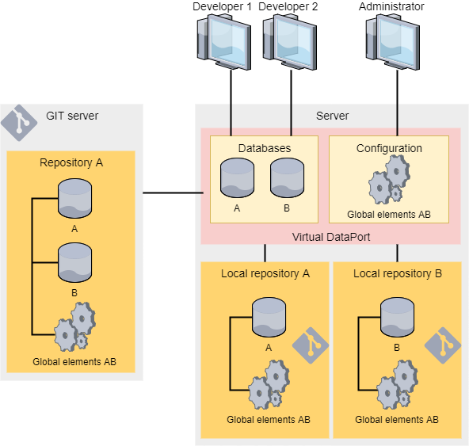
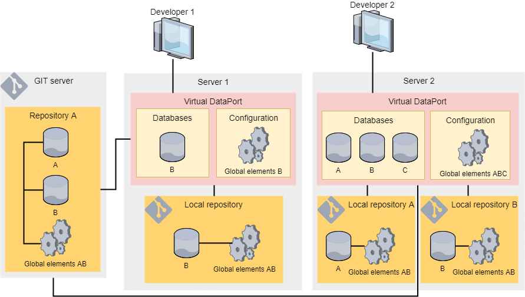
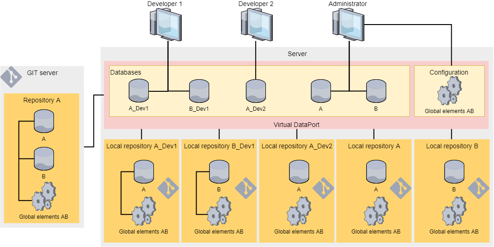

==============================
Scenarios and Recommended Uses
==============================

Denodo proposes three workflows when working with a version control system (VCS) on the development environment:

#. **Centralized workflow with shared databases**

   -  There is a single Virtual DataPort server and each developer uses its
      Administration Tool to connect to this Server.
   -  For each project, there is one single database. We recommend having one database per project.
   -  The developers of each project work with the same database.

#. **Distributed workflow**

   -  Each developer has a local installation of the Virtual DataPort
      server and its administration tool. Each local installation is under control of the developer. I.e. the developer is an administrator of that server.
      
   -  Each developer has a database for each project and they check in and out the changes from the central repository of the organization.

   -  Although all the developers will be administrators on their own Denodo servers, this workflow still requires the figure of the administrator that coordinates changes in jar extensions and internationalization maps. The purpose is to avoid that changes in jar extensions or i18n maps affect other projects.

      The section `Best Practices to Manage Global Elements`_ (below) explains this in more detail.

#. **Centralized workflow with private databases**

   -  There is a single Virtual DataPort server and each developer uses its
      Administration Tool to connect to this Server.
   -  For each project, there is one central database that is managed by
      the project manager or the administrator.
   -  For each project, the administrator creates a database for each developer 
      of the project and grants each developer the ADMIN privilege 
      (administrator of the database) over that database.
      
   -  When working on a project, each developer connects to her own database.
   
      After completing a task, the developer must check in the changes to make it available to the other developers.

   
Picking a VCS Workflow
======================

All the workflows we described have pros and cons, so it is important to determine which one fits better the organization’s development environment.

a. **Centralized workflow with shared databases**

   With this workflow you achieve the main purposes of a version control system:

   1. Store elements on a central repository, keeping a history of all the changes.
   #. Being able to identify the author of a specific change.
   #. Restore a specific revision

   The drawback of this workflow compared to the others is that it does not provide the capability of detecting and resolving conflicting changes performed by different developers over the same element. That is because with this workflow, the developers of a project work on the same database so they must coordinate among themselves to prevent modifying the same elements simultaneously. 

#. **Distributed workflow**
    
   Use this workflow if you need the capability of several developers detecting the type of conflicts mentioned above. If two developers make different changes on the same element, the second developer to check the change into the VCS will find that the element has been modified previously and will have to resolve the conflicts. With this workflow each developer needs to install and manage a Virtual DataPort server.

#. **Centralized workflow with private databases**
    
   This workflow also provides the conflict detection/resolution of the distributed workflow. The difference with the distributed workflow is that, in the distributed workflow, each developer has her own Virtual DataPort server; in this one, they all work with the same Virtual DataPort server, although they are connected to their own database.

The following sections provide more details about each suggested workflow:

-  :ref:`Centralized workflow with shared databases <Centralized Workflow with Shared Databases>`
-  :ref:`Distributed workflow <Distributed Workflow>`
-  :ref:`Centralized workflow with private databases <Centralized Workflow with Private Databases>`

Centralized Workflow with Shared Databases
==========================================

This workflow adapts to the majority of projects. In this workflow, all the developers of a project share the same database.

The following diagram shows a Virtual DataPort server that follows this workflow:

-  There are two projects: *A* and *B*. Each project has its own database.

The workflow is the following:

1. At the beginning of the project, the administrator creates the database and checks it into the VCS. It also grants the developers the privileges to access this database.
   
   If the administrator grants the ``EXECUTE`` and ``WRITE`` privileges to a developer over a set of views instead of the entire database, the administrator also has to grant the ``EXECUTE`` privilege over the views directly referenced by these derived views. Otherwise, the check ins of the views the user can modify will fail. The reason is that when Denodo checks a view into the VCS, it needs to obtain the VQL of that view and to do that, the user needs the ``EXECUTE`` privilege over the views referenced by this view.
   
   If the users have the privilege ``WRITE`` over a view ``V1`` but do not have the privilege ``EXECUTE`` over the views directly referenced by this view:
   
   -  They cannot modify V1.
   
   -  They can change the settings of the Options dialog of V1.
   
   -  They cannot check in the changes to they do in the Options dialog of V1 because they cannot obtain the VQL of V1.
   
#. To check in changes to a base view, the developer needs to have the WRITE privilege over the view. In the past, the user needed to be the owner of the base view or the administrator of the database.
   
#. Developers begin to work and when they complete a task, they check the changes into the VCS. The developers must coordinate among themselves to prevent modifying the same elements simultaneously.
   
#. When a developer changes a view and this change invalidates other derived views (e.g. remove a field of a view and this field is used by another view), the developer must fix the affected derived views/web services. Then, do a single check in that contains all these changes.
   
   If the developer makes a change that invalidates other views but does not have the privileges to modify the affected views, a developer that has the privileges to modify all the affected views should fix them. Then, this same developer should do a single check in that includes the initial changes to the view and the fix to the affected views.
   
   If including all the changes in a single commit is not possible, the VQL of some revisions could be invalid.
   
#. As a conclusion of the item above, when developers have access to different sets of views of the database, not the entire database, we recommend they check in the changes in layers. That is, the group that can modify lower-level elements (data sources and base views) should check in the changes to these first. Then, the group that can modify intermediate views, check in changes to intermediate views and then, the same with final views and web services. This will prevent the situation described above.
   
#. When developers require a new extension, they request it to an administrator. The administrator imports it and checks it in using the new wizard for checking in and out global elements. As soon as the administrator adds it to the Server, it becomes immediately available to all developers. However, the administrator should check that extension into the VCS to keep a history of the changes.

Take the following into account:

-  With this workflow, developers do not need to check in their changes because as they all use the same database, they all have access to the changes immediately. However, we recommend they check in their changes after completing a task in order to keep a history of all the changes.

-  From now on, only administrators and administrators of a database will be able to revert to a previous version. This behavior prevents the problems that could arise if a standard user reverted to a version that would involve executing VQL statements that the user was not allowed to execute. This rule applies to elements of a database and global elements.

-  If a database needs to be reverted to a version that requires an older version of a global element, an administrator has to revert the global elements first and then, the elements of the database. The section :ref:`Best Practices to Manage Global Elements` below explains these steps in detail.

-  In this workflow, when a user checks in a database or a folder, the *Check in* dialog may list elements that the *Server Explorer* (the tab on the left) does not list or are marked as synchronized (with the icon |icon_vcs_synchronized|). This occurs when another user created/modified elements on the database or folder the user is checking in, since the user refreshed the database (i.e. clicked the menu *File* > *Refresh*).

-  In this workflow, after doing a commit, a user may see new elements that were not there before. The reason is that after a commit, the administration tool refreshes the database (equivalent to clicking the menu *File* > *Refresh*). If another user created an element on this database since the last refresh, they will now appear in the elements tree.

Distributed Workflow
====================

This is the recommended workflow in projects for which you need the capability of detecting and resolving conflicting changes performed by different developers over the same element.

In this workflow, all developers have their own Virtual DataPort server and they are administrators of their own servers. Therefore, they can manage the global elements without any restriction.

The following diagram shows a Virtual DataPort server that follows this workflow:

-  There are two projects: *project A* and *project B*. Each project has its own database.

-  The developers have their own Virtual DataPort server so they only need to check out the database of the projects they work with.

   -  Developer 1 only works on *project B* so only checks out the database B.

   -  Developer 2 works on *project A* and *project B*. In addition, there is a non-versioned database just for testing.

-  Both developers manage the global elements used by the elements of its databases.

   Distributed workflow

The workflow is the following:

1. At the beginning of a project, the coordinator of the project creates the database and notifies all the developers.

#. Each developer checks that database out and begins working.

#. When a developer wants to share work with other developers, she has to check the changes into the VCS.

#. When developers require a new extension, they request it to an administrator. The administrator imports it and checks it in using the new wizard for checking in and out global elements. The administrator will later notify the developers of the project and they will obtain the new element using the new wizard that only checks in and out global elements.

#. When a developer changes a view and this change invalidates other derived views (e.g. remove a field of a view and this field is used by another view), the developer should fix the affected derived views/web services and do a single check in that contains all these changes. If the developer only checks in the change in the view but not the fix for the affected views, when other developers check out changes from the VCS, they could get an error if the VQL stored in the VCS is not valid.

   In addition, this is a way of making sure that you can revert back to any revision of the project. If including all the changes in a single commit is not possible, indicate so in the commit message to prevent that in the future, someone tries to revert back to this commit.

Centralized Workflow with Private Databases
===========================================

This is the recommended workflow for when you only have a Virtual DataPort server available and you also need the capability of detecting and resolving conflicting changes performed by different developers over the same element.

In this workflow, there is a single Virtual DataPort server for development. For each project, there is one central database that is managed by the project manager and one database for each developer of the project. All these databases point to the same database in the VCS.

The following diagram shows a Virtual DataPort server that follows this workflow:

-  There are two projects: *project A* and *project B*. Each project has its own database.

-  | *Developer 1* and *Developer 2* work on *project A*, so for this project we have these databases: 
   | *project_a*, *project_a_developer1* and *project_a_developer2*.

-  | Only *Developer 1* works on *project B*, so for this project we have these databases: 
   | *project_b* and *project_b_developer1*.

   Centralized workflow with private databases

The workflow is the following:

1. At the beginning of a project, an administrator creates these databases:

   -  The main database of the project is called *canonical database*. The coordinator will be the administrator of the database and will check out all the changes to this database periodically. When a database needs to be promoted to another environment, the coordinator will check out the database and export it to a VQL file.

      The administrator will create this database, enable version control for this database and check in the change. This will create the database in the repository.

   -  One database for each developer of the project. Each database that will be assigned to a developer. The administrator will grant the privilege “administrator of the database” over each database to the developer assigned to that database. This is the privilege *ADMIN* you can assign to users.

      To replicate each database, we recommend using the wizard *Import database* of the menu *VCS Management* because that will locate the available databases in the repository and the administrator only has to select it and provide a local name for it. This local name should follow the convention::
      
      <name of the project>_<username of the developer>.

2. The developers of the project connect to their own database and began working.

#. When a developer wants to share work with other developers, she has to check the changes into the VCS.

#. The other developers need to do a check out of their database to see the changes performed by others.

#. When the developers need to create a derived view over a view of another database, they have to point to the views of *canonical database*, not the developer databases. That is, if *developer 2* needs to create a selection view over the view *employee* of *project B*, *developer 2* has to create the derived view over the view *employee* of the database *project_b*, not *project_b_developer1*. The reason is that in other environments (testing, QA, etc.), only the canonical databases will exist, so the references between databases have to be created with them.

   The administrator has to grant the developers the privileges ``CONNECT`` and ``EXECUTE`` over the canonical databases over whose views, they will have to create views.

#. When a developer changes a view and this change invalidates other derived views or web services (e.g. remove a field of a view and this field is used by another view), the developer should fix the affected elements. Then, do a single check in that contains all these changes. If the developer only checks in the change to the view but not the fix for the affected elements, when other developers check out these changes from the VCS, they will get an error because the VQL stored in the VCS is not valid.

   In addition, this is a way of making sure that you can revert back to any revision of the project. If including all the changes in a single commit is not possible, indicate so in the commit message to prevent that in the future, someone tries to revert back to this commit.

#. When the developers require a new extension, they request it to an administrator. The administrator imports into the canonical database and checks it into the VCS using the new wizard for checking in and out global elements. As soon as the administrator add it to the Server, it becomes immediately available to all developers. However, the administrator should check that extension into the VCS to keep a history of the changes.

#. If a database needs to be reverted to a version that requires an older version of a global element, an administrator has to revert the global elements first and then, the elements of the database. The section :ref:`Best Practices to Manage Global Elements` (below) explains these steps in detail.

Best Practices to Manage Global Elements
========================================
Global elements are elements that do not belong to a specific database. For example, users, roles, server settings, etc. 

In this section, when we discuss global elements, we are only speaking of the two types of global elements that Virtual DataPort stores on a VCS: jar extensions and internationalization maps (i18n maps).

Follow these best practices to manage global elements when using the VCS support:

-  Administrators of the Denodo server must be in charge of managing the global elements. This is:

   -  Uploading jar extensions

   -  Managing internationalization maps (i18n maps)

   The aim is to avoid affecting other projects that also use these elements. Only administrators can manage jar extensions and i18n maps. They do that by right-clicking on the database > *VCS* > *Global elements*. From this menu, administrators can check in changes to the jar extensions and the i18n maps.

-  When the administrators create, modify or delete global elements, they must check the changes into the VCS. That way, they keep a history of these changes. In addition, when using the distributed workflow, the check in is necessary so the developers have access to the new elements.

-  When developers need to create or modify or delete global elements, they have to ask one of the administrators to do it.

   When working with the distributed workflow, after the administrator that coordinates the project changes in global elements checks in a global element, the developers must do a check out to obtain it. The reason is that each developer has her own Server. In the distributed workflow, the developers are the administrators of their Denodo servers so they can successfully check out global elements.

   This is not necessary in any of the centralized workflows because the elements are already in the Server once the administrator loads them.

-  If a database needs to be reverted to a version that requires an older version of a global element, the process has to be done in two steps:

   1. Revert the global element using a new wizard whose function will be just this (this wizard will be available in the next update).

      Only administrators will be able to use this wizard.

   #. Revert the elements that depend on the database. To do this operation, all the elements have to be checked in or discard the modifications (there cannot be local changes). The dialog to revert changes only shows commits over elements of that database, not global elements or elements from other databases.

-  Developers can check in elements that depend on global elements. E.g. derived views that use a custom function included in an extension.

-  Folders only can be created by an administrator or an administrator of the database where it is created, so it is recommended to check in the folders just after be created.

As all the databases share the global elements, there may be problems when you need different versions of the same extension. For example, let us say there are two projects *project A* and *project B* and each require a different version of a jar extension. Another example: you need to revert *project A* to a previous version that requires an older version of a jar extension and project B requires a newer one. If you run into these scenarios, consider using these naming conventions:

-  When a project needs a new version of a jar extension and another project still needs the old version, load the new version of the extension with a new name. This new name should be the name of the extension followed by the name of the project that needs this new version. The developers of this project will need to know that from now on, they need to use that new jar extension and not the existing one.

   We only recommend doing this when it is necessary to avoid having many versions of the same library loaded.

-  If a project needs to modify a map that is being used by another project, the administrator should create a new map, adding a suffix to its name so developers can distinguish it.

More Information about Global Elements
-----------------------------------------

Virtual DataPort manages jars extensions and internationalization (i18n) maps as global elements, common to all databases. The reasons why they do not belong to an individual database are:

-  Jar extensions are global because they extend the capabilities of the Virtual DataPort server, not a specific database. If they were linked to a single database, on many occasions, they would have to be loaded several times. Having the same extension replicated would increase the resources needed to store and use these extensions.

-  Internationalization (i18n) maps are global because usually they are used across all the databases. Therefore, if you create one, it can be used in all databases instead of having to replicate it across all of them.

Administrators are in charge of managing global elements and checking them into the VCS.

In Denodo 6.0 prior to update 20180618, the management of global elements used by databases synchronized with VCS was transparent to the user. When you did a check out and there were changes on a global element, these were checked-out as well. When you checked in an element that depended on global elements that had been modified, the check in also included the change to the global element.

-  Depending on the privileges of the user that performed the check out, the check out may not finished correctly. For example, if the user only had privileges to modify certain views of the database and the check out involved modifying a data source, the database remained in an out-of-sync status. Only administrators and administrators of that database can take a database out of this status.

-  When a global element is modified, all the databases with elements that use this global element are marked as modified as well. Then, all these databases have to be checked into the VCS even though is not really necessary because the jar has already been stored in the VCS after the check in of the first database.

To avoid these problems, Denodo 6.0 update 20180618 includes the following changes regarding the management of i18n maps and jar extensions:

1. There is a wizard just for checking in and out global elements. This wizard is only available to administrators. To open it, right-click on a database > *VCS* > *Global elements*.

#. Developers are not be able to check in or out global elements from the VCS. The implications are:

   -  When a developer checks changes into the VCS, the commit will never include modifications to global elements, even if they have been modified by an administrator.
   
   -  When a developer checks out changes from the VCS, the Virtual DataPort server ignores the changes to these elements.
   
   -  The wizard to revert elements of a database (not global elements) will only list commits that contain changes to the elements of that database.

      Because of the wizard described in step 1, there will not be commits that modify global elements and elements of a database. A commit will only modify one type of element or the other.

Promoting Changes from Development to Testing and Production
===============================================================

After the development team has finished its work, it is time for
testing.

The best way to promote a database or a set of changes from the development server to the testing server is to use the Solution Manager to :ref:`create a revision <Promotions>`. Then deploy the revision to the testing environment. After testing that the new views work as expected, deploy the same revision to the production environment. With previous versions of Denodo, the recommended way to promote elements was creating a script that invoked the scripts "export" and "import" of Denodo. However, doing it with the Solution Manager is better because:

-  The GUI of the solution manager makes it easier for developers to select the elements to promote.
-  It provides capabilities to promote elements to a cluster of Virtual DataPort servers, not just one server.
-  The revisions are persisted so you can review them later and keep a history of the changes.
-  ...

Promoting a Database Using Scripts Instead of the Solution Manager
------------------------------------------------------------------

If you want to promote changes using the scripts "export" and "import" instead of the Solution Manager, the administrator must follow these steps:

#. Connect to the central database of the project (in our example,
   project1 or project2) and check out the changes from the VCS.
#. Export to a file the entire database with the option “Export
   environment specific properties separately”.
#. Edit the generated properties file to adapt its values to the testing
   environment. E.g. Modify the URL of the JDBC data sources to point to
   the testing databases along with new credentials, etc.
   
   On subsequent promotions of a database, the administrator can use the properties file created on previous occasions. If the administrator imports a VQL file and the properties file does not have all the properties, the import process will fail without changing anything on the Server. If this happens, the import process will return a list of the properties that are missing so the administrator can add them to the properties file.
   
#. Import the VQL file with the properties file into the testing server.

After this, the users can begin testing the views they have created.

Regarding this process, we recommend the following:

-  To promote a database from one environment to the other, develop a script that invokes the scripts "import" and "export" of the Denodo Platform.

-  The process (e.g. the script) to promote a database from development to testing, and from testing to production should be the same. That way, when promoting to testing, you make sure that the process works.

-  To promote changes from one environment to another (e.g. from
   development to testing), we recommend promoting the entire database and not just a set of views. This avoids
   that some changes are not promoted accidentally.

-  To promote a database from testing to production use a VQL file and not
   VCS because the process of importing a database from a VCS repository
   takes longer than from a VQL file.

-  Because of the recommendation above, we also recommend promoting
   databases from development to testing using a VQL file. That way, when
   you migrate a database from development to testing, you test that the
   script that migrates databases between environments works.

Using VCS Environments
======================

Defining several VCS environments is useful when:

-  The development team is geographically distributed. For example, there is a team of Denodo developers in London and another in Denver.
-  And on each location, there is a replica of the data sources they use. For example, there is one Oracle database in London and another Oracle database in Denver and their views, tables... are the same (although it's data may be different).
-  And the teams of each location want to point to the data sources of their location.

If your organization *does not meet all* these conditions, we recommend creating only one environment in the server called "development".

