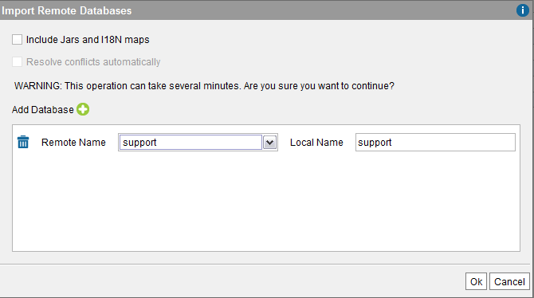

================================================
Importing an Existing Database from a VCS Server
================================================

Instead of enabling version control for an existing database, you can
import a database created by another user, from a VCS repository. To do
this, click **Import database** to open the “Import Remote Databases”
dialog.

   "Import Remote Databases" dialog

When opening this dialog, Virtual DataPort connects to the VCS server
set in the “Configuration” dialog of the “Administration > VCS
management” menu and retrieves the Virtual DataPort databases stored in
this VCS server.

Click |image1| and in the “Remote database” list, select the database
you want to import. In the “Local name” box, you can change the name
that the database will have locally. Then, click **Ok**.

You can import several databases simultaneously by clicking |image1| and
selecting another database.

The imported databases use the default VCS configuration (this can be
changed later).

When the check box **Include jars and I18n maps** is selected, the
Server enters in “single user mode” to import the metadata from the VCS
server. This means that the Server will queue all the queries executed
after clicking “Ok”. If this check box is cleared, the queries to other
databases will be executed during the import process and also, the
import process will be executed faster. The drawback is that the jars
and the i18n maps stored in the VCS server will not be imported. If this
check box is cleared and the imported elements rely in I18n maps or jars
that have not been imported, the import will fail, but you can repeat
this operation again, selecting this option.

If the check box **Resolve conflicts automatically** is selected,
Virtual DataPort tries to detect and solve conflicts when importing a
database that depends on global elements (i18n maps and jars). This
makes the import process slower.

Let us say we are in this scenario:

-  You have a jar called “jar\_1” that is versioned and that has been
   modified locally but you have not checked-in the changes.
-  You import the database “DB\_1” that depends on “jar\_1”, selecting
   “Include jars and I18n maps” and clearing “Resolve conflicts
   automatically”. The import fails because there is a conflict between
   the local “jar\_1” and the one stored in the VCS server.
-  If you open the "Import Remote Databases" dialog again and select
   “Resolve conflicts automatically”, the Server will overwrite the
   local “jar\_1” with the version stored in the repository.

.. note:: After disabling and enabling the VCS integration of a database
   or changing its "URL" of the VCS server, all the VCS metadata of the
   database will be lost. That is, you will have to check in again all the
   elements of the database.

.. |image1| image:: ../../common_images/icon-plus3.png
