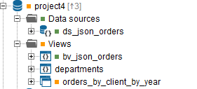

.. todo: for 8.0, rename the file to match the title of the section

====================================
Integration with the Server Explorer
====================================

When version control is active for the current database, each node in
the Administration Tool’s Server Explorer is marked with a VCS status
icon, unless it is not under version control (see `Server Explorer`_):

   Server Explorer

-  If you are using GIT and there are commits pending to be pushed, you
   will see a number beside the name of the database. In the screenshot
   `Server Explorer`_, you can see there is one commit pending to be
   pushed.
-  **Green**. The element is under version control and there are no
   local changes.
-  **Orange**. The element is under version control and contains
   uncommitted local changes.
-  **Gray**. The element is under version control and has been deleted,
   but the change has not been committed to the VCS.
-  **No icon**. The element is not under version control yet.
-  **Red**. The element is “out-of-sync”. I.e. there was an error while
   checking out this element from the VCS server. Check-ins cannot
   include elements in this status.
-  **Red/orange**. The element was “out-of-sync” (with the red icon) and
   later, modified. I.e. there was an error while checking out this
   element from the VCS server and then, you modified it locally.
-  **Red/gray**. The element was “out-of-sync” (with the red icon) and
   later, deleted locally. I.e. there was an error while checking out
   this element from the VCS server and then, you deleted it locally.

If you right-click an element, the contextual menu has a submenu
**VCS**, which contains the actions you can perform over that element.
These actions change depending on the VCS system used and the selected
element.

If you right-click an element and click **Diff**, the Tool will display
the “Diff” dialog where you can see the differences between the VQL of
the local version of the element and what is stored in the VCS server.
If you configured an external diff viewer tool, click **Compare** to see
the differences in this external tool. To set the path to an external
diff tool, click **Admin Tool preferences** on the menu **Tools**. Then,
click the **VCS** (see more about setting a compare tool in the section
:ref:`VCS Settings of the Administration Tool`).

If you click **Discard** on the selected element's **VCS** submenu, you will 
undo the uncommitted changes in the element's scope (e.g. using *Discard* on
a folder, will discard all the changes in the elements of that folder). The section :ref:`Discard` provides more details.
