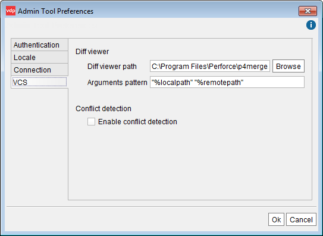

=======================================
VCS Settings of the Administration Tool
=======================================

The dialog “VCS Configuration” controls the VCS settings of the
Administration Tool. To open it, open the **Admin Tool preferences** on
the menu **Tools** and click the **VCS** tab.

   External diff viewer configuration

We recommend configuring the Administration Tool to use an external diff
viewer tool. This will make it easier two compare the content of
conflicting elements when performing check-ins and check-outs.

To do this, enter the path to the diff viewer tool executable in the
**Diff viewer path** field. Usually, the default value of the
**Arguments pattern** box is correct: ``"%localpath" "%remotepath"``.
This box defines how to launch the tool to compare the two files passed
as arguments. If you need to change the arguments, note that you have to
use the tokens ``%localpath`` and ``%remotepath`` as the paths to the
files that are going to be compared.

To enable “conflict detection” in Virtual DataPort, select **Enable
conflict detection**. The sections :ref:`Check In / Commit Operations` and
:ref:`Check Out / Update Operations` explain how enabling or disabling
“conflict detection” affect the behavior of the check in and check out
operations of Subversion and Microsoft TFS.
