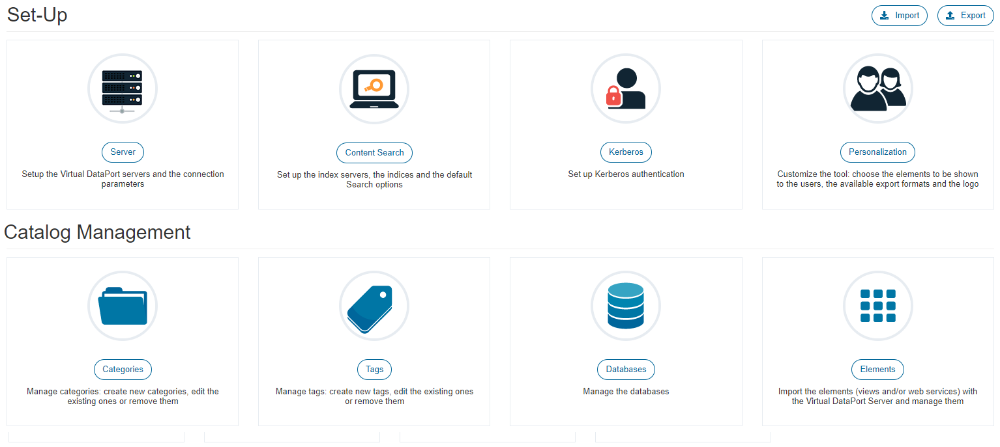

.. _data_catalog_administration:

==============
Administration
==============

.. toctree::
   :hidden:

   servers_configuration/servers_configuration.rst
   search_configuration/search_configuration.rst
   kerberos_configuration/kerberos_configuration.rst
   personalization/personalization.rst
   catalog_management/catalog_management.rst
   import_export/import_export.rst

   
All users of Virtual DataPort can log into the Data Catalog to search and query views and web services. 
The credentials and privileges users have in the Data Catalog are the same they have when they connect 
to Virtual DataPort through the administration tool or any other tool. Regular users are limited to search and 
query views and web services. However, as an administrator of 
the Data Catalog, you may want to grant power users the privileges to do additional tasks like manage 
the categories and tags, edit the description of views, assign properties to elements, etc. To do this, you have to assign
users the appropriate roles in Virtual DataPort.

The Data Catalog uses the following roles to decide what tasks users can do. These roles are pre-created in Virtual DataPort.

-  Users with the role "data_catalog_editor" can *edit* the following:

   -  :ref:`Categories <Edit Categories>`
   -  :ref:`Tags <Edit Tags>`
   -  :ref:`Databases <Edit Databases>`
   -  :ref:`Elements (Views / Web services) <Edit Elements>`
   -  :ref:`Property groups <Edit a Custom Property Group>`
    
   These users can edit these elements but cannot create new ones nor delete them.
    
-  Users with the role "data_catalog_classifier" can do the following:

   -  :ref:`Assign Categories <Assigning Categories>` to views and web services
   -  :ref:`Assign Tags <Assigning Tags>` to views and web services
   -  :ref:`Assign Property groups <Assigning Custom Properties>` to views and web services

-  Users with the role "data_catalog_manager" can do the following:

   -  The same as the users with the roles "data_catalog_editor" and "data_catalog_classifier"
   -  Create, modify and delete :ref:`categories <Categories Configuration>` and :ref:`tags <Tags Configuration>`
   -  Create, modify and delete :ref:`property groups <Property Groups Configuration>`

-  Users with the role "data_catalog_content_admin" can do the following:

   -  Configure all the options of the page :ref:`Set-Up / Personalization <Personalization>`: search configuration, welcome message, background image...
   -  In the page `Set-up / Content search <Search Configuration>`, configure the 
      following options: “Configure search snippets” 
      (for each Index Server assigned to a VDP server), “Default number of 
      fields in search results summary” and “Maximum number of results per entity in search 
      results summary”.

-  Users with the role "data_catalog_admin" and administrators of Virtual DataPort can do the following:

   -  The same as the users with the roles above.
   -  Configure the :ref:`connection to Virtual DataPort <Servers Configuration>` and other settings
   -  Configure the :doc:`indexer of data <./search_configuration/search_configuration>`
   -  Set-up :doc:`Kerberos authentication <./kerberos_configuration/kerberos_configuration>`
   -  :ref:`Import and export <Import and Export Data Catalog Metadata>` the metadata of the Data Catalog
   -  Synchronize the metadata with Virtual DataPort
 

   Administration screen
