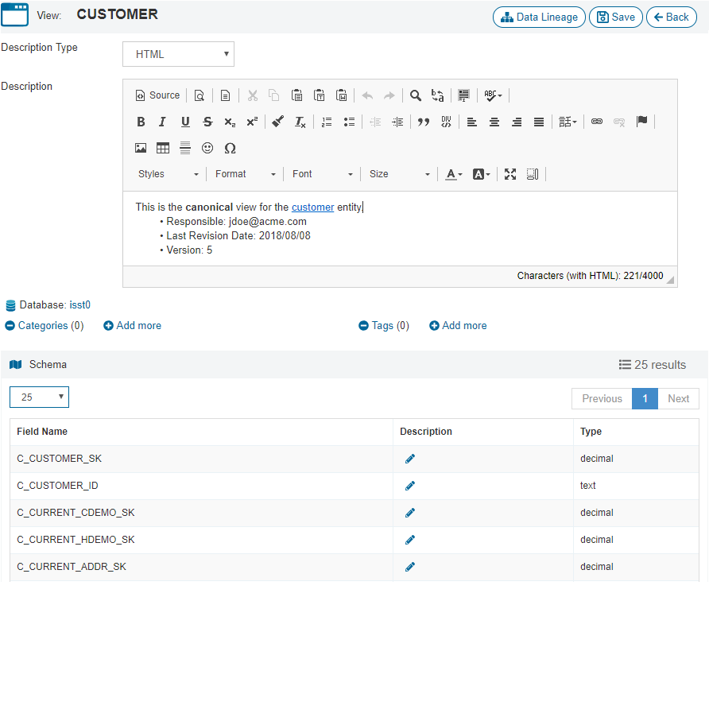
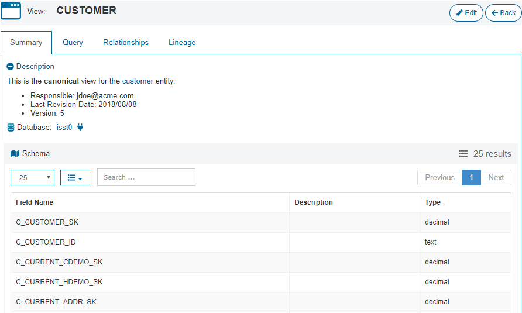

==================
Catalog Management
==================

.. toctree::
   :hidden:

   categories_configuration/categories_configuration.rst
   tags_configuration/tags_configuration.rst
   databases_configuration/databases_configuration.rst
   elements_configuration/elements_configuration.rst
   properties_groups_configuration/properties_groups_configuration.rst

This section explains how to manage the catalog's elements:

-  **Categories**: see section :ref:`Categories Configuration`.
-  **Tags**: see section :ref:`Tags Configuration`.
-  **Databases**: see section :ref:`Databases Configuration`.
-  **Elements (Views and Web Services)**: see section :ref:`Elements Configuration`.
-  **Property Groups**: see section :ref:`Property Groups Configuration`.
	
For each element, you can configure several properties. A common one for all these elements is the **description**. You can enter the description in plain text or use the HTML 
editor.

   Edit description using HTML tags

If you choose the HTML option, the description will be rendered as HTML on the element details page.

   Description with HTML tags in the details page of a view

