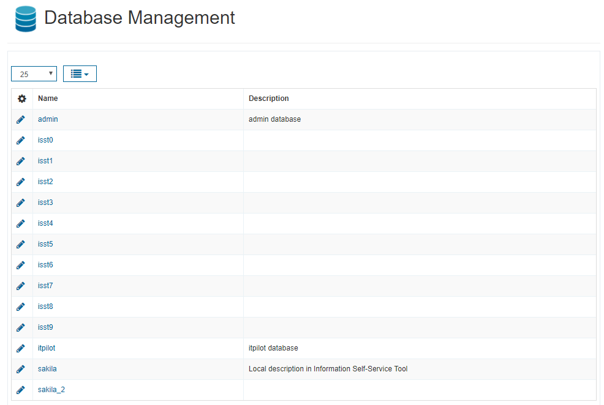
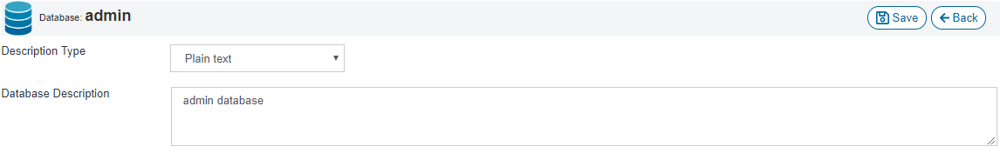

========================
Databases Configuration
========================

In the “Database Management” section you can see the databases from the Virtual DataPort server, once you have imported the metadata.
Here, you can set a more meaningful description to each database (by clicking on the edit icon), 
that can be different from the description in the Virtual DataPort server. When you edit a database, if it has properties groups assigned, 
you can also modify the values of the properties for that database.

In the following image, the database "sakila" has a local description, whereas the same database in Virtual DataPort has no description 
(as it is explained in section :ref:`Elements Configuration`, when synchronizing elements with the Virtual DataPort server, you can 
choose whether to keep the local descriptions or replace them with the ones from the server).

   Databases list
   

Edit Databases
==============
   
In the screen shown in the previous image, you can click on any database to see its 
elements (views and web services).