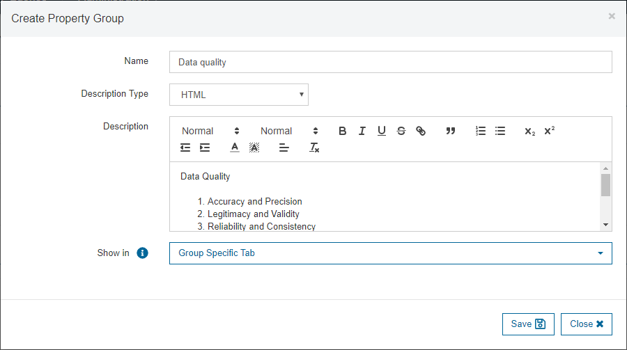
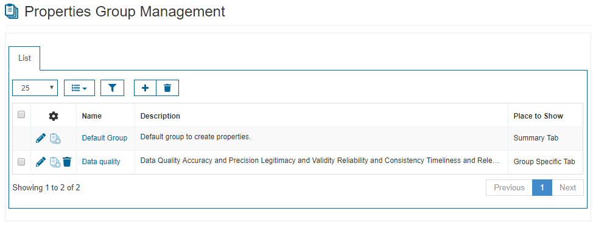
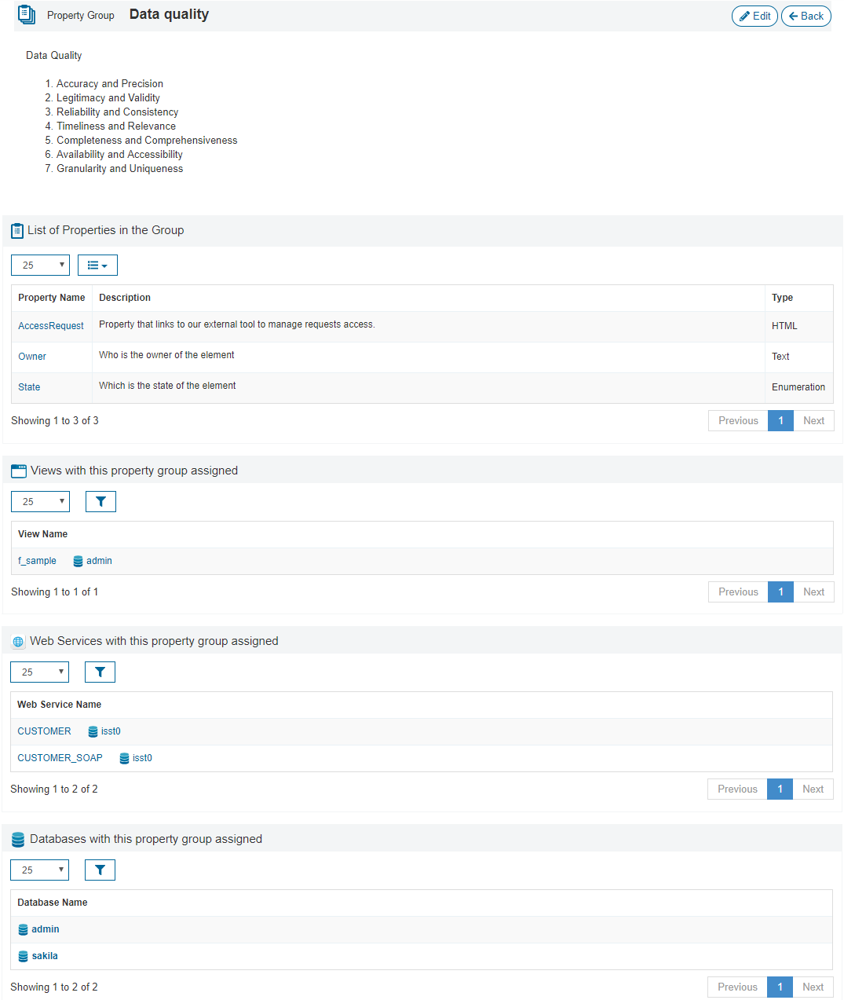
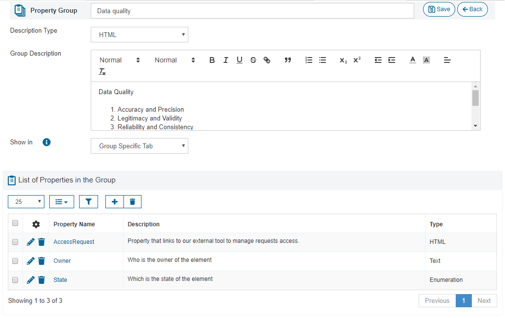
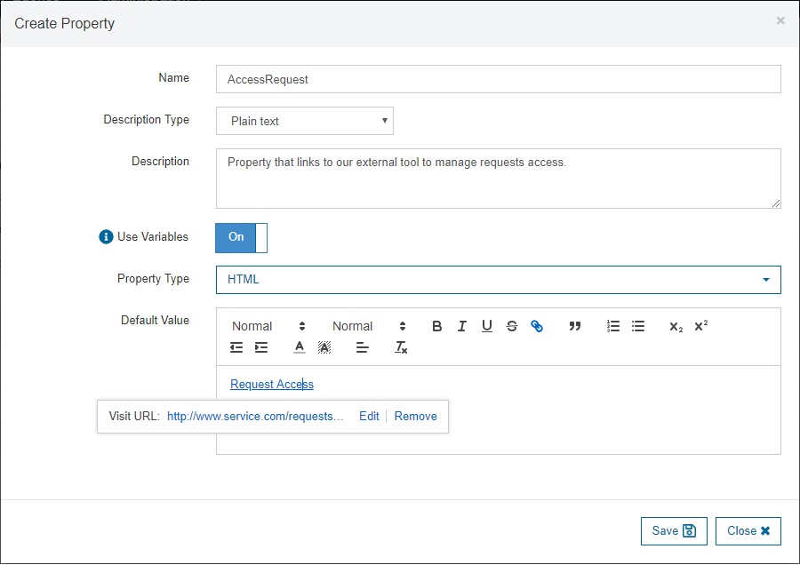
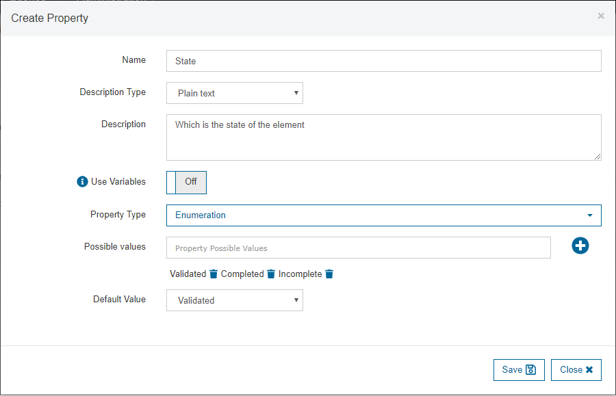
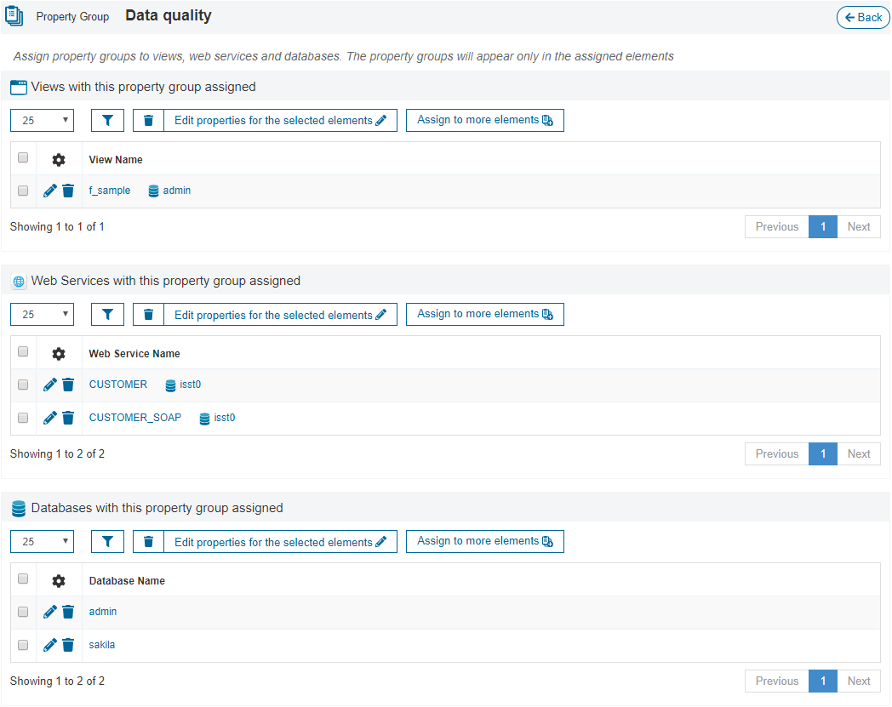
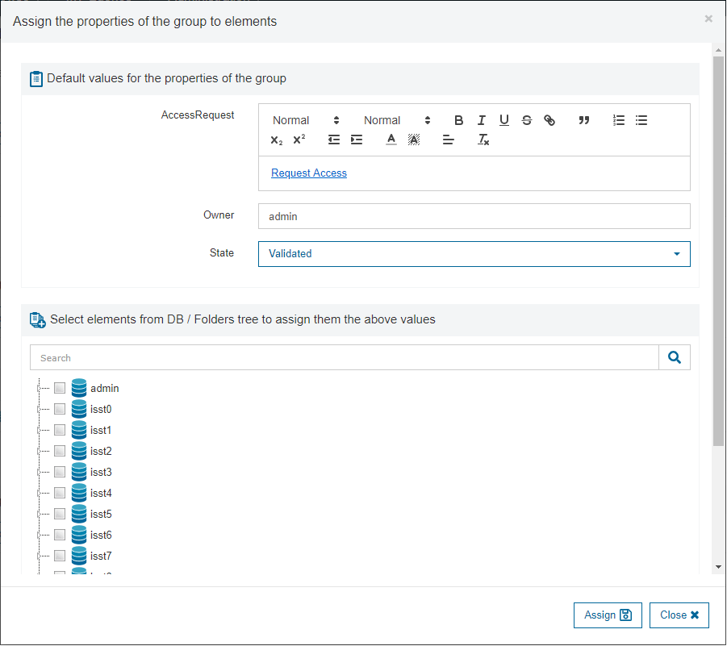

=============================
Property Groups Configuration
=============================

Custom properties are part of the catalog metadata. They can be assigned to the following elements:

- Databases.
- Views.
- Web Services.

For instance, with custom properties, you can specify:

- Who is the owner of an element (view, web service or database).
- Who is the responsible of the element.
- If the element is validated and by whom.
- Who has permissions over the element.
- The expected execution time for a view or web service.
- A link to request execution permissions for the current user over a view (this link could point to an external tool, like for example, a Data Governance tool).
- Etc.

They can also help to deal with Data Quality and Data Privacy regulations.

|

Defining and Editing Custom Property Groups and Properties
==========================================================

To allow the elements to have custom properties, a user with administration privileges must:

#. :ref:`Create a custom properties group <Creating a Custom Property Group>`.
#. :ref:`Create custom properties inside the group <Creating a Custom Property>`.
#. :ref:`Assign the custom properties group to the elements <Assigning Custom Properties>`.

.. note::  Individual properties cannot be directly assigned to elements.

Creating a Custom Property Group
--------------------------------

In the “Properties Group Management” section you can manage the groups of custom properties and their custom properties: create new ones, edit the existing ones or remove them. Each group can have an undetermined
number of custom properties.

When creating a new group, you have to choose where you want to show its properties when it is assigned to a view or web service (this setting it is not used when the group is assigned to a database). There are several options:

- Summary Tab: shows the information in the :ref:`Summary tab 
`.
- Additional Properties Tab: creates a new tab that shows the properties of this group together with the properties of other groups (properties from all assigned groups go to the same tab).
- Group Specific Tab: creates a different tab to show exclusively the properties of this group.

   Create a group of custom properties

   List of custom properties groups
   
By clicking on the name of each group, you enter its details page. Here, you can see the list of custom properties that belong to this group and which elements have this group assigned:

|

   Details of a custom properties group

Edit a Custom Property Group
----------------------------
      
By clicking on the *Edit* icon, you enter its edition page, where you can modify:

- Its name.
- Its description.
- Where to show its properties.
- Its list of :ref:`custom properties <Creating a Custom Property>`: you can create new ones, edit the existing ones or remove them.

   Edit Custom Group
   
Creating a Custom Property
--------------------------

When creating a custom property, you have to specify:

- Its name.
- Its description (in HTML or plain text).
- Its type:

    - Text.
    - Long Text.
    - HTML.
    - Enumeration. In this case, you have to define the :ref:`list of allowed values <Create Custom Property with enumeration>`.
    
- Its default value (optional). You can give the property a default value. Its rendering depends on the option chosen in the *Property Type* field.

    - Text: an input text.
    - Long Text: a text area.
    - HTML: a HTML editor.
    - Enumeration: a combo with the configured values to choose one of them.
    
- Use Variables: you can use the variables *$database_name*, *$element_name*, *$user_name* and *$roles* that will be replaced by the appropriate values when showing the value to the user.
  For example, if the property value is of type *HTML*, you could insert a parameterized link like the following one: 
  ``<a href="http://www.service.com/requests/access?view=$element_name&database=$database_name&username=$user_name&roles=$roles">Request Access</a>``

   Create Custom Property with variables
   
   

   Create Custom Property with enumeration
   
   
Assigning Custom Properties
---------------------------

Once the custom property groups (within their properties) are created, you have to assign them to the elements. 
To do this, click |image0| in the :ref:`list of custom properties groups <List of custom properties groups>` to enter 
the :ref:`Property Group Assignment page <Property Group Assignment>`.

|

   Property Group Assignment
   
In this page you can see all the elements that have this group assigned, grouped by element type (database, view, web service). Here, you can:

- Assign this group to more elements. When assigning the group to an element or set of elements, you can set the value of each property of the group.
- Unassign the properties group from the elements having it assigned.
- Modify the values of the properties of the group for an element or set of elements having the group assigned.

   

   Add Property Group to Views

Once you are done with the configuration of the custom properties groups, they will be shown in the :ref:`Browse` section of each element:

- :doc:`Databases </vdp/data_catalog/browse/databases_browse/databases_browse>`,
- :doc:`Views </vdp/data_catalog/browse/views_browse/views_browse>` or 
- :doc:`Web Services </vdp/data_catalog/browse/web_services_browse/web_services_browse>`.

