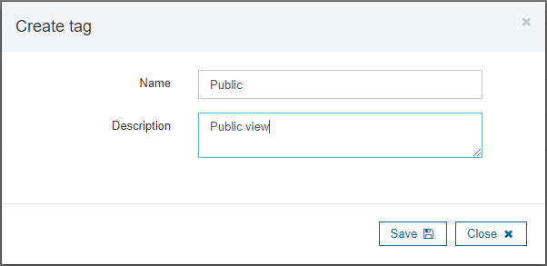
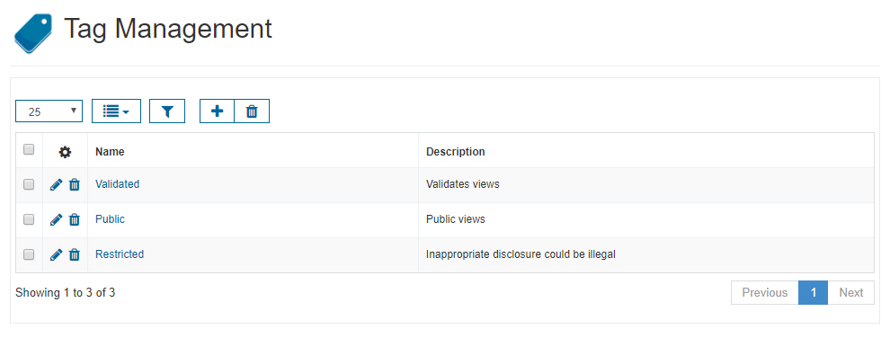
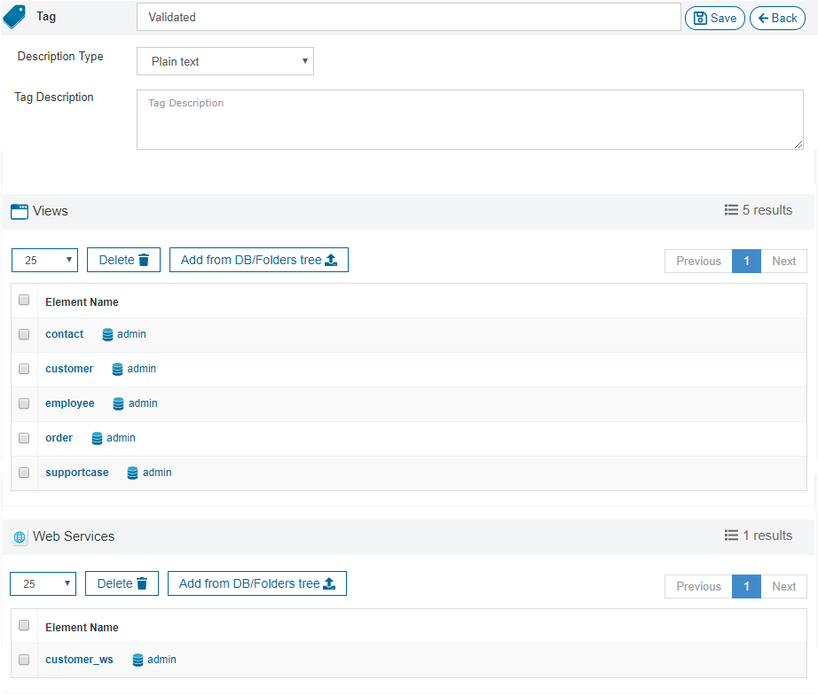
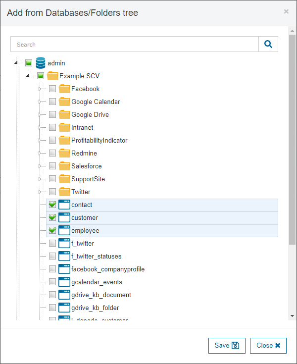

==================
Tags Configuration
==================

A tag is a keyword or term assigned to a piece of information. This kind of metadata helps describe an item and allows it to be found again by browsing or searching.
Tags are part of the catalog metadata. They are a way to classify views and web services according to some criteria (for instance, "validated" and "public" views).

In the “Tag Management” section you can manage the tags: create new ones, edit the existing ones or remove them.

   Create a tag

   Tags list

Edit Tags
---------
   
By clicking on the *Edit* icon, you will see a window like the one in `Edit Tag`_, where you can modify:

- Its name.
- Its description.

Assigning Tags
--------------

In the screen shown in the previous image, you can click on any tag to see the list of 
elements (views and web services from any database) assigned to that tag (see section :ref:`Tags`).

You can also see the list of elements that are assigned that tag, and remove them or add new ones, as shown in the following image:

   Add views from Databases/Folders tree to a Tag

Here, you can click on any element name to browse it.