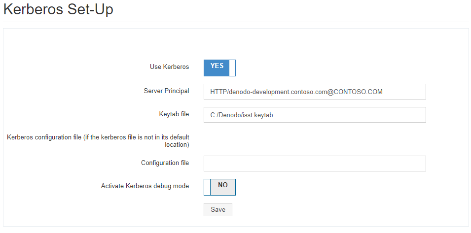
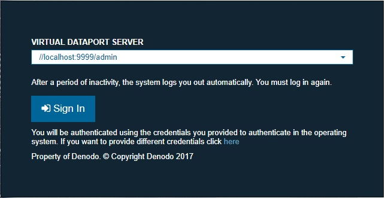

======================
Kerberos Configuration
======================

This tab allows you to configure the Data Catalog to
use Kerberos to authenticate the users with Virtual DataPort by using
Single Sign On (SSO), which means that the Data Catalog users
will not have to provide their credentials.

Before configuring Kerberos in the Data Catalog, you
need to configure the Kerberos authentication in the Virtual DataPort
servers to which the Data Catalog is going to
authenticate its users. To do that, follow the instructions of
the post-installation task :ref:`Setting-up Kerberos Authentication in the Data Catalog`
of the Installation Guide and then, the instructions of the section :doc:`/vdp/administration/server_administration_-_configuring_the_server/kerberos_authentication/kerberos_authentication`
of the Virtual DataPort
Administration Guide.

Finally, set-up the Kerberos authentication in the Data Catalog. In the wizard to do it (see figure below), provide the
following details:

   Kerberos configuration dialog

1. Select **Use Kerberos**.

#. In the box **Server Principal** enter the “Service Principal Name” (SPN)
   used to create the *keytab* file. That is, the SPN with the Fully
   Qualified Domain Name (FQDN) of the server where the Data Catalog is
   running. For example, "HTTP/denodo-prod.subnet1.contoso.com\@CONTOSO.COM".

#. In the box **Keytab file** enter the path to the *keytab* file.

#. Leave the **Kerberos configuration file** box empty unless one or more of these conditions is met:

   -  The host where the Denodo server runs does not belong to a Windows Active Directory domain.
   -  The Denodo server runs on Linux.
   -  The user account used by the Data Catalog in Active Directory has the option *constrained delegation* enabled.
   
   If one of these conditions is met, make sure the Kerberos configuration file (``krb5.conf`` or ``krb5.ini``) is 
   in one of its :ref:`default locations <Default location of the krb5 file depending on the operating system>`. If it is not there and cannot be copied there,
   enter the path to the Kerberos configuration file.

#. We recommend selecting the check box **Activate Kerberos debug mode**
   the first time you set up Kerberos in case you run into any issues. Once
   Kerberos has been set up, disable this.

   When this option is enabled, check the appendix :ref:`How to Debug Kerberos in Web Applications` 
   of the Installation Guide to learn how to see the debug information.

#. Restart the Data Catalog so these changes take effect. 

After these changes, when the users go to the Data Catalog, they will be logged in automatically - without entering their credentials - because the browser will send the Kerberos credentials of their system. In order for this to work, they need to access using the full qualified URL (FQDN) configured in step 2. 
For example, \https://denodo-prod.subnet1.contoso.com:9443/denodo-data-catalog/.

If you configured the Data Catalog to be able to connect to more than one Virtual DataPort server, users will not be logged in automatically. They will have to select first the Virtual DataPort server they want to connect but not provide their credentials (see screenshot below).

   Authentication dialog with Single Sign-On
   
.. important:: If there are errors in the Kerberos configuration and as a result, users cannot log in, you can by-pass this 
   by using :ref:`local-based authentication <Authentication and Authorization>`. You will not be able to query any data but you will
   be able to modify the Kerberos settings of the Data Catalog.