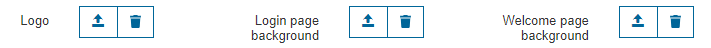
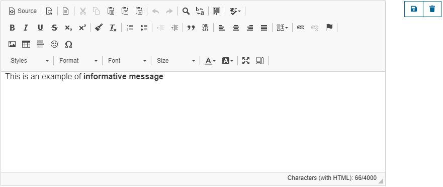
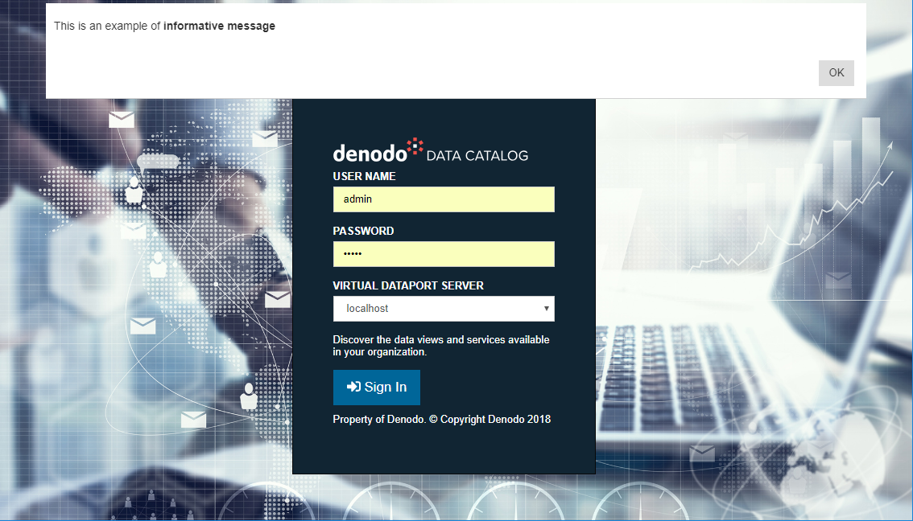
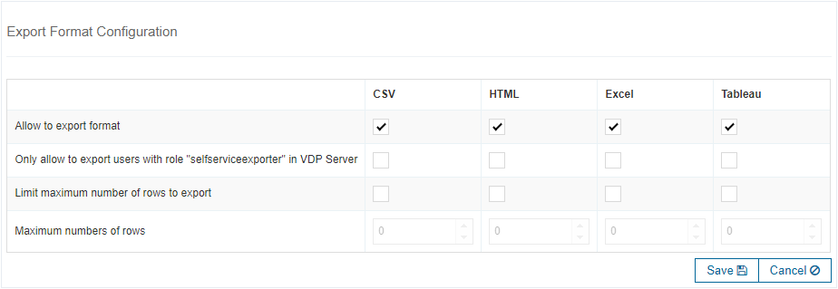
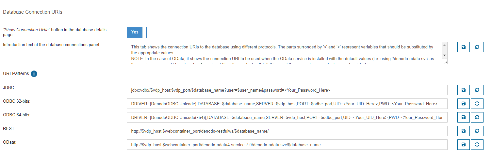

===============
Personalization
===============

This section explains how to configure and personalize several aspects of the tool. 
It covers the following topics:

.. contents::
   :local:
   :depth: 1
   :backlinks: none
   
These parameters are global for all the users of the tool.

Elements Shown to the Users
=================================================================================

You can specify which elements from the catalog the users are allowed to see:

- Only Views
- Only Web Services
- Both

It affects the results shown in the following sections:

- :doc:`Databases </vdp/data_catalog/browse/databases_browse/databases_browse>` browsing
- :doc:`Search </vdp/data_catalog/search/search>` (the user could only search in the catalog, not in the metadata)
- :doc:`Saved Queries </vdp/data_catalog/saved_queries/saved_queries>` (only saved queries from allowed elements are shown)

Browse Configuration
=================================================================================

You can choose whether to **Allow users to browse by Databases/Folders** or not.
If this option is disabled, users will not be able to access the 
:ref:`Databases/Folders <Databases>` panel. In this case, you can also choose to 
**Hide uncategorized views and web services** from users (uncategorized views
and web services will not appear in search results or when browsing by
:ref:`Categories <Categories>` or :ref:`Tags <Tags>`).

User Interface
=================================================================================

You can customize this tool to adapt it to the branding of your company.
You can change the following:

-  The logo displayed on the top left.
-  The image displayed on the background of the Login page.
-  The image displayed on the background of the Welcome page.

   Personalization
   
.. note:: Maximum size for uploaded images is 5MB.

Informative Message
-------------------

You can add an informative message that will be displayed to all users when they access the Data Catalog. It will show up at the top of the page.

It can be used to display a welcome message, inform users when the service is expected to be down for maintenance, legal disclaimers, etc.

   
   Informative Message Set-Up

To enter the message in HTML, click **Source** in the editor, enter the HTML and click **Source** again. The *Save* button is disabled while in *Source* mode.

   
   Informative Message

Export Format Configuration
=================================================================================

Regarding the exportation of the results of the :ref:`queries of views <Query of Views>` and :ref:`queries of web services <Query a Web Service>`, 
the administrator can configure:

- The available export formats, among: CSV, HTML, Excel and Tableau (the section :ref:`below <Enabling Exports to Tableau>` explains how to enable the exports to Tableau).
  All enabled by default.
- The maximum number of rows using each of the available formats.
- If only the users with the role *data_catalog_exporter* in Virtual DataPort 
  can export the results of the queries using each of the available exporters.

   Export Format Configuration

Enabling Exports to Tableau
---------------------------

To enable the feature of exporting data to Tableau, you need to install the "Tableau Data Extract API" in the host where the Denodo Platform is installed. To do this, follow these steps:

1. Go to the web site of the `Tableau Data Extract API <https://www.tableau.com/data-extract-api>`_.
#. In this page, sign in and download the package *C/C++/Java 64-bit version*. Select Windows or Linux depending on the operating system where the Denodo server runs.
#. Uncompress the downloaded file.
#. If the Denodo server runs on Windows, copy the files of the folder ``bin`` in the downloaded file to :file:`{<DENODO_HOME>}/jre/bin`.
#. If the Denodo server runs on Linux:

   i. Copy the files of the folder ``bin`` in the downloaded file to :file:`{<DENODO_HOME>}/jre/bin`.
   #. Copy the files of the folder ``lib/dataextract`` in the downloaded file to :file:`{<DENODO_HOME>}/jre/bin`.

#. Restart the Data Catalog.

Database and View Connection URIs
=================================================================================
   
You can choose whether to display the ``Show Connection URIs`` button or not in 
the databases' and views' details page. If you choose to show it, you can customize several
parameters:

- Introduction text of the database connections panel: this will be shown in the 
  panel instead of the default introduction.
- URI Patterns: these describe how to access the server's databases through 
  JDBC, ODBC, REST and OData. You may use the following variables in the
  pattern definitions: ``$vdp_host``, ``$vdp_port``, ``$user_name``, 
  ``$database_name``. These variables will be replaced by the appropriate 
  values when showing the URIs to the user.
   

   
   Database Connection URIs

   
Usage Statistics
=================================================================================
   
The Data Catalog allows showing usage statistics of the views and web services by analyzing the usage data collected by Denodo Virtual DataPort.
This feature requires some :ref:`preparation steps <Steps to configure the gathering of statistics>`, that will be explained later on this section.

When this feature is enabled, the details page of views and web services includes a :doc:`new tab </vdp/data_catalog/browse/views_browse/usage_of_views>` 
that shows some statistics about its usage (after they are :ref:`collected and computed <Computing usage statistics>`). 

Steps to Configure the Gathering of Statistics
----------------------------------------------

In order to show the :doc:`Usage tab </vdp/data_catalog/browse/views_browse/usage_of_views>` in the details page of views and web services, a user with administration privileges has to perform the following steps:

#. :doc:`Configure the Denodo Monitor </vdp/administration/monitoring_the_virtual_dataport_server/denodo_monitor/configuring_the_denodo_monitor>` to store the log of requests in a database (for instance, a table in Oracle). By default, Denodo Monitor saves the log information to a file. You need to modify this to use a database instead the log file.

   -  Edit :file:`{<DENODO_HOME>}/tools/monitor/denodo-monitor/conf/ConfigurationParameters.properties` and search for the following text
      and follow the instructions of the file.
   
   .. code-block:: none
   
      # ================================================================================
      # Settings to store the output of the Virtual DataPort query monitor in a database
      # ================================================================================
        
   .. note:: Data Catalog requires to use the Denodo Monitor included in update 20180926 or later.
   
#. Create the necessary views in a Virtual DataPort server:

   #. Create a database named as *denodo_logs*. The next steps are assuming this database.
    
   #. Create a base view over the previously configured table (*request_notification*) in the Denodo Monitor for the requests log.
   
      -  You have to name that base view as *"request_notification"* and include the columns with the default names.

   #. Create the view *usage_statistics_src* with full cache enabled:
   
      -  Import the VQL file *usage-statistics.vql* (with its properties *usage-statistics.properties*) from :file:`{<DENODO_HOME>}/resources/data-catalog/statistics`.
        
         You may need to modify the properties file before importing.
         
      -  If the cache is not enabled in the Denodo Virtual DataPort server, 
         you have to :doc:`enable and configure it </vdp/administration/server_administration_-_configuring_the_server/configuring_the_cache/configuring_the_cache>`.
   
   .. note:: Due to license restrictions, you cannot use the Denodo Virtual DataPort server shipped with the Solution Manager installer.
   
#. Enable the *usage statistics* in the Data Catalog:

   -  Configure the period/s to compute the usage statistics: *Last day*, *Last month* and/or *All time*.
   -  Configure the element/s over which to calculate the usage statistics: *User*, *User Agent* and/or *Query*.
   -  Configure the connection details to the Virtual DataPort server containing the views over the Denodo Monitor requests log (needed to calculate the usage statistics), as explained before.
   
      -  *Database*: the database where the views were created. If no value is specified in this field, the database of the *Connection URI* will be used.
      -  *View Name*: the name of the view to query the usage statistics. The default value *usage_statistics_src* will be used if no value is specified in this field.
      
   .. figure:: InformationSelfServiceTool-11e.png
      :align: center
      :alt: Usage Statistics
      
      Usage Statistics

#. :ref:`Compute the statistics <Computing usage statistics>`

   Once you get to this step, you have everything configured but nothing is shown in the new statistics tab from the details page. This is because no
   statistics were computed  yet. The next step, is to make the Data Catalog process the information stored in Denodo Virtual DataPort to compute
   and show the statistics. To do that, there are two options, as explained below.
    
Computing Usage Statistics
--------------------------

After having configured the Data Catalog to show the usage statistics, it needs to compute them. There are two ways to achieve this:

-  Scheduled with Denodo Scheduler:

   You can use :ref:`Denodo Scheduler <Scheduler Administration Guide>` to plan the computing of the statistics in an incremental way. 
   Denodo Scheduler retrieves the raw data from the Denodo Monitor and loads it incrementally in the cache (with the new usage data).
   You have to follow these steps:

   #. :ref:`Load <Importing Extensions>` the `Denodo Incremental Cache Load <https://support.denodo.com/resources/denodo-connect/download/1763/>`_ stored procedure in Denodo Virtual DataPort.
   #. :ref:`Create <Importing Stored Procedures>` the *INCREMENTAL_CACHE_LOAD* stored procedure in Denodo Virtual DataPort.
   #. :ref:`Import <Connection Details>` the Scheduler project from :file:`{<DENODO_HOME>}/resources/data-catalog/statistics/data_catalog_statistics_scheduler.zip`. 
      It creates a project *data_catalog_statistics*, that depending on the update you have installed will include or not the job *load_cache_and_update_statistics* 
      (a VDP job to load the cache and execute the view over the Data Catalog endpoint to compute the usage statistics using the data obtained from the view *usage_statistics_src*). 
      Besides, it will include other three jobs:
   
      i. *cache_load_first_time*: A VDPCache job to load the cache of the view *usage_statistics_src* the first time. 
         
         It is recommended to use this job if you have stored the Denodo Monitor logs for several days or weeks and you have not used the job *load_cache_incremental* to load the cache of its view incrementally. Execute this job once, and then use the job *load_cache_incremental* to load the cache incrementally from that moment.

      #. *cache_load_incremental*: A VDP job to call the incremental cache load stored procedure over the view *usage_statistics_src*. It is recommended to schedule it to be executed at least once a day (or more times if you desire to refresh the usage statistics most frequently).
      #. *update_statistics*: A VDP job to execute the view over the Data Catalog endpoint to compute the usage statistics using the data obtained from the view *usage_statistics_src*. It is recommended to schedule it to be executed just after the job *cache_load_incremental*, on which this depends.
   
      These three jobs are deprecated and are replaced by *load_cache_and_update_statistics*. This job does the same work as the other three.
      
      .. note:: If your project contains the job *load_cache_and_update_statistics*, use it. Otherwise, you are forced to use the other three explained jobs.

-  Manually from the Data Catalog:

   You can compute the usage statistics by clicking the *Compute usage statistics now* button in the Data Catalog.
   The action dispatched with this button loads the cache with new data since the last time the cache was refreshed, 
   and then computes the statistics (as Denodo Scheduler does, but in a scheduled way).
    
.. note:: The recommended option to keep your statistics up to date is by using the Denodo Scheduler. You can modify the scheduling triggers according to your needs.