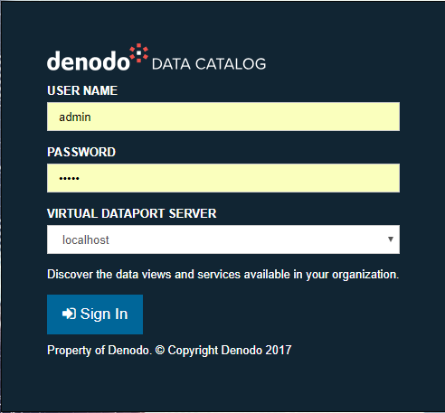
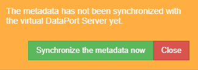
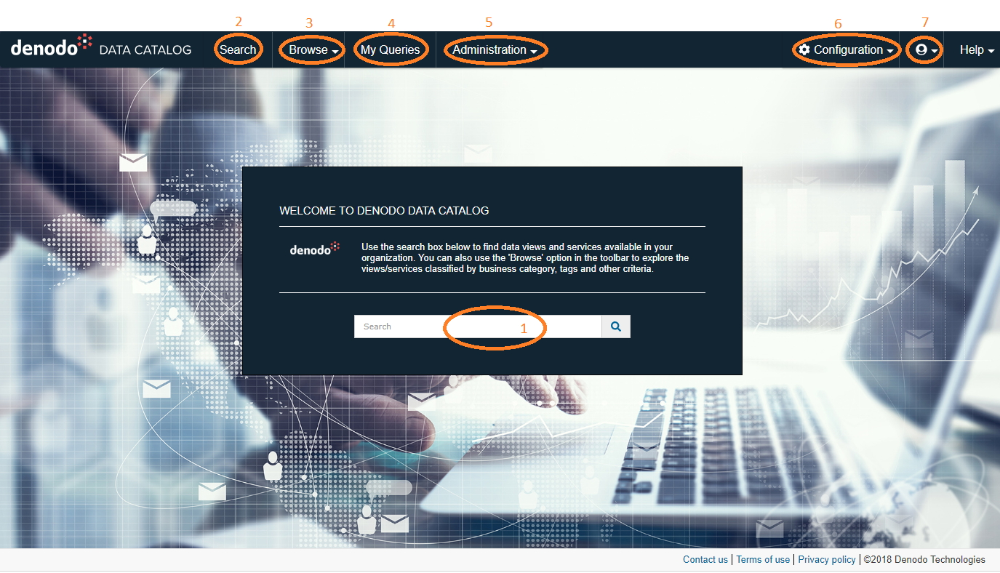

================================
Authentication and Authorization
================================

There are two types of authentication:

.. _local-auth:

-  **Local-based authentication**. This authentication type is only useful
   to configure the Virtual DataPort servers that users can connect to
   using this tool and the Kerberos settings.

   To use this type of authentication, go to \http://denodo-server.acme.com:9090/denodo-data-catalog/LoginLocal. 
   With this type of authentication, you can only use the local user
   “admin” whose password is “admin” by default.
   
   Once you log in for the first time using this authentication method, we
   recommend changing the password of the local “admin” user. To do this,
   click **Change password** on the top right of the site (under the user icon).
   
   .. note:: The main use of the local-based authentication is to change the 
      Virtual DataPort server to which the Data Catalog will connect or change the Kerberos authentication settings.

-  **VDP-based authentication** (default option). With this option, the
   tool delegates the authentication of users to Virtual DataPort.
   Therefore, you have to use the same login and password that you use in
   the Virtual DataPort Administration Tool.

   To use this type of authentication, launch the application from
   the Control Center or go to \http://denodo-server.acme.com:9090/denodo-data-catalog/Login.

   -  Select the Virtual DataPort server you want to connect to from the
      list.
   
   -  The user must have the “Connect” privilege over the database of the
      URI.
      

   Authentication screen in the Data Catalog

.. note:: If Kerberos is configured (see section :doc:`../administration/kerberos_configuration/kerberos_configuration`), 
   you can log in to the server with Kerberos using Single Sign On (SSO). 
   Note there is no support to use Kerberos with user and password.
      
.. note:: If you are logging in with an LDAP user, the URI database used to log in must point to a virtual database configured with LDAP.

When you select “VDP-based authentication”, the Virtual DataPort server checks
that the provided credentials are valid and that the user has the
privileges granted to connect to the Server. Take the following into
account:

-  Only the global administrators of the server and the users with the
   role *data_catalog_admin* can administer the tool and synchronize the metadata.
-  All the users can browse, search and query the data and metadata of
   the Server.

If it is the first time you access the Data Catalog (or if you have not yet synchronized the metadata) and you have administration privileges, 
an alert (see image below) will be shown in the top right of the site, asking you to synchronize the metadata with the Virtual DataPort Server.

   Alert message to synchronize metadata

A feature of the Data Catalog is to allow the administrators to create :doc:`categories </vdp/data_catalog/administration/catalog_management/categories_configuration/categories_configuration>` 
and :doc:`tags </vdp/data_catalog/administration/catalog_management/tags_configuration/tags_configuration>` and apply them to the databases and views from the Virtual DataPort Server, 
so that they are organized in some way. In order to do this, you first have to synchronize the metadata.

.. important:: It is highly recommended to :ref:`synchronize the metadata <data-catalog-synchronize-elements-with-the-server>` as the first step once logged in.

Once you are logged in, you will see the main window (see the figure below). These are the main parts:

#. Main page: a **search box** is presented. It is a shortcut to :doc:`Catalog Search </vdp/data_catalog/search/catalog_search/catalog_search>`, with the default options.
#. **Search** tab (see section :doc:`/vdp/data_catalog/search/search`): allows to do searches in the :doc:`catalog <../search/catalog_search/catalog_search>` and :doc:`contents <../search/content_search/content_search>` (if an index is configured).
#. **Browse**: allows to browse the :doc:`databases <../browse/databases_browse/databases_browse>`, the :doc:`relationships <../browse/associations_browse/associations_browse>` 
   among their views, the :doc:`categories <../browse/categories_browse/categories_browse>` and the :doc:`tags <../browse/tags_browse/tags_browse>`.
#. **My Queries** (see section :ref:`Saved Queries`): shows the list of the user's saved queries.
#. **Administration** (see section :doc:`Administration <../administration/administration>`): allows to configure the server and the catalog. It is only visible to administrators.
#. **Configuration** (see section :doc:`../configuration/configuration`): all users can edit their own preferences.
#. **Logout** links.

   Main Window

