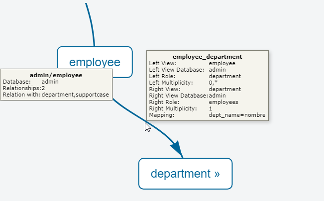
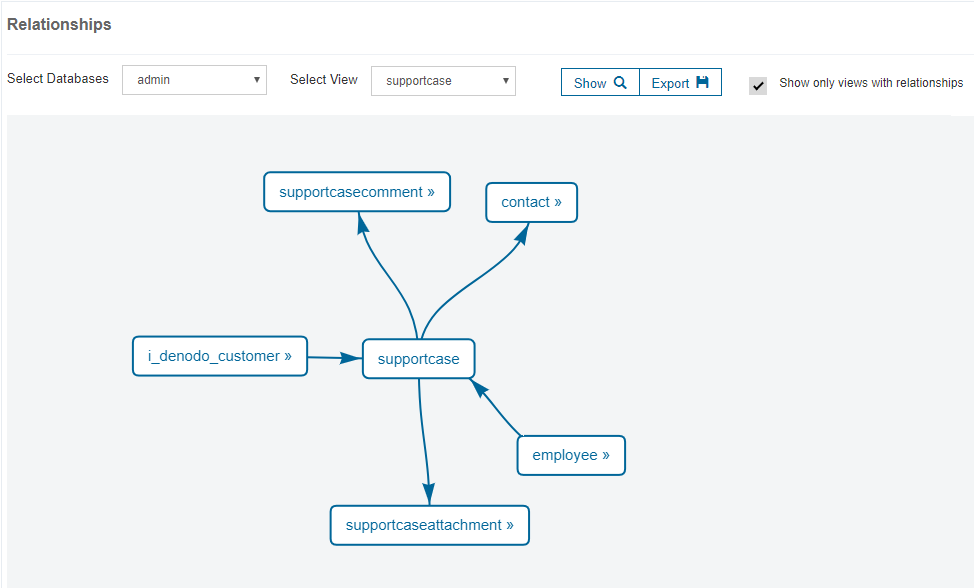

==============
Relationships
==============

The “Relationships” page shows a graph with the views of the server and
their associations.

   Graph with associations

By default, the tool only displays the views with associations. Clear
the check box **Show only views with associations** to display all the
views.

You can zoom in/out the diagram and export it to a file.

An association links two views, each playing a role in the association.
In the graph, the rectangles represent views and the arrows, the roles
of the view in the associations.

Move the mouse over a view to see information about: 

- The database it belongs to.
- The number and name of the views associated with this one. 

Double-click on the name of a view to go to the *Query* tab of that view (see section :ref:`Query of Views`).

Move the mouse over the arrow of an association to see information about
it: the roles and multiplicity of the views involved in the association
and their mapping.

You can focus the graph of associations on a specific database and/or view, by using the *Select Database* and *Select View* options.

   Centering the graph of associations in a view

