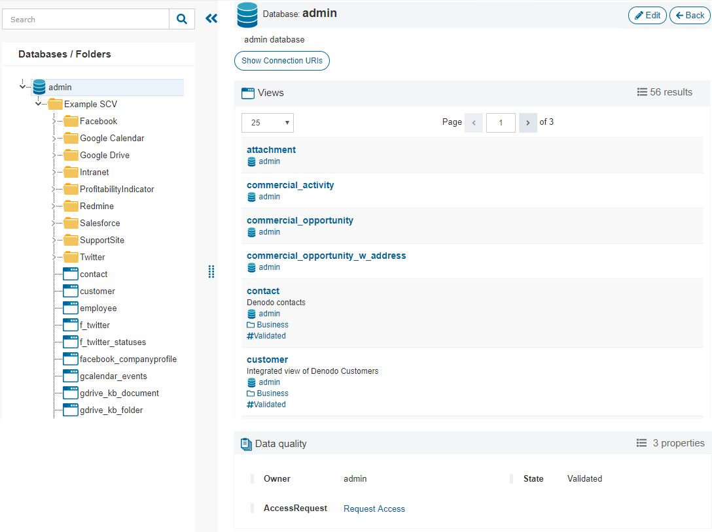
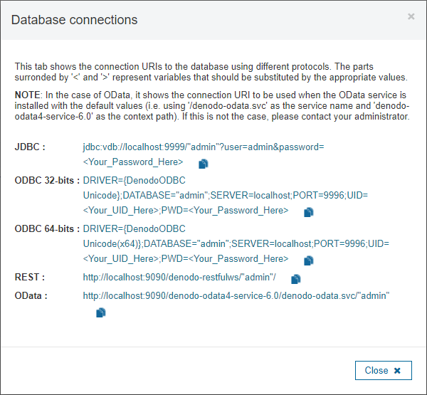

=========
Databases
=========

This dialog obtains from the Virtual DataPort server, in real time, the list of databases with its folders, views and web services. This is different from the dialogs "Categories" and "Tags", in which the information is obtained from the metadata stored in the Data Catalog and has to be periodically synchronized.

If the selected database has :ref:`custom properties groups assigned <Assigning Custom Properties>`, they are also displayed in this page.

You can filter the list of elements by using the *Search* option at the top of the sidebar.

   Database views
   
The button to :ref:`edit <Edit Database>` the database is only visible if the user has administration privileges.

Click **Show Connection** to obtain the URIs to connect to the current Virtual DataPort database through JDBC, ODBC, REST and OData. For REST web services, it shows the URI to query a web service deployed on that database.

   
   APIs to connect to a Virtual DataPort server