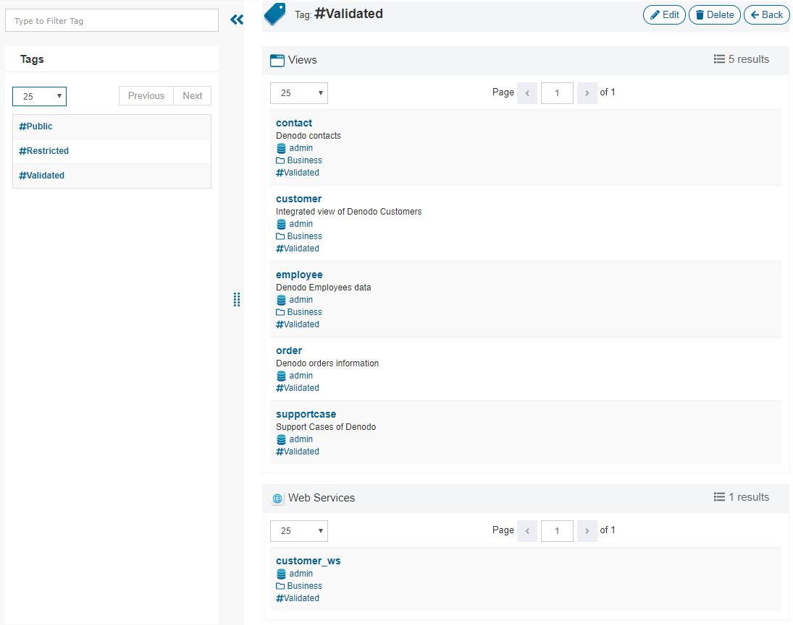

====
Tags
====

The page "Tags" lists the tags defined. You can filter them by using the *Search* option at the top of this sidebar.

Click on a tag to see the elements (views and web services) that have this tag assigned.

   Tag views
   
The buttons to :ref:`edit <Edit Tag>` and delete are only visible if the user has administration privileges.
