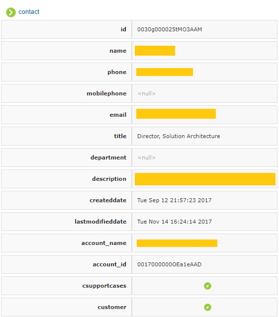

===============
Search of Views
===============

As explained in the section :doc:`/vdp/data_catalog/search/search`, searching on a view is only available
if those two conditions are matched:

#. An administrator has configured a search index for the selected
   server (see section :doc:`Search Configuration <../../administration/search_configuration/search_configuration>` for more information of
   how to do this), as the searches are performed on it.
#. The selected view was indexed during the generation of that index, as
   the index configured for a server may not contain all its views.

It allows searching on a specific view regardless of its fields, or in a
specific field. For instance, you could search for “Architecture” in the
*Contact* view, or for “Architecture” in the field “title” of the
*Contact* view.

   Search results for Contact view

Next to each result there are two links:

-  **Index Data**: allows to see all the data of the indexed tuple (see
   `Index data for a particular Contact`_).
-  **Live Data**: allows to see the current data of the tuple. It uses
   the primary key of the tuple to query the Virtual DataPort server and
   shows the result in a “pop-up”. If the view has associations, they
   can be browsed in the “pop-up” (see `Live data for a particular
   Contact with associations to browse`_).

   Index data for a particular Contact

   Live data for a particular Contact with associations to browse
   
.. note:: When searching the index, you can only see the 1000 first results. 
   You can access all the results from the *Query* tab (instead of the *Search* one) 
   when the last interval is reached and the |image0| button is disabled.

