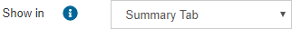
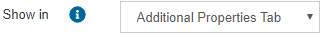
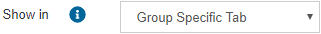

=====
Views
=====

.. toctree::
   :hidden:

   summary_of_views.rst
   query.rst
   associations_of_views.rst
   lineage_of_views.rst
   search_of_views.rst
   usage_of_views.rst
   
As explained before, the purpose of the *Browse* menu is to find a view or web service by navigating through the different types of elements: databases, categories or tags.

When you reach a view and you click on its name, the tool will display these tabs:

-  **Summary**: see section :ref:`Summary of Views`.
-  **Query**: see section :ref:`Query of Views`.
-  **Associations**: see section :ref:`Associations of Views`.
-  **Lineage**: see section :ref:`Lineage of Views`.
-  **Search**: see section :ref:`Search of Views`.
-  **Usage**: see section :ref:`Usage of Views`.

In addition, if the view has some :ref:`custom properties groups assigned <Assigning Custom Properties>`, their custom properties will be shown here. Depending on how the group is configured, 
they appear in different tabs:

- *Summary* tab: when the group is configured as |image0|
- *Additional Properties* tab: this is a new tab that includes the custom properties from all groups configured as |image1|
- *<Property Gropup Name>* tab: this is a new tab that includes only the properties of this group, which is configured as |image2|. 
  There will be as many new tabs as groups with this configuration the view has assigned.
  
The button to edit the view is only visible if the user has administration privileges.

