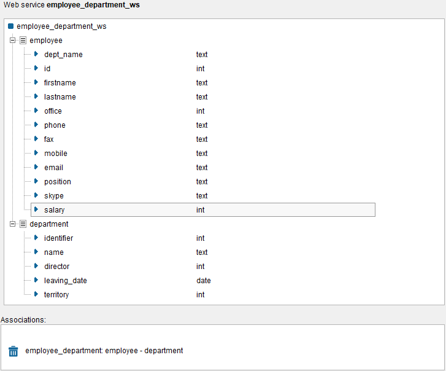
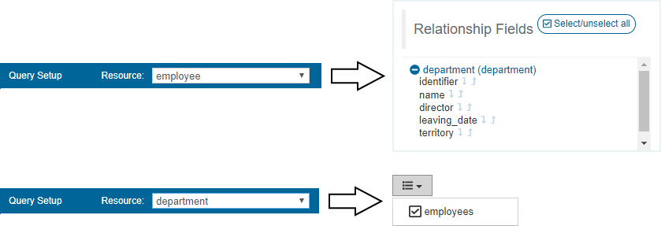

===================
Query a Web Service
===================

From the “Query” tab, you can query REST web services (currently, this option is not available for SOAP web services).

This tab is pretty similar to the one already explained in section :ref:`Query of Views`.

To display all the data of the web service, just let the "Query Setup" empty and click |image0|. You can also add
conditions to filter the data obtained from the web service.

In the case of web services, the "Query Setup" allows you to select the resource to query.

For instance, if we have deployed the web service depicted in `REST Web Service deployed in Virtual DataPort`_, 
we can query the resource “department” (and we can choose whether to include the link to its employees in the results table),
or we can query the “employee” resource (in this case, we can expand the association to its “department”, as already explained in the case of the views).

   REST Web Service deployed in Virtual DataPort

   Query REST Web Service

Regarding the "Query Results", the same :ref:`considerations <Query Results>` explained for views apply here,
except that, in this case, binary fields are shown as “[BINARY DATA]” and contain a link to download their content.

