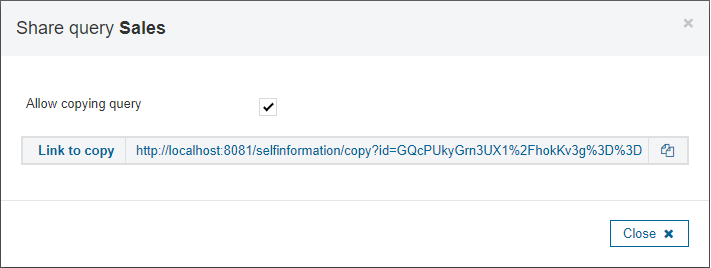
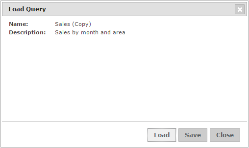

=====================
Copying Saved Queries
=====================

Each saved query has an arrow icon (|image0|) which lets the user to
share copies of the query with other users, by enabling the **Allow
copying query** check box.

   Sharing a saved query

Once enabled, a link to create a copy of the query is shown (`Getting
the link for sharing a query`_). From this moment, when any
authenticated user navigates to that link, a copy of the query
associated to that URL is created in the Query tab of the pertinent
view. Then, this user could execute it, modify it or save it as her own
query. The owner of the query can invalidate the link at any moment, by
disabling the **Allow copying query** check box. From that moment, the
link could not be used to create copies of the query anymore.

   Getting the link for sharing a query

   
Once the query is allowed to copy, its arrow icon changes to |image1|.

When another user navigates to the link to copy a query, 
a dialog displaying the name and description of
the query is shown. Then, the user can:

-  **Load** the copy of the query 
-  **Save** the query
-  **Cancel** the operation

   Load query from link

