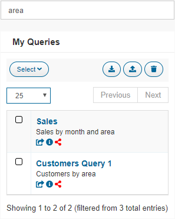

=============
Saved Queries
=============

.. toctree::
   :hidden:

   deploying_saved_queries/deploying_saved_queries.rst
   copying_saved_queries/copying_saved_queries.rst

The **My Queries** list displays the queries saved for the logged user
in the current server. This list can be filtered by a text contained in
the query name or query description.

   List of queries

The selected queries can be removed by clicking |image1|, or
exported to a file by clicking |image2|. A set of queries
previously exported to a file can be imported by clicking |image3|.

.. note:: You can use the import/export utility to migrate your saved queries
   from version 6.0 to 7.0. Please, take into account that the following elements 
   from 6.0 are no longer supported in 7.0:
   
   - 1 to N associations.
   - ``Group By`` and ``Having`` clauses.
   
   If you are importing a query with any of these elements, a warning message
   will be displayed, to inform you that they will be ignored.

