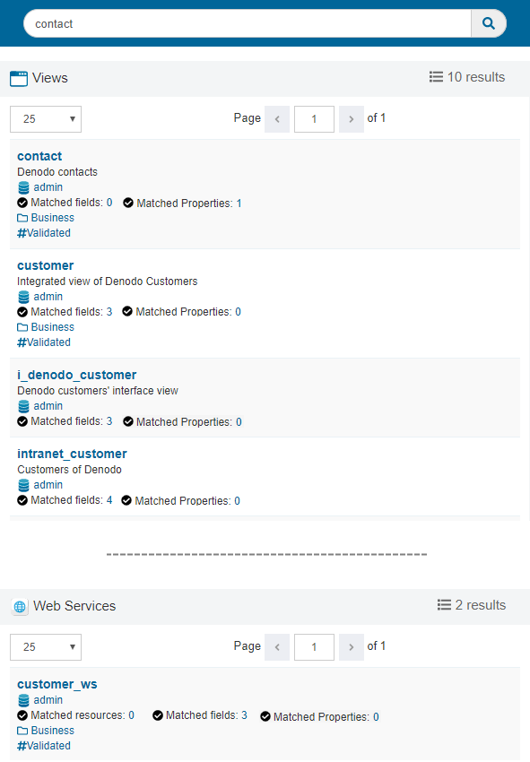

.. _data_catalog_catalog_search:

==============
Catalog Search
==============

The "Catalog Search" page is where you search in the metadata - not the data - of the Data Catalog. That is:

-  Search in the categories and Tags of the Data Catalog
-  Search in the metadata of views and web services of Virtual DataPort. E.g. in the name of fields, their description, etc.

The goal of this search is to help you locate the views and web services that provide the information you need.

   Search results
   
If you want to search on the data - not the metadata - of the views and web services, select the option :ref:`Content <Content Search>` on the left panel.

The results of a catalog search display the elements that contain the search terms (the search is case insensitive). More specifically, the results contain:

-  The elements whose name or description contain the search term.
-  The views and web services that have a field whose name or description contain the search terms. Click the number next to **Matched fields** to see the fields that match.
-  Views, web services and databases that :ref:`are assigned a property <Property Groups Configuration>` whose value contains the search terms. Click the number next to **Matched Properties** to see the properties that match.

You can narrow your search by selecting filters on the left panel (**Refine your result**):

-  If you select a category, the result will only show the views and web services that belong to that category *or any of its subcategories*.
-  If you select a tag, the result will only show the views and web services that have that tag assigned.
-  If you select a database, the result will only show the elements of this database.

   
The administrators of the Data Catalog have to consider the following:

-  The Data Catalog only shows elements over which the user has read permissions in Virtual DataPort.
-  In order for the "catalog search" to work, the administrator of the Data Catalog has to synchronize the metadata of Virtual DataPort with the metadata of the Data Catalog. The section :ref:`Elements Configuration` explains how to do this. Otherwise, the search results will be empty.