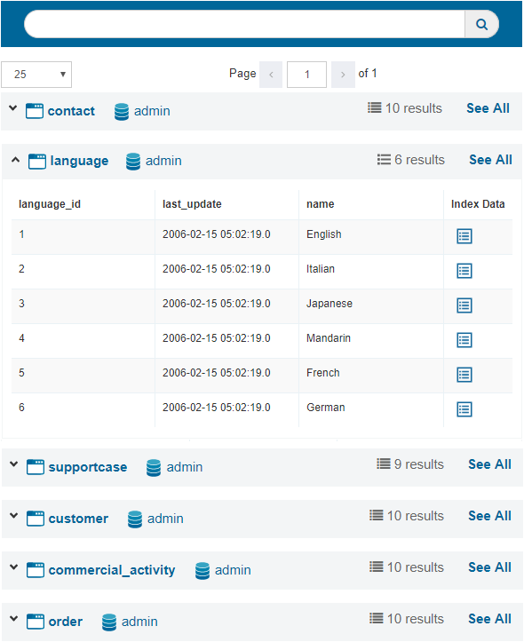

==============
Content Search
==============

This feature is only available if an administrator has set-up a search
index for the selected server (the section :ref:`Search Configuration`
explains how to do it). That is because the searches are performed on
that index and not querying the views on real time.

When you access this tab, you can choose whether to search in all the
databases and views or to select some of them.

The tool searches on the values of all the fields of all the indexed
views. As result, it displays the views where results were found and the
number of results per view (10 by default). To see a summary of the results of a view,
click **Details** (|image0|). As explained in the section :ref:`Search Configuration`, the administrator can configure the number of
results and the fields to be shown for each view, on that summary.

Note that you will only see the information over which you have
permissions defined in Virtual DataPort. This way:

-  Views with row restrictions are not shown it in the search results.
-  Views with column restrictions only show the columns with permissions
   in the search results.

   Search results

To load a particular view and/or access to its complete results,
click on its name to open the Search tab of that view (see
section :ref:`Search of Views`). In this case, if you have specified
any keyword when searching, the results of the view will show all 
the filtered results of that search.

You can also click on the database name to browse it.

