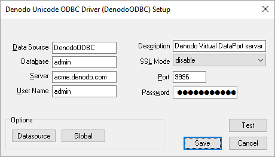
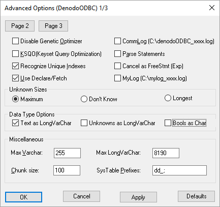
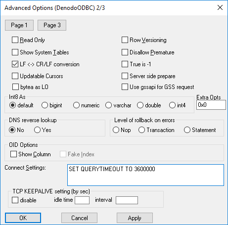
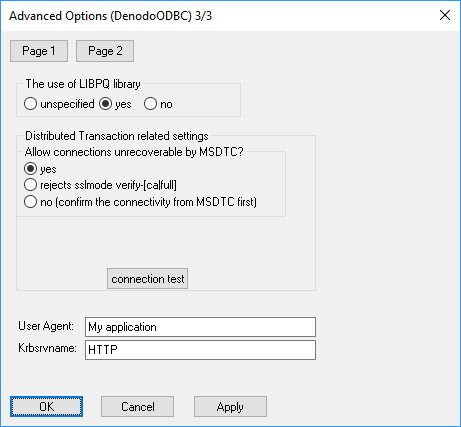

===========================================
Configuration of the ODBC Driver on Windows
===========================================

The Denodo Platform provides an ODBC driver for Windows, which is based
on the ODBC PostgreSQL driver.

To connect to Denodo from an ODBC application, follow these steps *in the machine where
the client application runs*:

1. :ref:`Install the ODBC driver <Install the ODBC Driver on Windows>`
#. :ref:`Register a new Data Source on Windows (DSN) <Set Up a DSN on Windows>`

Install the ODBC Driver on Windows
==================================

Install the ODBC driver *in the machine where the client application runs*. To do this, follow these steps:

#. Obtain the file ``denodo-vdp-odbcdriver-windows.zip``. To do this:

   a. Copy it from the installation (:file:`{<DENODO_HOME>}/tools/client-drivers/odbc/denodo-vdp-odbcdriver-windows.zip`).
   b. Or download it from the `ODBC page <https://community.denodo.com/drivers/odbc/32>`_ of the Denodo Community. 

      On this page, download the driver for Windows (the name ends up with *-win*). Make sure you select a version of the package
      that is *not newer* than the Denodo server you are going to connect. For example, if your Denodo server has the update 7.0 20181011, *do not* download
      the package *denodo-vdp-odbcdriver-7.0-update-20190312-win* because it is newer.

#. Extract the contents of this file and copy them to the host where the client application runs.

   It contains two files:

   -  DenodoODBC_x86.msi (folder "msi") installs the ODBC driver for 32-bit clients.
   -  DenodoODBC_x64.msi (folder "msi") installs the ODBC driver for 64-bit clients.

   You can install both on the same host so all the applications can use this ODBC driver regardless of its
   “bitness”.

   The 32-bit driver is for 32-bit clients like Microsoft Excel. Microsoft
   Excel can only use the 32-bits ODBC driver, even if it is running
   on a 64-bits O.S and is going to connect to a Virtual DataPort server
   running with the 64-bits JRE.

Set Up a DSN on Windows
=======================

After installing the Denodo ODBC driver on the host where the client application runs, you need to register a new data source, also known as DSN, that points to the Denodo server.

Follow these steps to do this:

#. Open the *ODBC Data Sources* applet of the Windows Administrative Tools
   (Control Panel).
   
   To open it, press the Windows key and enter *Set up ODBC data source*.
   
   .. important:: There are two dialogs to register an ODBC DSN, one for 32-bit
      applications and one for 64-bit applications.
      
      For example, to connect to Denodo from Microsoft Excel, use *Set up ODBC data sources (32-bit)*.

#. In the tab **User DSN**, click **Add**.

   When creating the DSN, do it with the same user account with you run the
   application that will connect to Denodo. If that is not possible, create a "System DSN". 
   Only local administrators of the computer can register a system DSN. If an administrator 
   cannot create the DSN, create a user DSN.

   The difference between a “System DSN” and a “User DSN” is that the “User
   DSN” can only be used by the current user and the “System DSN” can be
   used by all the users of the system.
   
#. Select the **DenodoODBC Unicode** driver (*not DenodoODBC ANSI*) and
   click **Finish**.
#. In the configuration dialog, fill in the following information:

   a. **Database**: database in Virtual DataPort. E.g. ``admin``.
      If the name of the database contains non-ASCII characters, they have
      to be URL-encoded. For example, if the name of the database is
      “テスト”, enter “%E3%83%86%E3%82%B9%E3%83%88”.
   b. **Server** and **Port**: host name and port of the server that runs
      Virtual DataPort. The default ODBC port is 9996.
   c. **User Name** and **Password**: credentials of the Virtual DataPort
      user.

      If Kerberos authentication is enabled on the Denodo database you are connecting to, the driver will ignore these credentials. Instead, it will obtain a Kerberos ticket from the system cache.
      
      .. note:: To be able to use Kerberos authentication, the configuration of
         the DSN has to meet these conditions:

         1. The Virtual DataPort database that the DSN connects to
            is configured with the option “ODBC/ADDO.net authentication type”
            set to “Kerberos”. Databases configured with this option will refuse the authentication with login/password.
            
         2. The client has to belong to the Windows domain. The reason
            is that the ODBC driver requests the Kerberos ticket to the ticket cache.
            
         3. In the *Server* field, enter the fully qualified domain name of the Denodo server. That is, 
            if in the Denodo server, in the Kerberos configuration, the field *Server principal* is 
            ``HTTP/denodo-prod.subnet1.contoso.com@CONTOSO.COM``, enter ``denodo-prod.subnet1.contoso.com``.

   d. If SSL is enabled on the Virtual DataPort server, in the **SSL Mode**
      list, select **require**.

    
   Denodo ODBC driver: configuration dialog

5. Click **Datasource** to open the **Advanced options** dialog.

   The default options (shown in the screenshot :ref:`below <Denodo ODBC driver: advanced configuration (Page 1)>`) are correct, but consider the following:
   
   -  If you want to log all the requests received by this DSN, select **CommLog (C:\\denodoODBC\_xxx.log)** and **MyLog (C:\\mylog\_xxx.log)**.

      .. important:: In a production environment, we strongly recommend clearing these
         check boxes because logging all the requests impacts the performance of
         the driver and the log file may grow to a very large size.

   -  In “Unknown sizes”, select **Maximum**. See more about what this
      means in the section :ref:`Maximum Length of Text Values`.

   -  As “Use Declare/Fetch” is selected, the DSN will use DECLARE
      CURSOR/FETCH to handle SELECT statements. The effect is that the DSN
      will retrieve the rows of the result set in blocks, instead of
      retrieving them all at once. **Chunk Size** establishes the number of
      rows of each block.
      The “Chunk size” of the DSN is equivalent to the “Fetch size” of the
      JDBC connections.

   
   Denodo  ODBC driver: advanced configuration (Page 1)

6. Click **Page 2**:

   The default options (shown in the screenshot :ref:`below <Denodo ODBC driver: advanced configuration (Page 2)>`) are correct.
   
   In addition, in the area “Level of rollback on errors”, select **Transaction**.   

   
   Denodo  ODBC driver: advanced configuration (Page 2)

..

   -  In the **Connect settings** box you can change the properties of the
      ODBC connection established with Virtual DataPort, by entering the
      following:

      a. ``SET QUERYTIMEOUT TO <value>`` to change the query time out (value in milliseconds).
      b. ``SET i18n TO <i18n>`` to change the i18n of the connection.

         For example, to set the default timeout of the queries to one hour, add the following:
   
         .. code-block:: sql
   
            SET QUERYTIMEOUT TO 3600000;
            SET I18N TO us_pst;
          
         Note the ``;`` between each statement.
       
         The following table describes these properties and lists its default values: 

.. _developer_guide-configuration_of_the_odbc_driver_on_windows_parameter_of_the_ODBC_driver:

.. table:: Parameters of the ODBC driver and their default value
   :name: Parameters of the ODBC driver and their default value

   +-------------------------+-------------------------+-------------------------+
   | Connection Property     | Description             | Default Value           |
   +=========================+=========================+=========================+
   | QUERYTIMEOUT            | Maximum time (in        | 900000 milliseconds (15 |
   |                         | milliseconds) the       | minutes)                |
   |                         | driver will wait for a  |                         |
   |                         | query to finish. After  |                         |
   |                         | this period, it will    |                         |
   |                         | throw an Exception. If  |                         |
   |                         | 0, the driver will wait |                         |
   |                         | indefinitely until the  |                         |
   |                         | query finishes.         |                         |
   |                         |                         |                         |
   |                         | This parameter sets the |                         |
   |                         | default timeout for all |                         |
   |                         | the queries. In         |                         |
   |                         | addition, you can       |                         |
   |                         | change the timeout for  |                         |
   |                         | a single query by       |                         |
   |                         | adding the parameter    |                         |
   |                         | ``'QUERYTIMEOUT' =      |                         |
   |                         | '<value>'``             |                         |
   |                         | to the ``CONTEXT``      |                         |
   |                         | clause of the query.    |                         |
   |                         | See more about this in  |                         |
   |                         | the section             |                         |
   |                         | :ref:`CONTEXT Clause`   |                         |
   |                         | of the Advanced         |                         |
   |                         | VQL Guide.              |                         |
   +-------------------------+-------------------------+-------------------------+
   | i18n                    | Sets the                | <I18N of the database   |
   |                         | internationalization    | that you are connecting |
   |                         | (i18n) configuration of | to>                     |
   |                         | the connection with the |                         |
   |                         | Server. If not present, |                         |
   |                         | the driver assumes the  |                         |
   |                         | i18n of the database    |                         |
   |                         | that you are connecting |                         |
   |                         | to.                     |                         |
   |                         |                         |                         |
   |                         | The "date" fields of    |                         |
   |                         | the queries' results    |                         |
   |                         | are converted to the    |                         |
   |                         | time zone assigned to   |                         |
   |                         | the i18n of the         |                         |
   |                         | connection.             |                         |
   |                         |                         |                         |
   |                         | The parameter ``i18n``  |                         |
   |                         | in the ``CONTEXT``      |                         |
   |                         | clause of the queries   |                         |
   |                         | overrides the value of  |                         |
   |                         | this parameter.         |                         |
   +-------------------------+-------------------------+-------------------------+

7. Click **Page 3** and do the following:

   a. Set the option **The use of LIBPQ library** to **Yes**.
   
   b. In the **User agent** box, enter the name of the application that
      will use this DSN. We recommend setting this field in all the
      DSNs to Virtual DataPort because is very useful for logging.
      
   c. Usually, the default value of **Krbsrvname** is correct. If you enabled Kerberos authentication on the database you are connecting to, this value has to match the "service class" of the Service Principal Name of the Server.
      For example, if in the field *Server Principal* of the Kerberos settings of the Server, you have ``HTTP/denodo1.contoso.com@CONTOSO.COM``, the value of *Krbsrvname* has to be ``HTTP``.
       

   Denodo ODBC driver: advanced configuration (Page 3)

8. Click **Ok** to close the "Advanced Options" dialog.

#. Click on **Test** to test the connection to Virtual DataPort.

#. Click **Ok**.

The DSN is now configured and ready to be used.

After setting up the DSN, we recommend reading the section :ref:`Integration
with Third-Party Applications`.

If there is an error during the creation of the DSN, try logging in using an account with administrative
privileges.