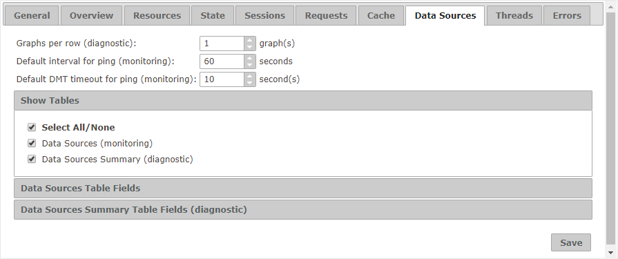

============================
Configuration - Data Sources
============================

The “Data Sources” tab 
allows you to configure how looks like the “Data Sources” tab for both
monitoring and diagnostic.

   Data Sources tab of the configuration

You can establish values for the following settings:

*  **Graphs per row**: Number of graphs that are arranged per row in the tab that shows the historical evolution of a
   data source when diagnosing.
*  **Default interval for ping**: Default value for the period (in seconds) of ping requests in the
   :ref:`dialog that configures the ping on data sources <Dialog to configure ping on data sources>` when monitoring.
*  **Default DMT timeout for ping**: Default value for the timeout (in seconds) of ping requests, when a specific
   timeout is selected in the :ref:`dialog that configures the ping on data sources <Dialog to configure ping on data sources>`.
   Do not confuse with the option "with default value" in that dialog, which takes the default timeout value of ping
   requests in Virtual DataPort.

The section “Show Tables” allows you to select if the tables “Data
Source” (monitoring) or “Data Sources Summary” (diagnostic) are visible.

In the section “Data Sources Table Fields”, you can choose which fields
appear by default in the table “Data Sources” and in which order.

In the section “Data Sources Summary Table Fields”, you can choose which
fields appear by default in the table “Data Sources Summary”
(diagnostic) and in which order.

