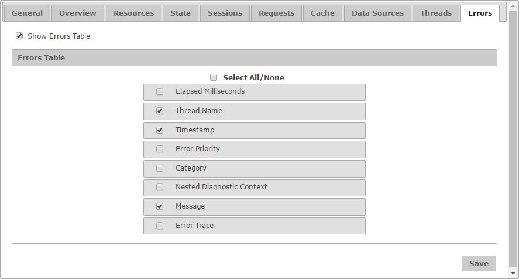

======================
Configuration - Errors
======================

The “Errors” tab allows you to
configure how looks like the “Errors” tab for a diagnostic.

   Error tab of the configuration

The setting **Show Errors Table** enables or disables the tab itself. If
selected, you can choose which fields appear by default in the table and
in which order.