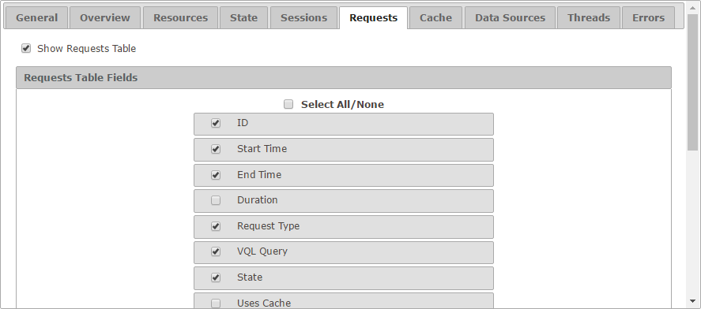

========================
Configuration - Requests
========================

The “Requests” tab allows
you to configure how looks like the “Requests” tab for both monitoring
and diagnostic.

   Requests tab of the configuration

The setting **Show Requests Table** enables or disables the tab itself.
If selected, you can choose which fields appear by default in the table
and in which order.

