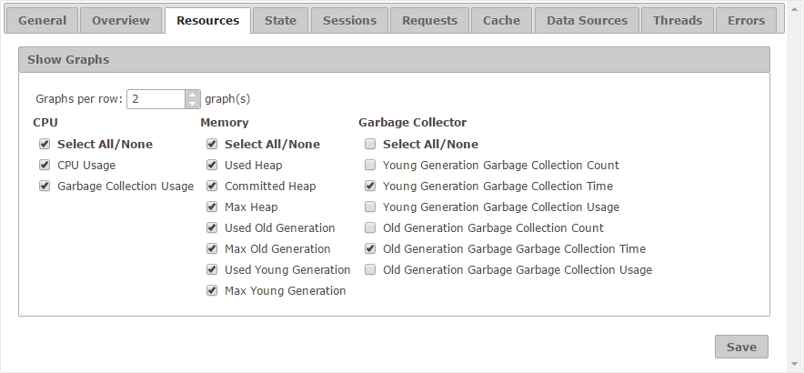

=========================
Configuration - Resources
=========================

The “Resources” tab allows
you to select which series are available in the graphs of the
“Resources” tab for both monitoring and diagnostic. Those values that
are cleared will not be visible.

   Resources tab of the configuration

Furthermore, the setting **Graphs per row** establishes how many graphs
are arranged per row.

