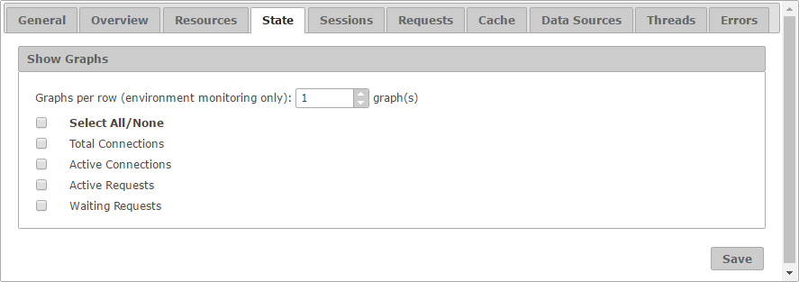

=====================
Configuration - State
=====================

The “State” tab allows you to
select which series are available in the graphs of the “State” tab for
both monitoring and diagnostic. Those values that are cleared will not
be visible.

   State tab of the configuration

Furthermore, the setting **Graphs per row** establishes how many graphs
are arranged per row in the “State” tab of a monitored environment.

