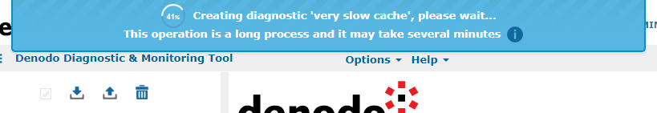
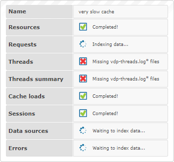
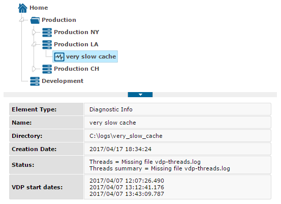
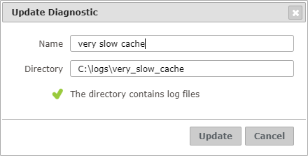
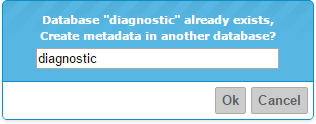

====================
Creating Diagnostics
====================

To diagnose what happened in the past in a Virtual DataPort server, follow these
steps:

1. Gather those log files with information about the Virtual DataPort server
   that you want to diagnose. The Diagnostic & Monitor Tool is able to process
   the following kind of log files:

   -  From the directory :file:`{<DENODO_HOME>}/logs/vdp/` of the host where the
      Virtual DataPort server is running, the ``vdp.log`` and its backup files
      if they exist (by default, its backup files follow the pattern
      ``vdp.log.1``, ``vdp.log.2``...).

   -  From the ``logs`` directory of the Denodo Monitor that was monitoring
      that server, the following log files and their backup files if they exist:

      -  ``<server_name>-connections.log``
      -  ``<server_name>-datasources.log``
      -  ``<server_name>-loadcacheprocesses.log``
      -  ``<server_name>-queries.log``
      -  ``<server_name>-resources.log``
      -  ``<server_name>-threads.log``

      where ``server_name`` is the name of the Virtual DataPort server in the
      Denodo Monitor configuration (``vdp`` by default).

2. Copy these files to a directory of the host where the Diagnostic &
   Monitoring Tool runs. The user account that launches the Tool needs to
   have read access over this directory.

3. :ref:`Log in <dmt-authentication-authorization>` to the Tool.

4. :doc:`Create a new server </vdp/dmt/creating_servers_and_environments/creating_servers/creating_servers>` that represents the one from
   which you obtained the logs. As you do not need to monitor
   the server, you can only enter the name of the server in the form.

5. Right-click on the server and click **Load Diagnostic Info…**

6. In the :ref:`Dialog to create a new diagnostic`, enter the
   path to the directory where you copied the logs and click **Create**.

   .. figure:: create-diagnostic.png
      :align: center
      :alt: Dialog to create a new diagnostic
      :name: Dialog to create a new diagnostic

      Dialog to create a new diagnostic

   If that directory contains log files about several servers, you need to
   select first which server you want to load the logs from.

   .. figure:: create-diagnostic-select-server.png
      :align: center
      :alt: Dialog to create a new diagnostic when the directory contains information about several servers
      :name: Dialog to create a new diagnostic when the directory contains information about several servers

      Dialog to create a new diagnostic when the directory contains information about several servers

.. note:: The path you specify in this dialog has to point to a
   directory in the host where the web application is running, not a directory
   on your local host.

The creation process involves several steps for each log file in the
directory: reading logging dates, creating metadata, caching its data and
indexing it. According to the size of the log files, creating a diagnostic may
be a long process. You can follow its progress in the notification area.

   Progress notification of a diagnostic creation

If you click on the |image1| button, a new notification area will open where you
can check the current stage for each individual log file.

   Notification of a diagnostic creation with information per file

At the end, a new diagnostic will be created in the tree area, under the server,
represented with the |image2| icon.

   New diagnostic node in the tree area

.. note:: The Diagnostic & Monitoring Tool supports partial diagnostics where
   not all the log files could be loaded into the system. This may happen if
   the directory only contains a subset of all the supported log files or if the
   caching failed unexpectedly. If that is the case, those features that rely on
   missing data will be disabled.

To update a diagnostic with new data, right-click on the diagnostic and
click **Edit**. The `Dialog to update a diagnostic`_ will open. If you change
the path of the directory (or the server name, in case of a directory with logs
from several servers), the current data will be discarded and the diagnostic
will use the data from the new log files. On the other hand, if you keep the
diagnostic definition, the Tool will detect which files have changed and will
only add data from those files to the diagnostic.

   Dialog to update a diagnostic

All the diagnostic-related metadata is stored in the same database of
the Diagnostic & Monitoring Virtual DataPort. The first time you create
a diagnostic, the Diagnostic & Monitoring Tool tries to create this
database with the name ``diagnostic``. If the database already exists, the
`Confirmation dialog of the diagnostic database name`_ will
appear, asking for a new database name. Change the database name if you
want and confirm. The Tool will use the database you enter in this
dialog even if it already exists.

   Confirmation dialog of the diagnostic database name

.. |image1| image:: ../../common_images/info.png

