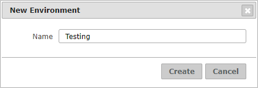

=====================
Creating Environments
=====================

The Diagnostic & Monitoring Tool allows you to group several servers in
environments in order to monitor all at once. An enterprise installation
of the Denodo Platform can organize the Virtual DataPort servers in
environments depending on their purpose: development servers, QA
servers, production clusters…

There are two ways to create an environment:

#. In the **Options** menu, click **New Environment**.
#. Or in the tree area, right-click on |image1| and click **New Environment...**.

In both cases, the Tool will open the dialog below.
Fill the form and click **Create**. A new environment
will be created in the tree area represented with the icon |image0|.

To add a server to an environment, drag the server to that environment.

   Dialog to create a new environment

