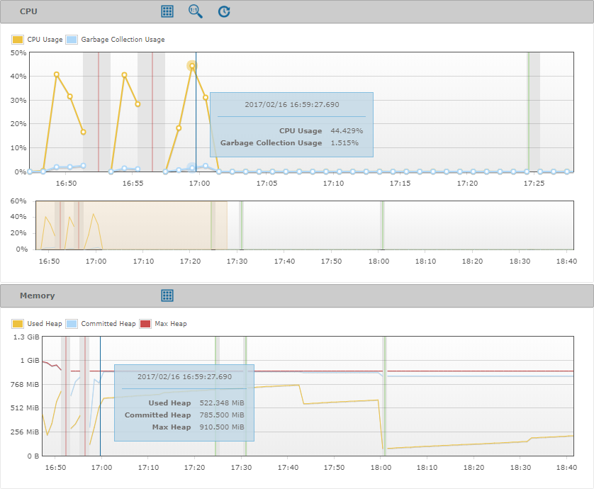
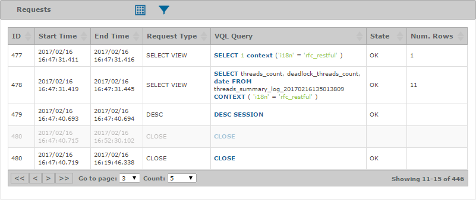
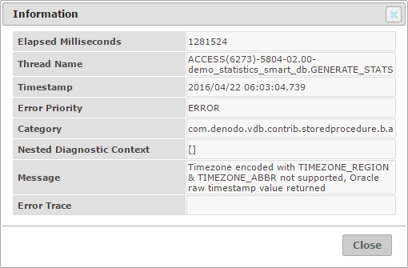
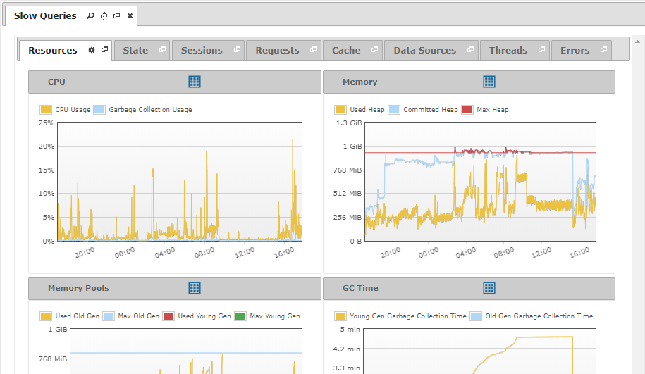
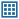
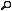
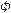

==========
Diagnosing
==========

.. toctree::
   :hidden:

   diagnosing_resources/diagnosing_resources.rst
   diagnosing_state/diagnosing_state.rst
   diagnosing_sessions/diagnosing_sessions.rst
   diagnosing_requests/diagnosing_requests.rst
   diagnosing_cache/diagnosing_cache.rst
   diagnosing_data_sources/diagnosing_data_sources.rst
   diagnosing_threads/diagnosing_threads.rst
   diagnosing_errors/diagnosing_errors.rst

A diagnostic allows you to inspect the state of a Virtual DataPort Server in
the past, by browsing graphically its logs. This can be extremely
helpful when you have detected a malfunction in its behavior and want to
find its cause.

The Diagnostic & Monitoring Tool displays the diagnostic information
collected in logs using graphs and tables. As you will see, the
interface is similar to the :ref:`monitoring of a server <Monitoring Servers>`,
but with historical data instead of real-time data.

The figure below shows an example of two graphs with several series each.
Besides the series data, a graph may contain information about Virtual DataPort
startups (red milestones) and Denodo Monitor session startups (green
milestones). These milestones are surrounded by blurred regions where there is
no information to show, because either the Denodo Monitor or the Virtual
DataPort were stopped.

   Diagnostic information presented in graphs

If you are interested in inspecting a region in more detail, select the region
with the mouse. The graph will zoom in on it and unfold a new graph with the
overview, so you always have the whole perspective. Now you can zoom in by
selecting regions in both the graph or the overview.

Discovering the actual values in the graphs is as easy as moving the mouse over
a graph. Graphs are synchronized, so you can track all their series data at
once. You only need to move the mouse over one of the graphs, and a tooltip will
appear in all the visible graphs showing the values for their measures at that
instant. You can click on a graph and the tracking will freeze, ignoring the
mouse movement, so you can inspect the frozen instant for all the graphs. Click
again, and the tracking will resume. In addition, if the series points are
visible, graphs will highlight which points are considered for the tracking.

For each graph, its header contains its name and a set of icons to operate with
it. You can click on the header and the graph will collapse.

The icons in the header of a graph are:

-  |grid|: Displays a menu where you can choose which series the graph will
   draw.

-  |magnifying-glass-1-1|: Visible only after zooming in on a region, removes
   the zoom and displays all the data available for the graph.

-  |diagnostic-interval|: Visible only after zooming in on a region, creates a
   new diagnostic interval for the selected period.

-  |details|: Visible only after clicking on the graph, shows more information
   for the selected (frozen) instant. This option is only available for
   some of the graphs.

`Diagnostic information presented in a table`_ shows an example of
diagnostic information displayed as a table. Blurred rows indicate that the logs
do not contain enough information about the element to be sure if it has
finished or not and, in case it contains an end time value, it will be
an approximate one.

   Diagnostic information presented in a table

Again, the header shows the
name of the table and a set of icons to operate with it. You can click
on the header and the table will collapse.

The icons in the header of a table are:

-  |grid|: Unfolds a menu where you can choose which fields the table will display.
-  |filter|: Displays a dialog to define a condition to filter the contents of the table.
   The section :doc:`../monitoring/monitoring` explains how to create a filter.

Diagnostic tables also support sorting by a certain field or set of
fields. Click on the name of a field to sort the content of the table by
that field. Click on another field while pressing the ``CTRL`` key in
your keyboard and you will add a second sorting field.

Double-click on a row, or right-click and select |info| **View Row**,
to see all its fields. This is useful if you configured the table
to display only some fields.

   The information dialog shows the values for all the fields of a row

.. important:: The Diagnostic & Monitoring Tool supports logs with several
   monitoring sessions and several restarts of the Virtual DataPort Server.
   Nevertheless, you should use the last version of the :ref:`Denodo Monitor`
   to enable all the features explained above.

To open a diagnostic or a diagnostic interval, double-click its name in
the tree area. The Diagnostic & Monitoring Tool will open a new tab in
the working area with the diagnostic information of that node.

   Diagnostic or diagnostic interval tab

The diagnostic information is displayed respecting the dates in the
logs; no time zone transformation is performed. Thus, you will work as
if you were in the time zone of the server you are diagnosing.

The tab of a diagnostic or diagnostic interval presents the following
set of icons:

-  |magnifying-glass|: Shows information about the current diagnostic or diagnostic interval.
-  |reload|: Reloads the whole tab as if it was opened again.
-  |detach|: Opens the tab in a new window.
-  |close|: Closes the tab.

The tabs with diagnostic information about the whole server (resources,
requests, threads…) are fixed and cannot be closed. However, you can
open new tabs that display parameterized information, like the requests
of a particular session for instance. Notice that these tabs count with
the following icons:

-  |magnifying-glass|: Shows all the information about the parameter of the tab.
-  |edit|: Allows you to change the name of the tab.

