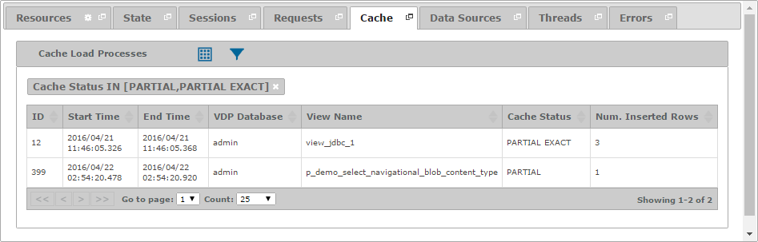

==================
Diagnosing - Cache
==================

The “Cache” tab displays the load processes of the cache on the Virtual
DataPort server. If there was a problem loading the cache, its
corresponding row will appear in red.

   Cache tab of a diagnostic or diagnostic interval

Notice that you can define filters using both the fields of a load
process and the fields of its corresponding session.

You can find a detailed explanation of the fields in the “Cache Load
Processes” table on the section :ref:`Monitoring - Cache`.

