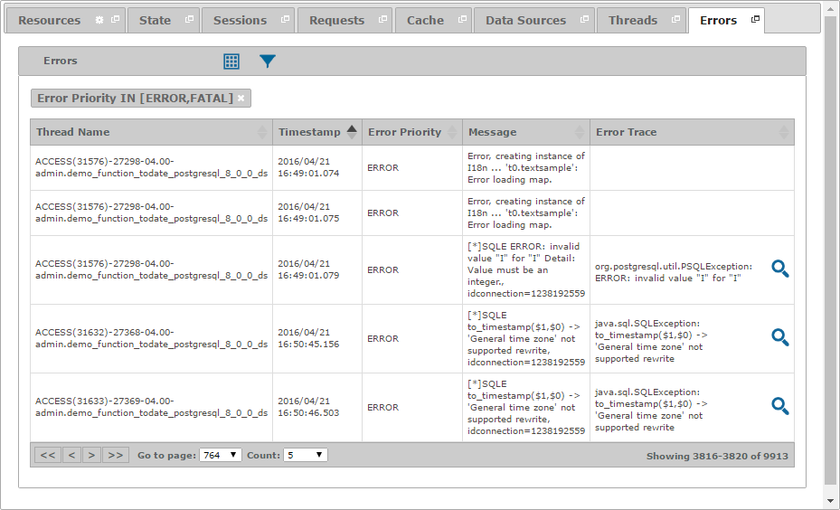

===================
Diagnosing - Errors
===================

The “Errors” tab displays all the relevant events that were registered in the
log of the Virtual DataPort server (``vdp.log``).

   Errors tab of a diagnostic or diagnostic interval

The fields that are available in the “Errors” table are:

-  **Elapsed Milliseconds**: Number of milliseconds elapsed from the
   moment the logging began.
-  **Thread Name**: Name of the thread that generated the logging event.
-  **Timestamp**: Date when the logging event occurred.
-  **Error Priority**: Priority of the logging event, which can take one
   of the following values: ``TRACE``, ``DEBUG``, ``INFO``, ``WARN``,
   ``ERROR`` and ``FATAL``.
-  **Category**: Category of the logging event.
-  **Nested Diagnostic Context**: Contextual information of the thread
   that generated the logging event.
-  **Message**: Description of the logging event.
-  **Error Trace**: Stack trace of the thread that generated the logging
   event.

